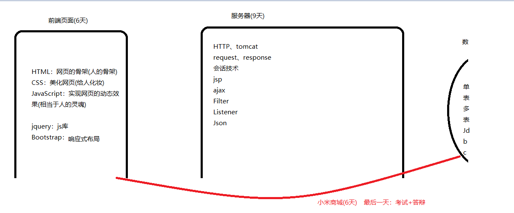
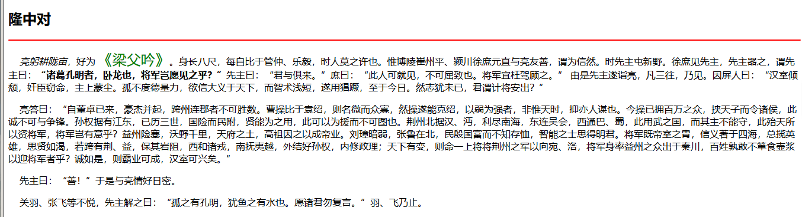
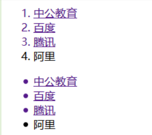
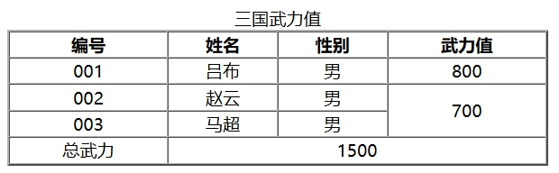
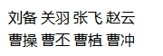
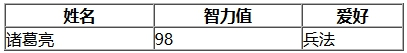
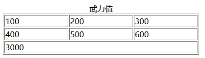
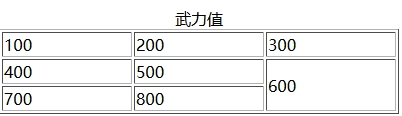
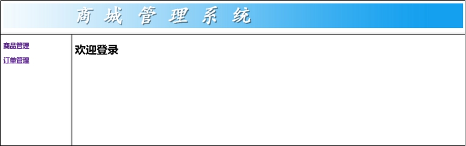
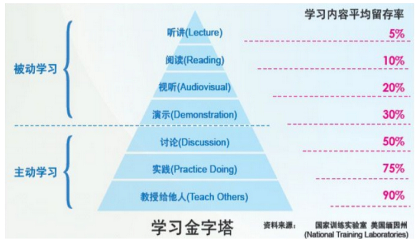

# Day01笔记

课程大纲：



学习层次：

​	1、听讲阶段(保证能够听懂)

​		拿个本记一下重点还有听不懂的地方

​	2、敲代码没思路(熟能生巧)

​		课堂上的代码敲完(至少敲两遍)

​	3、记不住

​		每日一测

​		作业

​		昨日回顾(思维导图)

​		做项目

​	4、说不出来了

​	5、活干不了(解决问题、解决bug、百度)

​		收集问题、收集bug解决方案

​	笔记软件：xmind、有道云笔记、Tpyora


今日重点：学习HTML中的各种标签

​		   难点：记忆

# 一、案例一：网站信息展示页面

## 1.1、需求说明



## 1.2 HTML语言入门

### 1.2.1 HTML简述及作用

> HTML称为[超文本](https://baike.baidu.com/item/%E8%B6%85%E6%96%87%E6%9C%AC/2832422)标记语言，是一种标识性的语言。它包括一系列标签．通过这些标签可以将网络上的文档格式统一，使分散的[Internet](https://baike.baidu.com/item/Internet/272794)资源连接为一个逻辑整体。HTML文本是由HTML命令组成的描述性文本，HTML命令可以说明[文字](https://baike.baidu.com/item/%E6%96%87%E5%AD%97/612910)，[图形](https://baike.baidu.com/item/%E5%9B%BE%E5%BD%A2/773307)、[动画](https://baike.baidu.com/item/%E5%8A%A8%E7%94%BB/206564)、[声音](https://baike.baidu.com/item/%E5%A3%B0%E9%9F%B3/33686)、[表格](https://baike.baidu.com/item/%E8%A1%A8%E6%A0%BC/3371820)、[链接](https://baike.baidu.com/item/%E9%93%BE%E6%8E%A5/2665501)等。

文本：可以使用一些普通的字符、数字....

超文本：可以使用特殊字符、插入图片、超链接、音乐、视频....

标记语言：使用标签将内容标记起来

语言：

​	编程语言

​	标记语言

​	sql语言

​	脚本语言

### 1.2.2  HTML入门案例

- 新建一个后缀名为.html的文件

  ```html
  <font color="red" size="7">今天是圣诞节！！！</font>
  ```

- 使用浏览器打开

  常用浏览器：火狐、谷歌、IE

### 1.2.3 HTML语言特点

- HTML文件不需要编译，直接使用浏览器打开即可解析效果（浏览器内置了解析引擎）

  java：先编译成.class  执行

- HTML文件的扩展名是*.html 或 *.htm(仅仅写法上有区别，运行上无区别)

- HTML都是由标签组成

  标签名预先定义好的（HTML）、自定义标签(XML)

  标签名不区分大小写(但是建议使用小写)

- 通常情况下标签由开始标签和结束标签组成 

  开始标签和结束标签之间的信息，叫做标签的内容体。

  ```html
  <font color="red" size="7">今天是圣诞节！！！</font>
  ```

  开始标签：<font> 属性写在开始标签中

  结束标签：</font>

  内容体：今天是圣诞节！！！

- HTML代码中的空格和换行解析时会被忽略

  多个空格解析成一个空格

  换行标签：<br/>

  空格标签：（&nbsp）(去掉分号了)

- 如果没有结束标签(无内容体)，建议以/结尾。<br/>

- HTML标签是有属性的。

  <标签名 属性名1= " 属性值1" 属性名2=" 属性值2"/>

  属性用于修饰标签效果，例如：字体颜色、字体大小等。好比人有肤色、眼睛大小等属性一样。

- HTML标签可以包裹嵌套，禁止交叉嵌套(成对出现)

  ```html
  交叉嵌套：
  <font><div></font></div>
  包裹嵌套：
  <font><div></div></font>
  ```

### 1.2.4  使用Hbuilder创建HTML

- 右键-新建-web项目
- 创建目录
- 创建html

HTLM文档的格式：

```html
<!DOCTYPE html> 声明该文档是一个html
<html>
  	<!--头标签-->
	<head>
		<meta charset="utf-8" /> 编码方式为utf-8
		<title></title>窗口的标题
	</head>
	<body>
		文档的正文
	</body>
</html>
```

## 1.3 HTML常见标签

### 1.3.1、HTML标签-注释

​	<!--HTMl注释的内容-->

### 1.3.2、HTML标签-标题标签

名称：<hn></hn> n的取值：1-6

特点：

​	1、会改变字号的大小

​	2、会自动换行

```html
<h1>标题1</h1>
        <h2>标题2</h2>
        <h3>标题3</h3>
        <h4>标题4</h4>
        <h5>标题5</h5>
        <h6>标题6</h6>
        <h7>标题7</h7>
```


### 1.3.3 HTML标签-水平线标签

标签名称：<hr/>

| 属性名   | 属性说明                                     |
| ----- | ---------------------------------------- |
| size  | 定义水平线的粗细 单位：像素(px)                       |
| color | 定义水平线的颜色颜色可以是英文单词：例如red,blue,yellow,pink颜色也可以是编码：#FFFFFF |
| width | 定义水平线的长短取值：具体的像素值、百分比                    |

```html
<hr size="3px" color="#00FF00" width="80%"/>
```


扩展：（以下美工知识仅需要了解）

- 像素。

屏幕上的任何信息，例如一张图片，也是由各个**一模一样大小的标准色块**组成的。

一个色块我们称之为一个像素。

 

- 颜色编码

 

\#000000 表示黑色，#FFFFFF白色，#FF0000**红色**，#00FF00**绿色**，#0000FF**蓝色**

\#112233可以简写为#123

\#00FF00可以简写为#0F0

- 百分比

  像素是固定值。

  百分比是级联改变的动态值

### 1.3.4 HTML标签-字体标签

标签名称：<font>

| 属性名   | 属性说明                                     |
| ----- | ---------------------------------------- |
| size  | 定义字号大小默认大小3号。取值范围:1~7     1号最小，7号最大      |
| color | 定义字体的颜色颜色可以是英文单词：例如red,blue,yellow颜色也可以是编码：#FFFFFF |

### 1.3.5 HTML标签-粗体&斜体标签

粗体：<b>

斜体：<i>

### 1.3.6 HTML标签-段落标签

标签名称：<p>

特点：段落与段落之间有空白行(注意和br的区别)

属性：algin:

​		center：居中

​		left：左对齐

​		right：右对齐

```html
<p align="right">第一段</p>
 <p>第二段</p>
```

### 1.3.7 HTML标签-换行标签

<br/>

### 1.3.8 HTML标签-空格标签

&nbsp

## 1.4 需求分析

根据要展示的效果分析使用哪些标签

## 1.5 代码实现

# 二、案例二：网站图片页面展示

## 2.1 需求说明

## 2.2 HTML标签-图片标签

标签名称：

| 属性名    | 属性说明               |
| ------ | ------------------ |
| src    | 指定需要展示的图片所在路径绝对路径： |
| alt    | 图片无法显示时的替代文本。      |
| width  | 图片宽度单位：像素/百分比      |
| height | 图片高度单位：像素/百分比      |

src：

- 相对路径

  ../ 返回上一级目录

  ```html
  
  
  ```

- 绝对路径

  ```
  
  ```

  ​

## 2.3 代码实现

# 三、案例三：网站列表页面展示

## 3.1 需求说明



分析：

​	1、有序、无序列表

​	2、超链接

## 3.2、列表&超链接标签

### 3.2.1、HTML标签-列表标签

**用于展示列表信息**

- 定义有序列表 <ol>
  - type 列表类型，取值：A、a 、I 、i 、1 等
- 定义无序列表 <ul>
  - type 符号的类型，取值：disc 实心圆、square 方块 、circle 空心圆
- 列表项  <li>


**ul或者ol属性（了解）**

| 属性说明                                     | 属性名  |
| ---------------------------------------- | ---- |
| 定义列表的符号类型。 有序列表：取值：A、a 、I 、i 、1 等无序列表：取值：disc 实心圆、square 方块 、circle 空心圆 | type |

```html
<!--有序列表-->
		<ol type="A">
			<li>中公教育</li>
			<li>百度</li>
			<li>腾讯</li>
			<li>阿里</li>
		</ol>
		<!--无序列表-->
		<ul type="square">
			<li>中公教育</li>
			<li>百度</li>
			<li>腾讯</li>
			<li>阿里</li>
		</ul>
```


### 3.2.2、HTML标签-超链接标签

标签名称：<a></a>

注意：

​	1、必须要有内容体

​	2、必须要有href属性

|        |                                          |
| ------ | ---------------------------------------- |
| href   | 用于指定需要连接并打开的页面路径（必填）路径写法等同于img的src写法。    |
| target | 确定以何种方式打开href所设置的页面。取值：_blank 在新窗口中打开href确定的页面。  _self 默认。使用href确定的页面替换当前页面。 |

href:

- 内网路径
- 外网路径

```html
<a href="../dan.html">圣诞快乐！！！</a>
<a href="/day01/dan.html">圣诞快乐！！！</a>
<a href="https://www.qq.com/">腾讯</a>
```

## 3.3、需求分析

## 3.4、案例代码实现 

```html
<ol type="A">
			<li><a href="http://www.offcn.com">中公教育</a></li>
			<li><a href="">百度</a></li>
			<a href="http://www.qq.com"><li>腾讯</li></a>
			<li>阿里</li>
		</ol>
```

# 四、案例四：表格展示

## 4.1、需求说明

 

## 4.2、表格标签

### 4.2.1  表格的作用

1. 展示数据
2. 用来进行网页的布局

### 4.2.2  表格的结构标签

| 标签名     | 作用        |
| ------- | --------- |
| table   | 表格容器      |
| tr      | 行         |
| th      | 列标题  居中效果 |
| td      | 列         |
| caption | 表格的标题     |

### 4.2.3  常用的表格属性

| 属性名         | 作用                            |
| ----------- | ----------------------------- |
| width       | 表格宽度                          |
| border      | 表格外边框粗细                       |
| align       | 可用在table(布局的居中)、tr、td中(内容的居中) |
| rowspan     | 跨几行                           |
| colspan     | 跨几列                           |
| cellspacing | 设置单元格之间的间隔                    |
| cellpadding | 设置单元格边框与文字之间的距离               |

Bgcolor：背景颜色

Background：背景图片

### 4.2.4 没有边框的表格

  

```html
<table>
			<tr>
				<td>刘备</td>
				<td>关羽</td>
				<td>张飞</td>
				<td>赵云</td>
			</tr>
			<tr>
				<td>曹操</td>
				<td>曹丕</td>
				<td>曹植</td>
				<td>曹冲</td>
			</tr>
		</table>
```

### 4.2.5 有表头且有边框的表格



```html
<table  border="1px" cellspacing="0px" width="400px" align="center">
			<tr>
				<th>姓名</th>
				<th>智力值</th>
				<th>爱好</th>
				
			</tr>
			<tr>
				<td>诸葛亮</td>
				<td>98</td>
				<td>兵法</td>
			
			</tr>
		</table>
```

### 4.2.6 跨列的表格



```html
<table border="1px" width="400px">
			<caption>武力值</caption>
			<tr>
				<td>100</td>
				<td>200</td>
				<td>300</td>
			</tr>
			<tr>
				<td>400</td>
				<td>500</td>
				<td>600</td>
			</tr>
			<tr>
				<td colspan="3">3000</td>
			
			</tr>
		</table>
```

### 4.2.7 跨行的表格



```html
<table border="1px" width="400px">
			<caption>武力值</caption>
			<tr>
				<td>100</td>
				<td>200</td>
				<td>300</td>
			</tr>
			<tr>
				<td>400</td>
				<td>500</td>
				<td rowspan="2">600</td>
			</tr>
			<tr>
				<td>700</td>
				<td>800</td>
			</tr>
		</table>
```

## 4.3、案例需求分析

## 4.4、案例代码实现

```html
<table bgcolor="beige" background="../img/index.jpg" align="center" width="600px" border="1px" cellspacing="0px">
			<caption>三国武力值</caption>
			<tr>
				<th>编号</th>
				<th>姓名</th>
				<th>性别</th>
				<th>武力值</th>
			</tr>
			<tr align="center">
				<td>001</td>
				<td>吕布</td>
				<td>男</td>
				<td>800</td>
			</tr>
			<tr align="center">
				<td>002</td>
				<td>赵云</td>
				<td>男</td>
				<td rowspan="2">700</td>
			</tr>
			<tr align="center">
				<td>003</td>
				<td>马超</td>
				<td>男</td>
		
			</tr>
			<tr align="center">
				<td>总武力</td>
				<td colspan="3">1500</td>
			
			</tr>
		</table>
```


# 五、案例五：网站后台展示页面

网站分为：

​	前台：给用户使用(做的页面比较美观)

​	后台：给管理员使用(做的页面比较简单)

## 5.1、需求说明

 

## 5.2、HTML标签-框架标签

<frame>标签，是框架设置布局标签，专门用于页面的布局和划分。

注意：framest和body不能一起使用

frameset属性：

| 属性名  | 属性说明              |
| ---- | ----------------- |
| cols | 对页面进行列切割单位：像素/百分比 |
| rows | 对页面进行行切割单位：像素/百分比 |

按列切割：


```html
	<frameset cols="20%,*,30%">
		<frame />
		<frame />
		<frame />
	</frameset>
```


按行切割：


```html
<frameset rows="15%,*,20%">
		<frame />
		<frame />
		<frame />
	</frameset>
```

混合切割：


```html
<frameset rows="15%,*">
		<!--第一行-->
		<frame />
		<!--第二行-->
		<frameset cols="20%,*">
			<frame />
			<frame />
		</frameset>
	</frameset>
```


<frame>标签，是<frameset>的子标签。用于页面引入。 

frame属性

| 属性名  | 属性说明                 |
| ---- | -------------------- |
| src  | 引入的页面路径              |
| name | 该框架的名称用于和a标签target连用 |
|      |                      |

### 5.3、需求分析

### 5.4、案例代码实现

main.html

```html
<frameset rows="17%,*">
		<!--第一行-->
		<frame src="top.html" />
		<!--第二行-->
		<frameset cols="20%,*">
			<frame src="left.html"/>
			<frame name="aaa" src="center.html"/>
		</frameset>
	</frameset>
```

其它代码：略




 

 

 