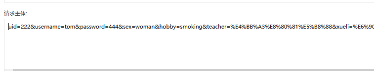
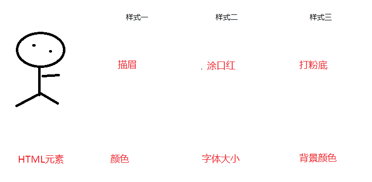
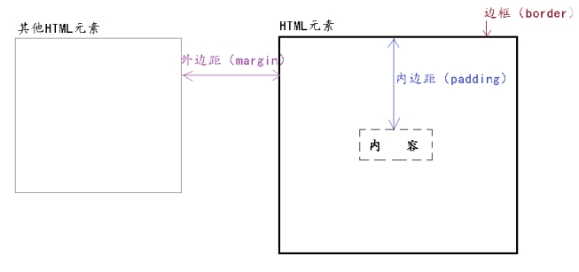
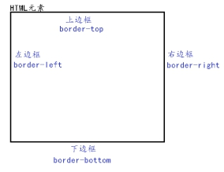
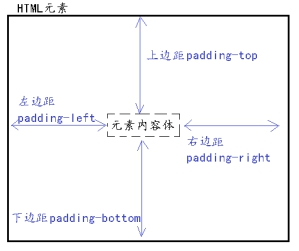
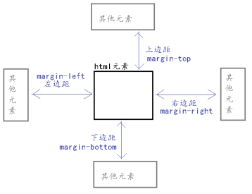

# Day02笔记

今日内容安排：

1、表单的作用

2、表单中的标签：input 、select、text-area(具体的应用场景)

3、input中的属性以及type的值

4、表单的两个属性(action、method)

5、使用table做布局

6、CSS(能够看懂别人写好的CSS代码并简单修改)

# 一、表单（重点）

## 1.1、表单的作用 

标签名称：<form>

作用：用来接收用户输入的数据，从而实现和服务器的交互

## 1.2、HTML-表单输入项标签（input）

**<input> **标签用于获得用户输入信息，type属性值不同，会成为不同的组件。最常用的标签。

input属性：

| 属性名      | 属性说明                                     |
| -------- | ---------------------------------------- |
| type     | 定义表单输入项input的组件类型详见下一个表格*type属性值说明*      |
| name     | 组件名。给组件起一个名字 作用：提交时  name属性对应的值是参数名，用户输入的数据是参数值  form.html?username=lucy&password=666 |
| value    | 组件默认值。如果是单选框或者复选框：需要手动给其设置值              |
| checked  | 设置单选框/复选框的默认选中状态                         |
| readonly | 设置该标签的参数值只读，用户无法手动更改。 参数可以正常提交           |
| disabled | 设置该标签不可用（禁用），参数值无法更改。参数无法提交              |
| size     | 组件的长度                                    |

input-type属性值说明：

| 属性值      | 说明                             |
| -------- | ------------------------------ |
| text     | 文本框，单行的输入字段，用户可在其中输入纯文本。       |
| password | 密码框。                           |
| radio    | 单选框。必须设置一个name属性，且值必须相同(同一组)   |
| checkbox | 复选框。给name属性设置同一个值              |
| submit   | 提交按钮。                          |
| reset    | 重置按钮。 用于将所有的 表单输入项恢复到 **默认状态** |
| file     | 附件框。用于文件上传                     |
| hidden   | 隐藏域。(并不影响参数的提交)                |
| button   | 普通按钮(结合JavaScript中的事件使用)       |
| date     | 定义日期字段                         |
| number   | 定义数字字段                         |
| email    | 定义email地址字段                    |
| Image    | 定义图片作为按钮(提交表单)                 |
| color    | 取色器                            |

## 1.3、HTML-表单输入项标签（select）

- <select> 定义一个下拉列表。  	    ol、ul
- <option>定义一个下拉列表的列表项。 li

**select属性：**

| 属性名      | 属性说明                     |
| -------- | ------------------------ |
| name     | 组件名。参数名                  |
| Multiple | 设置该标签选项全部显示，并且可以进行多选提交。。 |

**option属性：**

| 属性名      | 属性说明                                     |
| -------- | ---------------------------------------- |
| value    | 设置需要提交的参数值。如果没有设置value属性，此时提交过去的参数值是<option>中的内容体，如果设置了value，参数时是value设置的值 |
| selected | 设置某个列表项默认选中。                             |

## 1.4、HTML-表单输入项标签（text-area）

<textarea></textarea>标签

文本域标签，可支持用户输入并提交大量纯文字数据。

**textarea属性：**

| 属性名  | 属性说明                             |
| ---- | -------------------------------- |
| name | 组件名。如果需要下拉选择框数据提交到服务器，必须提供name属性 |
| cols | 设置文本域列                           |
| row  | 设置文本域行数                          |
|      |                                  |

```html
<form>
			<input type="hidden" name="uid" value="222" />
			用户名：<input type="text" name="username" size="7" /><br />
			密码：<input type="password" name="password"/><br />
			性别：<input type="radio" name="sex" value="man" /> 男
				<input type="radio" checked="checked" name="sex" value="woman" /> 女<br />
			爱好：
				<input type="checkbox" checked="checked" name="hobby" value="smoking"/> 抽烟
				<input type="checkbox" name="hobby" value="drinking" /> 喝酒
				<input type="checkbox" name="hobby" value="tangtou"/> 烫头<br />
			头像：<input type="file" /><br />
			出生日期：<input type="date" />
			<br />
			年龄：<input type="number" />
			<br />
			邮箱：<input type="email" />
			<br />
			最喜欢的颜色：<input type="color" />
			<br />
			最喜欢的老师：<input type="text" name="teacher" readonly="readonly" value="代老师" />
			<br />
			法术：<input type="text" name="fashu" value="法术" disabled="disabled" />
			<br />
			学历：<select name="xueli" multiple="multiple">
					<option value="xiao">小学</option>
					<option value="middle">中学</option>
					<option>大专</option>
					<option selected="selected">本科</option>
					<option>硕士</option>
				</select>
			<br />
			个人介绍：<textarea cols="10" rows="5"></textarea>
			<br />
			<input type="submit" value="提交" />
			<input type="reset" value="重置"/>
			<input type="button" value="普通按钮" />
			<input type="image" src="../../img/zhuce.png" />
		</form>
```

## 1.5、表单标签(form)-常用属性

**from属性：**

| 属性名    | 属性说明                   |
| ------ | ---------------------- |
| action | 将表单数据提交到何处。(默认提交到当前页面) |
| method | 将数据以何种方式提交。取值：get、post |

**get和post的区别**：

- 提交参数的位置不同

  get：提交的参数数据在地址栏上

  ```html
  /aaa?uid=222&username=tom&password=2323&sex=woman&hobby=smoking&teacher=代老师&xueli=本科
  ```

​        post：提交的参数数据在请求体中



- 安全性方面

  get不安全：数据直接暴露在地址栏上

  post相对安全：请求体中

- 提交数据量大小方面

  get提交数据量有限

  post提交数据量无上限

> 问题：做文件上传，必须用post


**使用table改善表单的布局：**

```html
<form action="/aaa" method="post" >
		<table align="center" border="1px" cellspacing="0px" width="500px">
			<tr>
				<td align="right">用户名：</td>
				<td><input type="text" name="username"/></td>
			</tr>
			<tr>
				<td align="right">密码：</td>
				<td><input type="password" name="password"/></td>
			</tr>
			<tr>
				<td align="right">性别：</td>
				<td>
					<input type="radio" name="sex" value="man" /> 男
				<input type="radio" checked="checked" name="sex" value="woman" /> 女
				</td>
			</tr>
			<tr align="center">
				<td colspan="2"><input type="submit" value="提交" />
			<input type="reset" value="重置"/>
			<input type="button" value="普通按钮" /></td>
			
			</tr>
			</table>
		</form>
```

## 1.6 标签span和div

行内元素：

​	1、有多少内容占多大的空间

​	2、不会自动换行

块级元素：

​	1、独自占一行

​	2、自动换行

### 1.6.1、HTML-标签-<span>

### 1.6.2、HTML-标签-<div>

应用场景：

​	1、Div   一般用于网页的布局

​	2、span 一般用于展示少量的信息

# 二、CSS

## 2.1、css简述

### 2.1.1、css是什么？

> 层叠样式表(英文全称：Cascading Style Sheets)是一种用来表现[HTML](https://baike.baidu.com/item/HTML)（[标准通用标记语言](https://baike.baidu.com/item/%E6%A0%87%E5%87%86%E9%80%9A%E7%94%A8%E6%A0%87%E8%AE%B0%E8%AF%AD%E8%A8%80/6805073)的一个应用）或[XML](https://baike.baidu.com/item/XML)（标准通用标记语言的一个子集）等文件样式的计算机语言。CSS不仅可以静态地修饰网页，还可以配合各种脚本语言动态地对网页各元素进行格式化。[1][ ]()
>
> CSS 能够对网页中元素位置的排版进行像素级精确控制，支持几乎所有的字体字号样式，拥有对网页对象和模型样式编辑的能力

CSS作用：美化网页



```html
<font style="color: blue;font-size: 70px;font-family: '微软雅黑';">今天天气不错！！！</font>
```

CSS的好处：

​	1、功能更加强大(修改表格内容居中的例子)

​	2、HTML和样式是分离的(代码的解耦)

### 2.1.2、css的位置

- 行内样式

  ```html
  <font style="color: blue;font-size: 70px;font-family: '微软雅黑';">
  			今天天气不错！！！
  		</font>
  ```

- 内部样式

  ```html
  <style>
  			div{
  				border: 1px solid red;
  				width: 200px;
  				height: 200px;
  			}
  		</style>
  ```

- 外部样式

  ```html
  <!--外部引入 方式一-->
  		<link rel="stylesheet" href="../../css/aa.css" />
  		<!--外部引入方式二-->
  		<style>
  			@import url("../../css/aa.css");
  		</style>
  ```

### 2.1.3  CSS的格式规范

​	选择器名称{

​		属性名1: 值1 值2 值3;

​		属性名2:值;

​	}

## 2.2、css选择器

### 2.2.1、元素选择器

元素名称

### 2.2.2、类选择器

.类名

### 2.2.3、id选择器

> ##id名

```html
<style>
			div{
				border: 1px solid red;
				width: 300px;
				height: 300px;
			}
			.bb{
				border: 1px solid red;
				width: 300px;
				height: 300px;
			}
			#aa{
				border: 1px solid red;
				width: 300px;
				height: 300px;
			}
		</style>
	</head>
	<body>
		<div id="aa">11111</div>
		<div class="bb">22222</div>
		<div class="bb">333333</div>
	</body>
```

## 2.3、css样式

### 2.3.1、边框背景属性

所有的HTML标签都有边框，默认边框不可见

- border
- width
- height
- background-color
- background-image
- background-repeat  不平铺—背景图片样式平铺或不平铺

### 2.3.2、字体

- font-size
- color

### 2.3.3、布局

#### 2.3.3.1、float

​	通常默认的排版方式，将页面中的元素从上到下一一罗列，而实际开发中，需要左右方式进行排版，就需要使用浮动属性

格式：

选择器{

​	float:属性值;

}

常用属性值：

​		none：元素不浮动（默认值）

​		left：元素向左浮动

​		right：元素向右浮动

​		

​	注意：因为元素设置浮动属性后，会脱离原有文档流（会脱离原有的板式），从而会影响其他元素的样式，所以设置浮动以后，页面样式需要重新调整

​	原有的规则：原有的文档流

​	脱离原有的规则，必须脱离原有的文档流

​	浮动属性，会使得原有的布局被打乱

#### 2.3.3.2、clear

​	由于浮动元素不再占用原文档流的位置，所以它会对页面中其他元素的排版产生影响。

如果要避免影响，需要使用clear属性进行清除浮动。

格式：

选择器{

clear:属性值;

}

​	常用属性值：

​		left：不允许该元素左侧有浮动元素（清除左侧浮动的影响） 

​		right：不允许该元素右侧有浮动元素（清除右侧浮动的影响）

​		**both**：同时清除左右两侧浮动的影响（一般用both） 

```html
<style>
			#aa{
				border: 1px solid red;
				width: 120px;
				height: 120px;
				background-color: red;
				float: left;
			}
			#bb{
				border: 1px solid red;
				width: 140px;
				height: 140px;
				background-color: green;
				float: left;
			}
			#cc{
				border: 1px solid red;
				width: 160px;
				height: 160px;
				background-color: yellow;
				float: left;
			}
			#tao{
				border: 1px solid red;
				width: 360px;
				height: 360px;
				background-color: pink;

			}
			#clear{
				clear: both;
			}
		</style>
	</head>
	<body>
		<div>
			<div id="aa">上天下海</div>
			<div id="bb">外套</div>
			<div id="cc">人手一件</div>
			<div id="clear"></div>
		</div>
		
		<div id="tao">
			淘宝直播
		</div>
	</body>
```


### 2.3.4、转换

#### display

HTML提供丰富的标签，这些标签被定义成了不同的类型，一般分为：块级元素和行内元素。

**块级元素**：以区域块方式出现。每个块标签独自占据一整行或多整行。块结束会自动换行

​		特点：可以设置宽高

**行内元素**：根据内容多少来占用行内空间，不会自动换行

​		特点：不可以设置宽高

**常见的块级元素有哪些**：

​	div、p、标题标签、列表标签

**常见的行内元素有哪些**：

​	span、font、a

​      

块级元素和行内元素的相互转换：


 **格式：**

​	选择器{

​	display:属性值

​	}

**常用的属性值**：

block：此元素将显为块元素（块元素默认的display属性值）

inline：此元素将显示为行内元素（行内元素默认的display属性值）

none：此元素将被隐藏，不显示，也不占用页面空间。

```html
<style>
			span{
				border: 1px solid red;
				width: 200px;
				height: 200px;
				/*将行内元素转为块元素*/
				display: block;
			}
			div{
				border: 1px solid red;
				width: 200px;
				height: 200px;
				/*将块级元素转为行内元素*/
				display: inline;
			}
			#yin{
				border: 1px solid red;
				width: 200px;
				height: 200px;
				display: none;
			}
		</style>
	</head>
	<body>
		<span>11111111111111111</span>
		
		<div>22222222222222</div>
		
		<p id="yin">我隐身啦！！！</p>
	</body>
```


## 2.4、css盒子模型

### 2.4.1、什么是盒子模型

​	所有的HTML元素，我们都可以看成一个四边形，即一个盒子。

用CSS来设置元素盒子的 内边距、边框 和 外边距 的样式的方式，

相当于设置盒子的样式，所以我们将其称之为 盒子模型

 

### 2.4.2、边框

边框：HTML元素盒子的框体

 

边框有四个属性可以设置：

- border-top:上边框
- border -right:右边框
- border -bottom:下边框
- border -left:左边框

通用设置：border  

### 2.4.3、内边距padding

内边距：HTML元素里的内容体  到  HTML元素边框 的距离

 

内边距有四个属性可以设置：

- padding-top:上边距
- padding-right:右边距
- padding-bottom:下边距
- padding-left:左边距

### 2.4.4、外边距margin

外边距：HTML元素边框 到 其他HTML元素边框的距离

  

外边距有四个属性可以设置：

- margin-top:上边距
- margin -right:右边距
- margin -bottom:下边距
- margin -left:左边距


