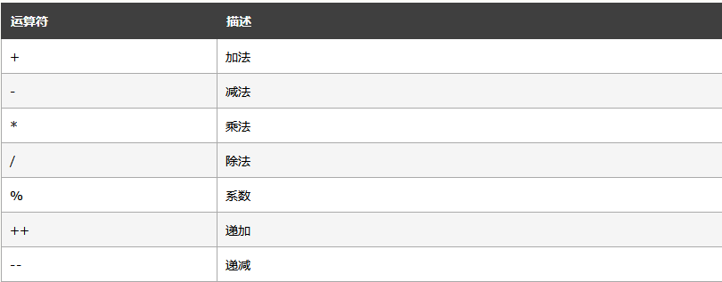
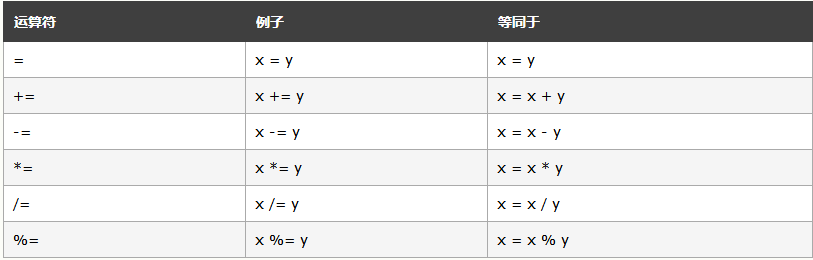
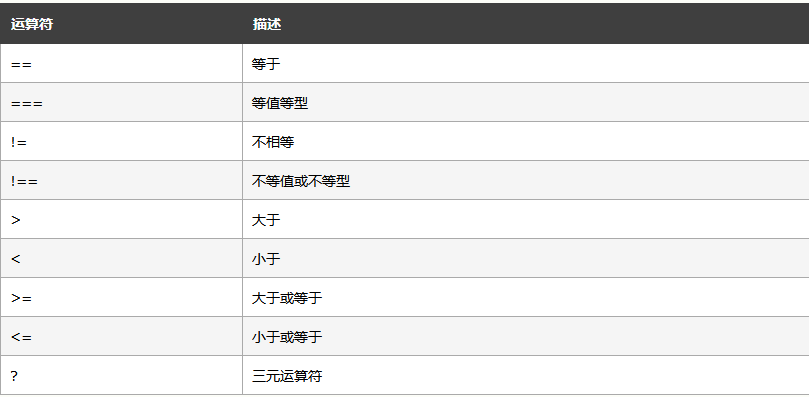
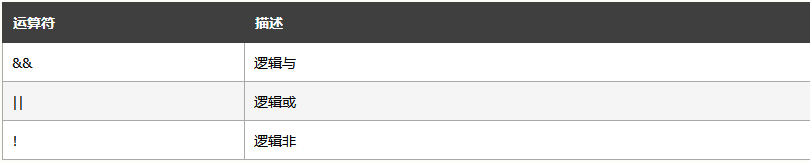
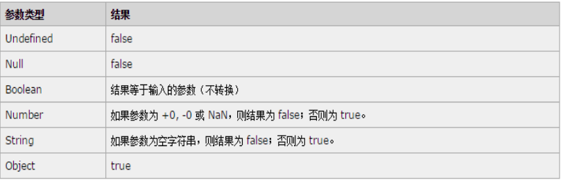
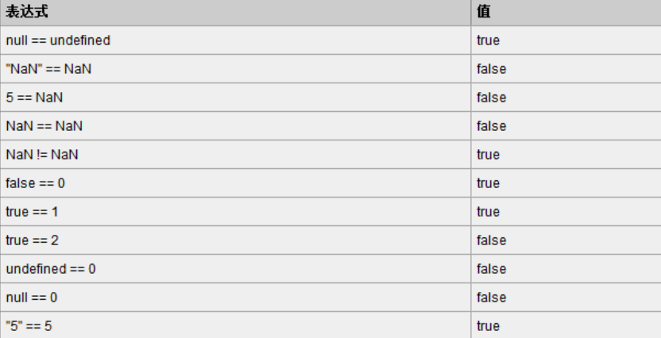
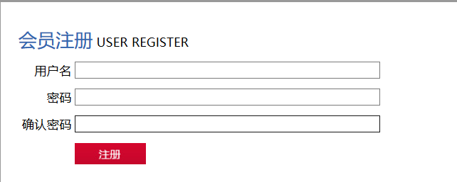

# Day03笔记-JavaScript

昨日内容回顾：

​	1、表单的作用

​	2、表单名称：<form>

 	      两个属性：action、method

​	3、input

​		属性：type、name、value、checked、readonly、disabled、size

​		type的值：text、password、radio、checkbox、file、hidden

​				  submit、reset、image、date、number、color、email

​				 button

​	4、select  属性： name  multiple   

​		子标签<option> 属性：value、selected

​	5、文本域  text-area

​	6、块级元素和行内元素的区别

​		块级元素：div

​		行内元素：span

​		div和span应用场景

​	7、CSS放置位置(行内样式、内部样式、外部样式)

​	8、基本选择器  

​		元素选择器(标签名称)

​		类选择器(.类名)

​		ID选择器(#id名)

​	9、浮动  float    clear

​	10、转换

​		display：block、inline、none

​	11、盒子模型(边框、内边距、外边距)


三个问题：

​	1、为什么要学习该技术

​	2、该技术是什么

​	3、如何使用


JS文档网址：https://www.w3school.com.cn/jsref/dom_obj_location.asp

# 1、JavaScript

## 1.1、JavaScript概述

### 1.1.1、JavaScript是什么?

> JavaScript 是互联网上最流行的脚本语言，这门语言可用于 HTML 和 web，更可广泛用于服务器、PC、笔记本电脑、平板电脑和智能手机等设备。
> JavaScript 是脚本语言
>
> JavaScript 是一种轻量级的编程语言。
>
> JavaScript 是可插入 HTML 页面的编程代码。
>
> JavaScript 插入 HTML 页面后，可由所有的现代浏览器执行。
>
> JavaScript 很容易学习。

脚本语言无法独立运行，需要嵌套在HTML中执行

无需编译，直接运行(浏览器内部都内置JavaScript解析引擎)

### 1.1.2、JavaScript的发展史

​	 JavaScript诞生于1995年。起初它的主要目的是处理以前由服务器端负责的一些表单验证。在那个绝大多数用户都在使用调制解调器上网的时代，用户填写完一个表单点击提交，需要等待几十秒，完了服务器反馈给你说某个地方填错了......在当时如果能在客户端完成一些基本的验证绝对是令人兴奋的。

​	当时走在技术革新最前沿的**Netscape**（网景）公司，决定着手开发一种客户端语言，用来处理这种装简单的验证。当时就职于**Netscape**公司的**布兰登·艾奇**开始着手计划将1995年2月发布的**LiveScript**同时在浏览器和服务器中使用。为了赶在发布日期前完成**LiveScript**的开发，**Netscape**与**Sun**公司成立了一个开发联盟。而此时，**Netscape**为了搭上媒体热炒**Java**的顺风车，临时把**LiveScript**改名为**JavaScript**，所以从本质上来说**JavaScript**和Java没什么关系。

　　 **JavaScript 1.0**获得了巨大的成功，**Netscape**随后在**Netscape Navigator 3**（网景浏览器）中发布了**JavaScript 1.1**。之后作为竞争对手的微软在自家的**IE3**中加入了名为**JScript**（名称不同是为了避免侵权）的**JavaScript**实现。而此时市面上意味着有3个不同的**JavaScript**版本，**IE**的**JScript**、网景的**JavaScript**和**ScriptEase**中的**CEnvi**。当时还没有标准规定**JavaScript**的语法和特性。随着版本不同暴露的问题日益加剧，**JavaScript**的规范化最终被提上日程。

​	1997年，以**JavaScript1.1**为蓝本的建议被提交给了**欧洲计算机制造商协会**（ECMA，European Computer Manufactures Association）该协会指定39号技术委员会负责将其进行标准化，**TC39**来此各大公司以及其他关注脚本语言发展的公司的程序员组成，经过数月的努力完成了**ECMA-262**——定义了一种名为**ECMAScript**的新脚本语言的标准。第二年，**ISO/IEC**（国标标准化组织和国际电工委员会）也采用了**ECMAScript**作为标准（即**ISO/IEC-16262**）。

### 1.1.3、JavaScript的组成

- ECMAScript	(核心)：规定了JS的**语法和基本对象**。
- DOM文档对象模型：**处理网页内容**的方法和接口(day04讲)
- BOM浏览器对象模型：**与浏览器交互**的方法和接口(第五部分讲解)

### 1.1.4、JavaScript的引入方式

#### 1.1.4.1、内部脚本


```javascript
<script>		
	alert(11);
</script>
```
可以书写在HTML的任何位置

可以写多个<script>，执行顺序从上到下


alert("内容")   以弹出窗口的形式

document.write("哈哈哈");  将内容输出到浏览器文档上

#### 1.1.4.2、外部引入

```javascript
	<script type="text/javascript" src="../js/aa.js" >
    	alert("呵呵呵");//此时js不起作用
	</script>
```
## 1.2、JavaScript基本语法(对比着Java)

### 1.2.1、注释

单行注释： //

多行注释：/**/

### 1.2.2、变量&类型

#### 1.2.2.1、变量简述

Java是强类型语言：基本数据类型(四型八种)、引用数据类型

JavaScript是弱类型语言

声明变量：

​	var  变量名;

给变量赋值：

​	变量名 = “值”;

在声明JavaScript变量时，需要遵循以下命名规范：

- 必须以字母或下划线开头，中间可以是数字、字符或下划线
- 变量名不能包含空格等符号
- 不能使用JavaScript关键字作为变量名，如：function、this、class
- JavaScript严格区分大小写。 建议使用小写开头


> 需求：使用JavaScript求1-100之和

```javascript
var sum = 0;		
for(var i=1;i <= 100;i++){
			sum += i;
		}
		alert("和为："+sum)
```
#### 1.2.2.2、基本数据类型

| 属性名       | 属性说明                                     |
| --------- | ---------------------------------------- |
| string    | 字符串类型。没有字符类型，值可以使用""或者''引起来              |
| boolean   | 布尔类型。取值：true false                       |
| number    | 数字类型。整数、小数、NaN（not a number）             |
| null      | 一个对象为空的占位符var p = null;  typeof(p) 是object(了解) |
| undefined | 表示变量声明却未定义具体的值 var d;                    |

 ```javascript
<script>
			//字符串类型
			var str = "lucy";
			var c = '黑';
			//alert(typeof(c));
			//布尔类型
			var b1 = true;
			var b2 = false;
			//alert(typeof(b1));
			//数字类型
			var i1 = 12;
			var i2 = 3.14;
			var i3 = NaN;
			var sum = i1 + undefined;
			//(sum);
			//null
			var p = null;
			//alert(typeof(p));
			//undefined
			var d;
			//alert(typeof(d))
		</script>
 ```

JavaScript区别于java，是**弱类型**语言，变量的使用不用严格遵循规范，所以一个变量声明好之后，是可以赋予任意类型的值;

var i = 3;

i = "hello";

i = true;

通过**typeof**运算符可以分辨变量值属于哪种基本数据类型（instanceof）

### 1.2.2.3、运算符

#### 1.2.3.1、算术运算符



#### 1.2.3.2、赋值运算符



#### 1.2.3.3、比较运算符



Java:==和equals的区别

JavaScript：== 和 ===的区别：

​	==   只比较值是否相等，不比较类型

​	=== 即比较值是否相等，又比较类型是否相同

```javascript
<script>
			var i = 3.14;
			var str = "3.14";
			alert(i == str);//true
			alert(i === str);//false
		</script>
```

#### 1.2.3.4、逻辑运算符



Java：&和&&的区别？  if(2<1 && 3>5)  &&：短路功能

JavaScript：没有逻辑运算符 & 和 |


#### 1.2.3.3、参考附录-if条件中的特殊格式（扩展-了解）

遇到特殊情况，请查阅下面两个表格即可。





## 1.3、JavaScript常用对象

### 1.3.1 Function：函数(方法)对象

- **函数的创建&调用**

  java：修饰符  返回值类型  方法名(参数列表){

  ​	方法体

  }

  JS：

  ​	创建&调用

  ```javascript
  //创建一(最常用)
  			function fun1(){
  				alert("fun1方法执行了");
  			}
  			//创建二
  			var fun2 = function(){
  				alert("fun2方法执行了！！")
  			}
  			//调用
  			fun1();
  			fun2();
  ```

  ​

- **函数格式**

  - JavaScript函数定义必须用小写的function；

  - JavaScript函数无需定义返回值类型，直接在function后面书写 方法名；

  - 参数的定义无需使用var关键字，否则报错；

    ```javascript
    function getSum(i,j){
    				return i + j;
    			}
    var sum = getSum(5,5);
    ```

    ​

  - JavaScript函数体中，return可以不写，也可以return 具体值，或者仅仅写return；

- **函数使用的注意事项**

  ​	JavaScript函数若同名，则不存在方法重载，只有方法相互覆盖，最后定义的函数覆盖之前的定义；

  ​	因为JavaScript不存在函数重载，所以JavaScript仅根据方法名来调用函数，即使实参与函数的形参不匹配，也不会影响正常调用；

  ​	如果形参未赋值，就使用默认值undefined

  ```javascript
  function getSum(i,j){
  				return i + j;
  			}
  			function getSum(a,b,c){
  				return a + b + b;
  			}
  			var sum = getSum(5,5);
  ```

### 1.3.2 Date：日期对象

创建：

​	var date = new Date();

两个方法：

​	getTime();  返回 1970 年 1 月 1 日至今的毫秒数

​	toLocaleString():根据本地时间格式，把 Date 对象转换为字符串。

### 1.3.3 Math：数学对象

> Math 对象并不像 Date 和 String 那样是对象的类，因此没有构造函数 Math()，像 Math.sin() 这样的函数只是函数，不是某个对象的方法。您无需创建它，通过把 Math 作为对象使用就可以调用其所有属性和方法。

常用方法：

​	random():0-1的随机数

​	floor(值) ：向下取整

​	ceil(值)：向上取整	

### 1.3.4 RegExp：正则表达式对象

开头：/^

结束：$/

test("内容")   判断内容是否符合正则表达式

```javascript
<script>
			//定义正则表达式
			var req = /^[A-Za-z0-9]+$/;
			var f = req.test("dsfdsd212sA");
			//alert(f);
			
			var req2 = /^(13[0-9]|14[5|7]|15[0|1|2|3|5|6|7|8|9]|18[0|1|2|3|5|6|7|8|9])\d{8}$/;
			alert(req2.test("14577777777"));

			var req3 = /^\s*$/;
			alert(req3.test("     "));
		</script>
```


## 1.4、JS事件

### 1.4.1、JS事件是什么？有什么作用？

通常鼠标或热键的动作我们称之为事件(Event) 


一什么什么(鼠标、键盘的动作)就去做一些事情(执行方法)

### 1.4.2、onclick

点击事件：由鼠标或热键点击元素组件时触发 

```html
<script>
			function run1(x){
				alert("鼠标被单击了！！"+x);
			}
			function run2(){
				alert("run2方法执行了！！");
			}
  			function run3(){
				alert("双击啦！！！");
			}
		</script>
	</head>
	<body>
		<input type="button" value="单击" onclick="run1(11),run2()" />
     	 <input type="button" value="双击" ondblclick="run3()" />
	</body>
```

事件上绑定方法，可以传参，也可以绑定多个方法


双击事件：ondblclick

### 1.4.3、onsubmit

表单提交事件：**表单的提交按钮被点击时**触发

需要一个返回值：

​	true：表单数据进行提交

​	false：阻止表单数据提交

```html
			function run4(){
				alert("表单触发了！！！");
				return true;
			}
		<form onsubmit="return run4()">
			用户名：<input type="text" name="username" /><br />
			密码：<input type="password" name="password" /><br />
			<input type="submit" value="注册" />
		</form>
```


# 2、案例1：使用JS完成注册页面的校验

## 2.1、需求说明



需求：

​	1、用户名不能为空(如果用户名为空，提示用户名不能为空)

​	2、密码、确认不能为空

​	3、密码和确认密码必须一致

校验通过，表单提交，否则阻止表单提交

## 2.2  JavaScript知识讲解

### 2.2.1  根据id选中某个元素

var 元素对象 = document.getElementById("id名")

### 2.2.2  获取某个元素的value值 

元素对象.value;

```html
<script>
			function getValue(){
				//1、获取input元素对象
				var inputEle = document.getElementById("username");
				//2、获取value值
				var val = inputEle.value;
				alert(val);
			}
</script>
	</head>
	<body>
		用户名：<input id="username" type="text" />
		<input type="button" value="获取用户名" onclick="getValue()" />
	</body>
```

## 2.3、需求分析

## 2.4、案例代码实现

```javascript
<script>
			//校验非空的正则表达式
			var req = /^\s*$/;
			//校验表单
			function checkForm(){
				//校验用户名不能为空
				var f1 = checkIsNotNull("username","用户名");
				//密码不能为空
				var f2 = checkIsNotNull("pwd","密码");
				//确认密码不能为空
				var f3 = checkIsNotNull("repwd","确认密码");
				//密码和确认密码必须一致
				if(f2 && f3){
					//获取密码的值
					var p_val = document.getElementById("pwd").value;
					//获取确认密码的值
					var rep_val = document.getElementById("repwd").value;
					//判断是否相等
					if(p_val != rep_val){
						alert("两次密码必须保持一致");
						return false;
					}
				}
				
				return f1 && f2 && f3;
			}
			//校验非空
			function checkIsNotNull(id,msg){
				var u_val = document.getElementById(id).value;
				if(req.test(u_val)){
					alert(msg+"不能为空")
					return false;
				}
				return true;
			}
		</script>

<form onsubmit="return checkForm()">
```


# 3、案例2：轮播图

## 3.1、需求说明

需要编写程序，完成自动切换图片功能。

每2秒切换一次图片。

## 3.2、知识讲解-JavaScript

### 3.2.1、定时器

两种：循环定时器、一次性定时器

#### 3.2.1.1、循环定时器的设置和取消

##### 3.2.1.1.1、启动循环定时器

##### 3.2.1.1.2、停止循环定时器

​	setInterval方法在创建一个定时器的同时，还会返回一个的定时器的ID，该ID就代表这个定时器。

```javascript
<script>
			//启动循环定时器
			//参数1：要执行的业务(方法)
			//参数2：间隔时间 单位：毫秒
			var id = setInterval("run1()",1000);
			//计数器
			var count = 0;
			function run1(){
				count++;
				alert("执行了"+count+"次");
				if(count == 5){
					//停止
					clearInterval(id);
				}
			}
		</script>
```


#### 3.2.1.2、一次性定时器的设置和取消

##### 3.2.1.2.1、启动一次性定时器

一次性定时器，调用一次就会创建并执行一个定时器一次。

两个参数和循环定时器的一样

```javascript
<script>
			setTimeout("run()",2000)
			function run(){
				alert("run方法执行了!!!")
			}
</script>
```

##### 3.2.1.2.2、停止一次性定时器

setTimeout方法在创建一个定时器的同时，还会返回一个的定时器的ID，该ID就代表这个定时器。

此定时器ID在当前页面是不重复的。

### 3.2.2、js事件-onload

页面加载完成的事件

```javascript
	<script>
			
			function run(){
				alert("run方法执行了!!!!");
			}
			
			window.onload = function(){
				alert("页面加载完成执行！！！！");
			}
	</script>
	</head>
	<body onload="run()">
	</body>
```

## 3.3 需求分析

## 3.4、案例代码实现

```javascript
<script>
			//计数器
			var count = 1;
			//切换图片
			function changeImg(){
				//1、选中该图片元素对象
				var img = document.getElementById("lbt");
				//2、修改src属性的值
				img.src = "../img/"+(++count)+".jpg";
				if(count == 3){
					count = 0;
				}
			}
		</script>
	</head>
	<body onload="setInterval('changeImg()',2000)">
		
		
	</body>
```


# 4、案例3：定时弹广告

## 4.1、需求说明

- 网站顶部在页面打开两秒后显示广告图；
- 广告图展示两秒后关闭广告图；

## 4.3、案例代码实现 

```javascript
<style>
			.hideImg{
				display: none;
			}
			.showImg{
				display: block;
			}
		</style>
		<script>
			//弹出图片
			function showImg(){
			//选中图片
			var ad = document.getElementById("ad");
			//修改class值
			ad.className = "showImg";
			//两秒后隐藏
			setTimeout("hideImg()",2000);
			}
			//隐藏图片
			function hideImg(){
			//选中图片
			var ad = document.getElementById("ad");
			//修改class值
			ad.className = "hideImg";

			}
			
		</script>
	</head>
	<body onload="setTimeout('showImg()',2000)">
		
	</body>
```


# 5、BOM对象

## BOM(Browser Object Model) 浏览器对象模型

## 5.1 Window对象

```javascript
<script>
			//window可以省略
			window.alert("aa");
			if(confirm("是否确认删除？")){
				alert("yes");
			}else{
				alert("no");
			}
			alert(prompt("请输入内容："));

			var p;
			function dakai(){
				p = window.open("http://www.offcn.com");
			}
			function guanbi(){
				p.close();
			}

<input type="button" value="打开" onclick="dakai()" />
		<input type="button" value="关闭" onclick="guanbi()" />
		</script>
```


##  5.2 Location

```javascript
<script>
			function get(){
				//获取地址栏的url信息
				var url = location.href;
				alert(url);
			}
			function set(){
				//设置地址栏的url信息
				location.href = "http://www.qq.com";
			}
		</script>
	</head>
	<body>
		<input type="button" value="获取url路径" onclick="get()" />
		
		<input type="button" value="设置url路径" onclick="set()" />
	</body>
```


 


 

 

 

 

 

 