# **Day04笔记**

昨日内容回顾：

1、JS语言的特点

​      脚本语言、无需编译

2、JS三大组成部分

​	EcmaScript、BOM、DOM

3、JS两种引入方式是什么

​	内部引入：<script></script>  外部引入：<script src="...js">

4、JS的基本数据类型有哪些？如何判断所属类型

​	string、nubmer、boolean、null、undefined

​	typeof

5、== 和 === 的区别

6、JS中是否可以用&作逻辑运算符

​	不可以

7、JS函数定义方式是什么，是否有重载概念？

​	function 方法名(参数列表){}

​       var 方法名 = function(){}

​     没有重载，相互覆盖

8、请解释你对事件的理解？

9、请写出今天所学的全部事件？

​	onclick、ondblclick、onsumit、onload

10、Onsumit的两个返回值分别代表什么意思？

​	true：提交表单数据

​	false：阻止提交

11、<input type=”text” id = “hehe”>

问：如何获取该元素对象

​	var ele = document.getElementById("hehe");

​    如何获取value值

​	var val = ele.value;

​    如何设置value值

​	ele.value = "值";

12、请写出如何启动循环定时器、两个参数的意思、如何停止循环定时器

​	var id  = setInterval(参数1，参数2)

​	clearInterval(id);

13、请写出一次性定时器

 setTimeout(参数1，参数2)

14、Onload代表什么意思？  页面加载完成

# **1、案例1：完善注册表单校验**

## **1.1、需求说明及分析**

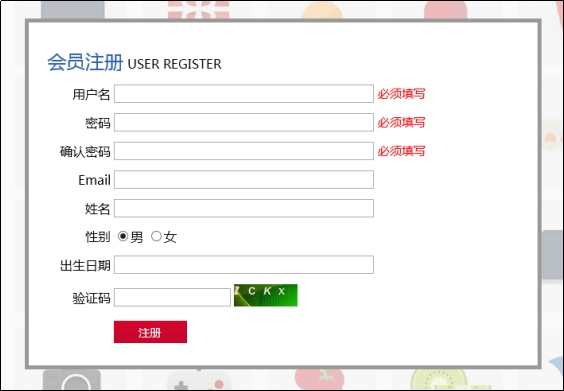

之前注册校验通过警告框来提示信息，这使得信息的提示很不友好。

所以我们对信息的提示进行改进，使错误信息的提示以图示方式进行展示。

## **1.2、JavaScript知识讲解(一)**

### **1.2.1、操作元素内容体-innerHTML**

获取value值：元素对象.value

设置value值：元素对象.value = 值

获取class值：元素对象.className

设置class值：元素对象.className = 值


| 属性名                  | 属性说明                     |
| -------------------- | ------------------------ |
| **元素对象.innerHTML**   | 获取某个元素的内容体信息(获取到HTML标签)  |
| **元素对象.innerHTML=值** | 设置某个元素的内容体信息（可以解析HTML标签） |
|                      |                          |

innerText：只可以获取纯文本

innerText = 值：不可以解析HTML标签


```html
<script>
			function run1(){
				var div = document.getElementById("aa");
				//获取元素内容体
				var content = div.innerHTML;
				alert(content);
			}
			function run2(){
				var div = document.getElementById("aa");
				//设置元素内容体
				div.innerHTML = "<font color='red' size='7'>红色字体</font>";
			}
		</script>
	</head>
	<body>
		<div id="aa">
			<font color="#0000FF" size="5">我是蓝色字体！！</font>
		</div>
		
		<input type="button" value="获取div的内容体" onclick="run1()" />
		<input type="button" value="设置div的内容体" onclick="run2()" />
	</body>
```

## **1.3、案例代码实现**

```javascript
<script>
			//校验非空的正则表达式
			var req = /^\s*$/;
			//校验表单
			function checkForm(){
				//校验前先清空span的内容体
				var u_msg = document.getElementById("usernameMsg");
				u_msg.innerHTML = "";
				var p_msg = document.getElementById("pwdMsg");
				p_msg.innerHTML = "";
					var rep_msg = document.getElementById("repwdMsg");
				rep_msg.innerHTML = "";
				//校验用户名不能为空
				var f1 = checkIsNotNull("username","用户名");
				//密码不能为空
				var f2 = checkIsNotNull("pwd","密码");
				//确认密码不能为空
				var f3 = checkIsNotNull("repwd","确认密码");
				//密码和确认密码必须一致
				if(f2 && f3){
					//获取密码的值
					var p_val = document.getElementById("pwd").value;
					//获取确认密码的值
					var rep_val = document.getElementById("repwd").value;
					//判断是否相等
					if(p_val != rep_val){
						//alert("两次密码必须保持一致");
						rep_msg.innerHTML = "<font color='red'>两次密码必须一致</font>"
						return false;
					}
				}
				
				return f1 && f2 && f3;
			}
			//校验非空
			function checkIsNotNull(id,msg){
				var u_val = document.getElementById(id).value;
				if(req.test(u_val)){
					//alert(msg+"不能为空")
					//选中span元素
					var span = document.getElementById(id+"Msg");
					//设置内容体
					span.innerHTML = "<font color='red'>"+msg+"不能为空</font>"
					return false;
				}
				return true;
			}
		</script>
```

# **2、案例2：表格隔行换色**

## **2.1、需求说明及分析**

开发中，需要使用表格陈列数据，数据过多不易查看，通常使用隔行换色进行表示。

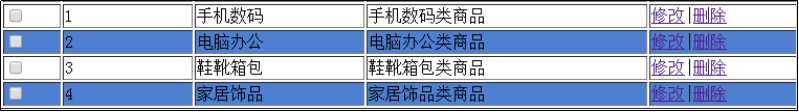

分析：

​	1、选中偶数行(获取元素其它几种方式)

​	2、数组

## 2.2、JavaScript知识讲解（二）

### **2.2.1、JS数组**

Java中数组和集合的区别：

​	1、数组的长度不可变，集合的长度可变

​	2、数组只能存同一种数据类型(Object [])，集合可以存任意数据类型

​	3、数组既能存基本数据也能存引用数据类型，集合只能存储引用数据类型 list.add(1);


JS中的数组相当于Java中的集合，特点：长度可变、可以存任意数据类型

数组创建方式：

| 方式                                       | 方式说明                                     |
| ---------------------------------------- | ---------------------------------------- |
| **Var  arr= [**'a','b','c',true,10**];** | 常用的JS数组创建方式。 数组长度为5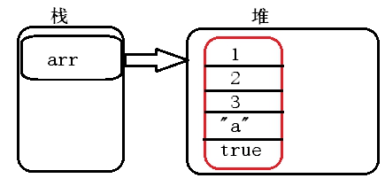 |
| **var arr = new Array();**               | 常用的JS数组创建方式。创建一个数组对象，数组长度默认为0 。默认值：undefined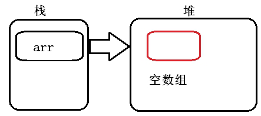 |
| var arr = new Array(4);                  | 数组长度是4，相当于开辟了度长为4的空间，每个元素是undefined。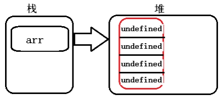 |
| var arr = new Array(“a”,”b”,true);       | 创建了一个数组，长度3, 	数组元素是”a”,”b”,true 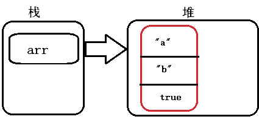 |
|                                          |                                          |

```javascript
<script>
			//方式一
			var arr1 = ["hello",true,12.13,null];
			//数组的长度
			alert(arr1.length);
			//遍历数据
			for (var i=0;i<arr1.length;i++) {
				alert(arr1[i]);
			}
			//访问索引为4的元素
			arr1[4] = "heihie";
			alert(arr1[4]);
		</script>
```

### 2.2.2、获取元素对象的四种方式

通常情况下，我们使用document，即DOM对象，就可以获取并操作页面元素标签，进而改变页面效果。

根据ID获取元素对象：document.getElementById("id名")  返回的类型：单个对象

准备代码

```html
<span id="s1">span1111</span>

		<hr />

		<input type="radio" name="sex" value="man"/>男

		<input type="radio" name="sex" value="woman"/>女

		<hr />

		<div>div1111</div>

		<div>div2222</div>

		<div>div3333</div>

		<hr />

		<font class="redF">红色字体1</font>

		<font class="redF">红色字体2</font>

		<font class="redF">红色字体3</font>

		<br />

		<input type="button" value="点击展示span内容体" onclick="run1()" />

		<input type="button" value="点击展示两个单选框的value" onclick="run2()"/>

		<input type="button" value="点击展示三个div的内容体" onclick="run3()" />

		<input type="button" value="点击展示三个font的内容体" onclick="run4()" />

```

document对象方法-DOM

| 方法名                             | 方法说明                                |
| ------------------------------- | ----------------------------------- |
| getElementById(id值)             | 通过元素的ID值 获取到某个元素对象 返回：单个对象，因为id是唯一的 |
| getElementsByName(name值)        | 通过元素的name值 获取到所有符合要求的元素对象，返回的是数组    |
| getElementsByTagName(标签名)元素/标签名 | 通过元素的标签名 获取到所有符合要求的元素对象，返回的是数组      |
| getElementsByClassName(class值)  | 通过元素的class值 获取到所有符合要求的元素对象，返回的是数组   |

```javascript
<script>
			function run1(){
				//使用id获取
				var span = document.getElementById("s1");
				alert(span.innerHTML);
			}
			function run2(){
				//使用name获取
				var arr = document.getElementsByName("sex");
				for(var i=0;i<arr.length;i++){
					alert(arr[i].value);
				}
			}function run3(){
				//使用标签名获取
				var arr = document.getElementsByTagName("div");
				for(var i=0;i<arr.length;i++){
					alert(arr[i].innerHTML);
				}
			}
			
			function run4(){
				//使用class获取
				var arr = document.getElementsByClassName("redF");
				for(var i=0;i<arr.length;i++){
					alert(arr[i].innerHTML);
				}
			}
		</script>
```

## **2.3、案例代码实现**

```<style>

```

```javascript
		.blue{
			background: blue;
		}
	</style>
	<script>
		function changeColor(){
			//1、获取序号为偶数的所有行
			var arr = document.getElementsByTagName("tr");
			
			for(var i=1;i<arr.length;i++){
				if(i % 2 == 0){
					//2、设置背景颜色为蓝色
					arr[i].className= "blue";
				}
			}
			
		}
	</script>
```
# **3、JavaScript知识讲解(三)**

## **3.1、DOM对象 **

### **3.1.1、DOM对象是什么？有什么作用？**

BOM:浏览器对象模型

是什么：DOM（Document Object Model） 文档对象模型  document

type="text"、name input属性

作用：DOM是将标记型文档(HTML)中所有内容（标签、文本、属性）都封装成对象，用于操作网页中的元素

**每个HTML页面**在被浏览器解析的时候都会在内存中**创建一棵DOM树**，我们通过编写JS代码就可以访问这棵树上任

何一个节点，并且对节点进行操作。通过 DOM模型，可以访问所有的 HTML 元素，连同它们所包含的文本和属性。可以对其中的内容进行修改和删除，同时也可以创建新的元素。新创建的元素对象，要挂到DOM树上才可以

在网页上显示出来。

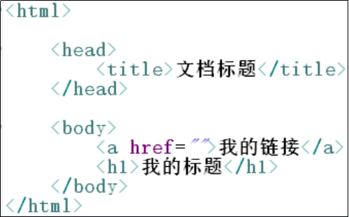

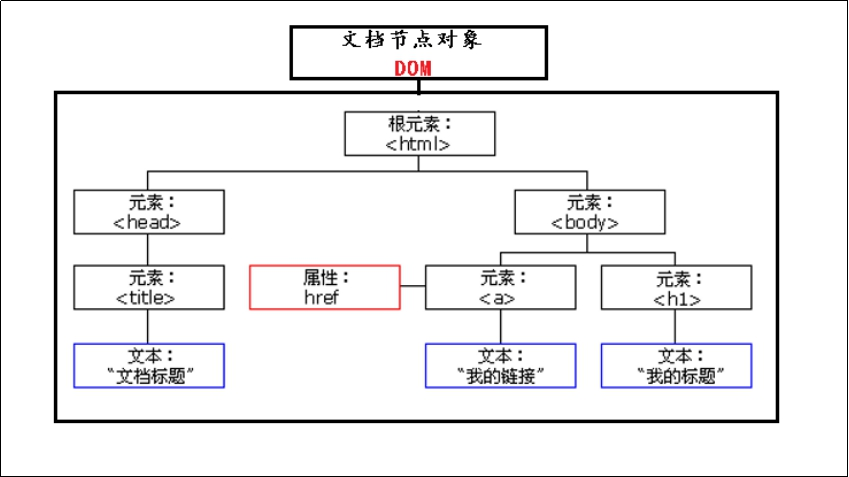

document.

## 3.2、JS事件总结

l 常见事件

| **事件名**       | **描述**            |
| ------------- | ----------------- |
| **onload**    | 页面加载完成事件          |
| **onsubmit**  | 表单提交事件            |
| **onclick **  | 点击事件              |
| ondblclick    | 双击事件              |
| **onblur **   | 失去焦点事件  前提：得先获取焦点 |
| **onfocus **  | 获取焦点事件            |
| **onchange ** | 值改变时事件            |

```html
<script>
			function run1(){
				alert("失去焦点了！！！");
			}
			function run2(){
				alert("获取焦点了！！");
			}
			function run3(obj){
				alert("值发生改变了！！"+obj.value);
			}
		</script>
	</head>
	<body>
		用户名：<input type="text"  onblur="run1()" />
		密码：<input type="text"  onfocus="run2()" />
		<select onchange="run3(this)">
			<option value="bj">北京</option>
			<option value="sh">上海</option>
			<option value="gz">广州</option>
		</select>
	</body>
```

this：当前被选中的元素对象

鼠标键盘事件：

| **事件名**         | **描述**                 |
| --------------- | ---------------------- |
| **onkeydown **  | 某个键盘的键被按下              |
| onkeypress      | 某个键盘的键被按下或按住           |
| **onkeyup **    | 某个键盘的键被松开              |
| onmousedown     | 某个鼠标按键被按下              |
| onmouseup       | 某个鼠标按键被松开              |
| **onmouseover** | 鼠标被移到某元素之上 鼠标移入        |
| **onmouseout**  | 鼠标从某元素移开 前提：必须先移入 鼠标移出 |

示例代码：

```html
<script>
			function run1(){
				alert("键位被按下了");
			}
			function run2(){
				alert("键位被弹起了");
			}
			function run3(){
				alert("鼠标移入了");
			}
			function run4(){
				alert("鼠标移出了");
			}
</script>

		<input value="某个键位被按下时会弹出窗口" onkeydown="run1()" />
		<hr />
		<input value="某个键位被弹起时会弹出窗口" onkeyup="run2()" />
		<hr />
		<input value="鼠标移入时会弹出窗口" onmouseover="run3()" />
		<hr />
		<input value="鼠标移出时会弹出窗口" onmouseout="run4()" />

```


# **4、案例3：全选-全不选-反选**

## **4.1、需求说明及分析 **

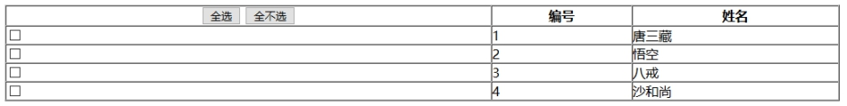

## **4.2、案例代码实现**

```javascript
<script>
			//全选
			function quan(){
				//1、获取所有复选框对象
				var arr = document.getElementsByClassName("itemSelect");
				//2、修改其checked属性为true    checked：true(被选中) false（取消选中）
				for(var i=0;i<arr.length;i++){
					arr[i].checked = true;
				}
			}
			//全不选
			function bu(){
				//1、获取所有复选框对象
				var arr = document.getElementsByClassName("itemSelect");
				//2、修改其checked属性为false   checked：true(被选中) false（取消选中）
				for(var i=0;i<arr.length;i++){
					arr[i].checked = false;
				}
			}
			//反
			function fan(){
				//1、获取所有复选框对象
				var arr = document.getElementsByClassName("itemSelect");
				//2、修改其checked属性为false
				for(var i=0;i<arr.length;i++){
					//方式一：
				/*	if(arr[i].checked){
						//checked修改为false
						arr[i].checked = false;
					}else{
						//checked修改为true
						arr[i].checked = true;
					}*/
					//方式二：
					arr[i].checked = !arr[i].checked;
					
				}
			}
		</script>
```

# **5、jquery入门**

## **5.1、jQuery简述** 

> jQuery是一个快速、简洁的JavaScript框架，是继Prototype之后又一个优秀的JavaScript代码库（*或JavaScript框架*）。jQuery设计的宗旨是“write Less，Do More”，即倡导写更少的代码，做更多的事情。它封装JavaScript常用的功能代码，提供一种简便的JavaScript设计模式，优化HTML文档操作、事件处理、动画设计和Ajax交互。
>
> jQuery的核心特性可以总结为：具有独特的链式语法和短小清晰的多功能接口；具有高效灵活的css选择器，并且可对CSS选择器进行扩展；拥有便捷的插件扩展机制和丰富的插件。jQuery**兼容各种主流浏览器**，如IE 6.0+、FF 1.5+、Safari 2.0+、Opera 9.0+等。

核心理念：wirte less,do more  写的更少，做的更多

## **5.2、jQuery的引入及使用**

jQuery版本有很多，不同版本的jQuery之间方法和功能有一定改变。

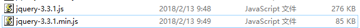

 .min.js  压缩版

压缩版和非压缩版的区别：

​	1、压缩版将代码中的回车换行、注释等等内容给删掉了

​	2、功能是一模一样的

​	3、学习、开发阶段使用非压缩版，项目上线使用压缩版


**引入：**

```javascript
<script type="text/javascript" src="../js/jquery-3.3.1.js" >
</script>
```

如果未引入，控制台报以下异常：

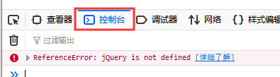


**使用：**

​	方式一：jQuery("选择器")

​	方式二：$("选择器")(建议)

```javascript
<script>
			function getValue(){
				//jquery方式一
				var val = jQuery("#ll").val();
				//alert(val);
				//jquery方式二
				//js对象
				document.getElementById("ll");
				//jq对象
				var ele = $("#ll");
				alert(ele.val());
			}
</script>
```

## **5.3、jQuery对象和JS对象的互转**

document.getElementById("ll")    返回的是JavaScript对象

$("#ll")  返回的是Jquery对象


js对象不能调用jquery中的方法或者属性，同样的，jq对象不能调用js中的方法或属性

但是在开发中，会涉及到两个对象的混用


JS和Jq的相互转换：

​	js对象 = jq[0]  或者 jq.get(0)     jq对象本质上是一个js数组

​        jq对象 = $(js对象);

```javascript
function getValue(){
				//jq对象
				var jq1 = $("#ll");
				//jq对象转为js对象
				var js = jq1[0];
				//alert(js.value);
				//js对象转为jq对象
				var jq2 = $(js);
				alert(jq2.val());
			}
function run(){
				//使用jq方式获取input元素对象
				var jq = $("input");
				//分别获取四个input的value值
				for(var i=0;i<jq.length;i++){
					//jq[i] 是一个js对象
					alert(jq[i].value);
				}
			}
<input type="text" id="ll" onclick="getValue()" value="lucy"/>
	
		用户名：<input type="text"/></br>
		密码：<input type="password" /><br />
		<input type="button" value="获取input的value" onclick="run()" />
```


## **5.4、jQuery页面加载完成时执行代码**

```javascript
<script>
			//页面加载完成方式一(不常用)
			/*$(document).ready(function(){
				alert("页面加载完成！！");
			})*/
			//页面加载完成方式二
			$(function(){
				alert("哈哈哈");
			})
			$(function(){
				alert("呵呵呵");
			})
			$(function(){
				alert("嘿嘿嘿");
			})
		</script>
```

注意：jq中的页面加载完成事件不会覆盖，从上到下执行！！！！


```javascript
			
			$(function(){
              //页面加载完成执行里面的代码
				//alert("哈哈哈");
				//1、获取按钮对象
				var b = document.getElementById("button");
				//2、给其一个点击事件
				b.onclick = function(){
					alert($("#username").val());
				}
			})

		用户名：<input type="text" id="username"/></br>
		<input type="button"   id="button" value="获取用户名的值" />
```


jq中获取value值：jq对象.val();

jq中设置value值：jq对象.val(值);

## **5.5、jQuery基本选择器**

和CSS基本选择器一样


ID选择器：$("#id名");

类选择器：$(".类名")

元素选择器：$("元素名")

 ```javascript
<script>
			$(function(){
				//alert($("#username").val());
				var sex = $(".sex");
				for (var i=0;i<sex.length;i++) {
					alert(sex[i].value);
				}
				var input = $("input");
				for (var i=0;i<input.length;i++) {
					alert(input[i].value);
				}
			})
		</script>
	</head>
	<body>
		用户名：<input type="text" id="username"/></br>
		性别：<input type="radio" class="sex" value="man" /> 男
			<input type="radio" class="sex" value="woman" /> 女
		<input type="button"   id="button" value="获取用户名的值" />
	</body>
 ```


 

 

 

 

 

 

 

 

 

 