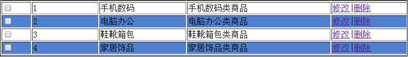
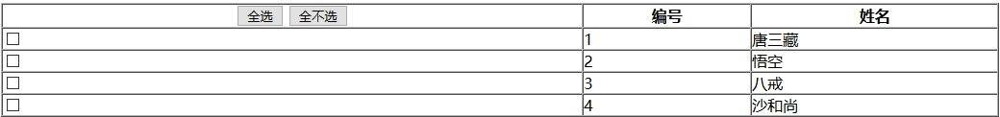
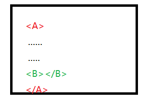
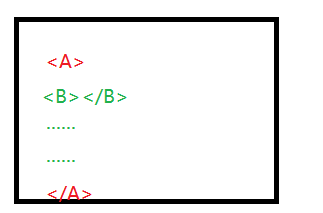
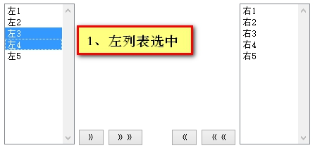
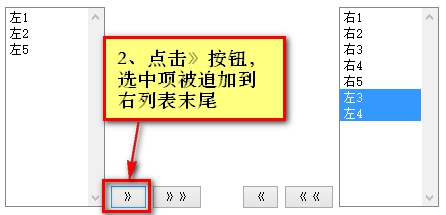
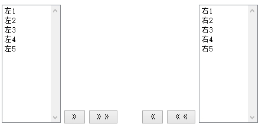
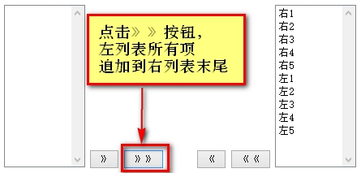

# **Day05笔记**

昨日内容回顾：

1、请分别写出如何获取/设置value值、元素内容体、当前页面路径、单选/复选框状态、class名字的代码

​	JS方式：

​		获取：.value、.innerHTML、location.href、.checked、.className

​		设置：.value = 值  .......

​	jq方式：

​		获取value：.val();

​		设置value：.val(值)

2、InnerHTML 和 innerText的区别

3、Java中数组和集合的区别（面试题）

4、JS中数组的特点以及创建方式

​	特点：长度可变、可存储任意类型

​	创建：var arr = [1,2,3,4];

​		    var arr2 = new Array(4);

​		   var arr3 = new Array(1,2,3,4);

5、获取元素对象的四种方式是什么，返回值是什么？

​	document.getElementById()   id是唯一的  返回单个对象

​	document.getElementsByName()   返回是数组

​	document.getElementsByClassName()

​	document.getElementsByTagName()

6、请谈谈你对DOM的理解

7、请列出你所知道的全部js事件(多多益善)

​	onclick、ondblclick、onload、onsubmit、onfocus、onblur、onchange

​	onkeydown、onkeyup、onmouseover、onmouseout

8、Jq是什么，和js有什么关系

​	是一个js库  核心理念：wirte less,do more 

9、Jq如何引入，如果没有引入成功，会有什么样的后果？

​	$ not defined

10、JS对象和jq对象如何相互转换

​	document 获取的是JS对象   .value

​	$() 获取的是jq对象   .val();

​	js 对象 = jq对象[0];

​	jq对象 = $(js对象)

11、请分别写出js方式和jq方式的页面加载完成执行的代码，两种方式有什么不同

​	js方式：onload

​	jq方式：

​		$(document).ready(function())

​		$(function(){})

12、Jq中三种基本选择器是什么？如何书写？

​	$("#id")  

​	$(".class名")

​	$("元素名")

13、代码效果出不来，你学会调出控制台去看了嘛？

# **1、案例1：重写弹出广告**

## **1.1、需求说明**

- 网站顶部在页面打开两秒后显示广告图；
- 广告图展示两秒后关闭广告图；

## **1.2、知识讲解-jQuery(一)**

### **1.2.1、jQuery动画效果**

代码准备：

```html
		<style>
			#d1{
				background-color:lightskyblue;
				width:300px;
				height:300px;
			}
		</style>
		<script>
			//展示
			function run1(){			
			}
			//隐藏
			function run2(){
			}
			//切换显示/隐藏
			function run3(){	
			}
		</script>

<div id="d1"></div>

<input type="button" value="展示" onclick="run1()" />

<input type="button" value="隐藏" onclick="run2()" />

<input type="button" value="切换显示/隐藏" onclick="run3()" />

```

以下所有动画效果方法中都有两个参数：

- speed   动画效果的持续时间   单位：毫秒
- fn   动画效果完成后调用的函数  (回调函数)


**基本效果：**(放大缩小效果)

| 属性名               | 属性说明                 |
| ----------------- | -------------------- |
| show(speed,fn);   | 显示元素                 |
| hide(speed,fn);   | 隐藏元素                 |
| toggle(speed,fn); | 1、使得显示元素隐藏2、使得隐藏元素显示 |

**滑动效果：**(上下滑动)

| 属性名                      | 属性说明                 |
| ------------------------ | -------------------- |
| **slideDown(speed,fn);** | 显示元素                 |
| **slideUp(speed,fn);**   | 隐藏元素                 |
| slideToggle(speed,fn);   | 1、使得显示元素隐藏2、使得隐藏元素显示 |

**淡入淡出效果：**

| 属性名                   | 属性说明                 |
| --------------------- | -------------------- |
| fadeIn(speed,fn);     | 显示元素                 |
| fadeOut(speed,fn);    | 隐藏元素                 |
| fadeToggle(speed,fn); | 1、使得显示元素隐藏2、使得隐藏元素显示 |
|                       |                      |

```javascript
<script>
			//展示
			function run1(){
				//1、选中div
				var div = $("#d1");
				//2、显示
				//div.show(2000)
				//div.slideDown(2000);
				div.fadeIn(2000,function(){
					alert("显示成功!!");
				});
			}
			//隐藏
			function run2(){
				//1、选中div
				var div = $("#d1");
				//2、隐藏
				//div.hide(2000)
				//div.slideUp(2000);
				div.fadeOut(2000,function(){
					alert("隐藏成功！");
				});
			}
			//切换显示/隐藏
			function run3(){
				//1、选中div
				var div = $("#d1");
				//2、切换
				//div.toggle(2000)
				//div.slideToggle(2000);
				div.fadeToggle(2000);
			}
		</script>
```


## 1.3、案例代码实现 

```javascript
<script>
			//页面加载完成
			$(function(){
			//2秒后弹出广告
			setTimeout("showImg()",2000);
			})
			//弹出广告
			function showImg(){
				//1、选中img元素对象
				var img = $("img");
				//2、调用滑动效果
				img.slideDown(2000,function(){
					//两秒后隐藏
					setTimeout("hideImg()",2000);
				});
				
			}
			//隐藏广告
			function hideImg(){
				//1、选中img元素对象
				var img = $("img");
				//2、调用滑动效果
				img.slideUp(2000);
			}
		</script>
	</head>
	<body>
		
		
	</body>
```


## **1.4、知识讲解-jQuery（二）**

### **1.4.1、层级选择器** 

- **A B**    获得A元素内部的所有的B元素。   子子孙孙
- **A>B**   获得A元素下面的所有B子元素。  儿子
- **A+B **  获得A元素**同级**下一个B元素  二弟
- **A~B**   获得A元素**同级**之后的所有B元素   所有弟弟

**代码准备：**

```html
<script>
			$(function(){
				//1、获取id为main的span标签 内 所有的div标签

				//2、获取id为main的span标签 内 子元素div标签

				//3、获取id为main的span标签 后 第一个div兄弟标签

				//4、获取id为main的span标签 后 所有的div兄弟标签

			});
</script>

<span id="main">

			<div>111111</div>

			<div>222222</div>

			<div>333333</div>

			<span>

				<div>44444</div>

			</span>

</span>

		<div>55555</div>

		<span>

			<div>66666</div>

		</span>

		<div>77777</div> 

```

```javascript
$(function(){
				//1、获取id为main的span标签 内 所有的div标签
					/*var arr1 = $("#main div");
					for(var i=0;i<arr1.length;i++){
						alert(arr1[i].innerHTML);
					}*/
				//2、获取id为main的span标签 内 子元素div标签
					/*var arr1 = $("#main>div");
					for(var i=0;i<arr1.length;i++){
						alert(arr1[i].innerHTML);
					}*/
				//3、获取id为main的span标签 后 第一个div兄弟标签
				/*var arr = $("#main+div");
				for(var i=0;i<arr.length;i++){
						alert(arr[i].innerHTML);
					}*/

				//4、获取id为main的span标签 后 所有的div兄弟标签
				var arr = $("#main~div");
				for(var i=0;i<arr.length;i++){
						alert(arr[i].innerHTML);
					}
			});
```


### 1.4.2、属性选择器

我们可以通过属性选择器，以属性名或者值来匹配对应标签

<input type="radio" value="woman" />

<input type="password" value="123" />

- **[属性名]**			获得有 **指定属性名** 的标签对象。  [type]
- **[属性名=值]**         获得 指定属性名**等于**指定值 的标签对象 [type=radio]
- **[属性名\*=值]**         获得 指定属性名 **含有** 指定值 的标签对象  [type*=o]


多个属性选择器可以组合使用

[选择器1][选择器2]..

**代码准备：**

```html
<script>

			$(function(){

				//1、获取所有存在type属性的标签

				//2、获取所有type属性为radio的标签

				//3、获取所有type属性含有o的标签

				//4、获取所有input标签中的单选框，且name为sex的标签

			});

		</script>
		用户名：<input type="text" name="uname" value="小刘"/><br />

		密码：<input type="password" name="pwd" value="123"/><br />

		性别：<input type="radio" name="sex" value="man" />男

			  <input type="radio" name="sex" value="woman" />女<br />

		是否VIP：<input type="radio" name="vip" value="no" />不是

			  	 <input type="radio" name="vip" value="yes" />是<br />
 
```

```javascript
$(function(){

				//1、获取所有存在type属性的标签
				/*var arr = $("[type]");
				alert(arr.length);*/
				//2、获取所有type属性为radio的标签
				/*var arr = $("[type=radio]");
				for(var i=0;i<arr.length;i++){
						alert(arr[i].value);
				}*/
				//3、获取所有type属性含有o的标签
				/*var arr = $("[type*=o]");
				for(var i=0;i<arr.length;i++){
						alert(arr[i].value);
				}*/
				//4、获取所有input标签中的单选框，且name为sex的标签
					var arr = $("input[type=radio][name=sex]");
					for(var i=0;i<arr.length;i++){
						alert(arr[i].value);
				}
			});
```

### 1.4.3、基本过滤选择器

通常我们在获取到一系列标签对象之后，会有一些筛选需求，

这里就可以使用基本过滤选择器。

- :first	   获取第一个元素     
- :last            获取最后一个元素
- :even         获取索引为偶数的元素      索引从0开始
- :odd          获取索引为奇数的元素
- :not(..)       除了           1234:not(2)  ==> 134
- :eq(index)      获取索引为index的元素
- :gt(index)     获取索引大于index的元素
- :lt(index)         获取索引小于index的元素

**代码准备：**

```html
<script>

			$(function(){

				//1、在所有DIV标签中，获取第一个div

				//2、在所有DIV标签中，获取最后一个div

				//3、在所有DIV标签中，获取所有偶数位的div

				//4、在所有DIV标签中，获取所有奇数位的div

				//5、在所有DIV标签中，获取除了第一位以外所有的div

				//6、在所有DIV标签中，获取索引等于1的div

				//7、在所有DIV标签中，获取索引大于1的div	

				//8、在所有DIV标签中，获取索引小于1的div
			});

</script>

		<div>11111111，索引是0</div>

		<div>22222222，索引是1</div>

		<div>33333333，索引是2</div>

		<div>44444444，索引是3</div>

		<div>55555555，索引是4</div>

		<div>66666666，索引是5</div>

		<div>77777777，索引是6</div>

		<div>88888888，索引是7</div>

```

```javascript
$(function(){

				//1、在所有DIV标签中，获取第一个div
					//var arr = $("div:first");
					/*var arr = $("div:eq(0)");
					for(var i=0;i<arr.length;i++){
						alert(arr[i].innerHTML);
					}*/
				//2、在所有DIV标签中，获取最后一个div
					/*var arr = $("div:last");
					for(var i=0;i<arr.length;i++){
						alert(arr[i].innerHTML);
					}*/
				//3、在所有DIV标签中，获取所有偶数位的div
					/*var arr = $("div:even");
					for(var i=0;i<arr.length;i++){
						alert(arr[i].innerHTML);
					}*/
				//4、在所有DIV标签中，获取所有奇数位的div
					/*var arr = $("div:odd");
					for(var i=0;i<arr.length;i++){
						alert(arr[i].innerHTML);
					}*/
				//5、在所有DIV标签中，获取除了第一位以外所有的div
					/*var arr = $("div:not(div:first)");
					for(var i=0;i<arr.length;i++){
						alert(arr[i].innerHTML);
					}*/
				//6、在所有DIV标签中，获取索引等于1的div
					var arr = $("div:eq(1)");
					for(var i=0;i<arr.length;i++){
						alert(arr[i].innerHTML);
					}
				//7、在所有DIV标签中，获取索引大于1的div	
				var arr = $("div:gt(1)");
					for(var i=0;i<arr.length;i++){
						alert(arr[i].innerHTML);
					}
				//8、在所有DIV标签中，获取索引小于1的div
				var arr = $("div:lt(1)");
					for(var i=0;i<arr.length;i++){
						alert(arr[i].innerHTML);
					}
			});
```


### **1.4.4、表单属性选择器**


- **:checked**	单选框/复选框选中
- **:selected**       下拉框被选择
- :enabled        可用
- :disabled       不可用。

**代码准备：**

```html
<script>
			$(function(){
				//获取可用的表单输入项

				//获取不可用的表单输入项

				//获取选中的复选框

				//获取国家下拉框中，被选中的option 

			});

		</script>

		<h1>不可用的表单输入项</h1>

		<input type="text" disabled="disabled" />

		<input type="button" value="不可用按钮" disabled="disabled" />

		<h1>复选框</h1>

		<input type="checkbox" name="hobby" value="code"/>编程

		<input type="checkbox" name="hobby" value="swimming" 						checked="checked"/>游泳

		<input type="checkbox" name="hobby" value="reading" checked="checked"/>			阅读
		<hr />
		<h1>下拉选择框</h1>
		城市：<select id="city">
			<option value="">请选择</option>
			<option value="bj">北京</option>
			<option value="sh">上海</option>
		     </select>

		<hr />

		国家：<select id="country" multiple="multiple">

			<option value="China" selected="selected">中国</option>

			<option value="America" selected="selected">美国</option>

			<option value="Russia">俄罗斯</option>

			<option value="England">英国</option>

		</select>

```

 ```javascript
$(function(){
				//获取可用的表单输入项
				/*var arr = $("input:enabled");
				alert(arr.length);*/
				//获取不可用的表单输入项
				/*var arr = $("input:disabled");
				alert(arr.length);*/
				//获取选中的复选框
				//$("[type=checkbox]:checked");
				//获取国家下拉框中，被选中的option 
				var arr = $("#country>option:selected");
				for(var i=0;i<arr.length;i++){
						alert(arr[i].value);
				}
			});

 ```

# **2、案例2：重写隔行换色**

## **2.1、需求说明**

开发中，需要使用表格陈列数据，数据过多不易查看，通常使用隔行换色进行表示。

 

## **2.2、知识讲解-jQuery（三）**

js操作class属性：

​	js对象.className = 值

### **2.2.1、jQuery操作class属性**

**代码准备：**

```html
<style>
			.blueDiv{
				background-color: #87CEFA;
				width:300px;
				height:300px;
			}
			.redDiv{
				background-color: red;
				width:300px;
				height:300px;
			}
</style>
<script>
		$(function(){
				//1、设置d1这个div标签样式为blueDiv
				//2、移除d2这个div标签的redDiv样式
			});
		</script>
		<div id="d1">11111</div>
		<div id="d2" class="redDiv">22222</div>
```

```javascript
		$(function(){
				//1、设置d1这个div标签样式为blueDiv
				$("#d1").addClass("blueDiv");//追加样式
				//2、移除d2这个div标签的redDiv样式
				$("#d2").removeClass();//移除class
			});
```


## 2.3、需求分析

## **2.4、案例代码实现**

```javascript
$(function(){
				$("tr:gt(0):odd").addClass("blue");
})
```


# **3、案例3：重写全选全不选、反选**

## **3.1、需求说明及分析**



## **3.2、知识讲解-jQuery(四)**

- **prop("属性名"); **   获取指定属性的值     ==>   attr("属性名")     prop("value")  等价于  val()    
- **prop("属性名",属性值);**   ==> attr(属性名，属性值)   指定某个属性名的值为 属性值
- removeProp("属性名");  移除某个属性    ==> removeAttr(属性名)   (注意一下版本问题)

**代码准备：**

```html
<style>

			.blueDiv{

				background-color: #87CEFA;

				width:300px;

				height:300px;

			}

			.redDiv{

				background-color: red;

				width:300px;

				height:300px;

			}

		</style>

		<script>

			$(function(){

				//1、获取d2这个div标签的class值

				//2、设置d1这个div标签样式为blueDiv

				//3、移除d2这个div标签的redDiv样式

			});

		</script>

<div id="d1">11111</div>

<div id="d2" class="redDiv">22222</div>

```

```javascript
$(function(){
				//1、获取d2这个div标签的class值
				 var c = $("#d2").prop("class");
				 //alert(c);
				//2、设置d1这个div标签样式为blueDiv
				$("#d1").prop("class","blueDiv");
				//3、移除d2这个div标签的redDiv样式
				$("#d2").removeAttr("class");
			});
```


## **3.3、案例代码准备及实现**

结论：

- 数组调用prop("checked",true)，给数组**设置值**，可以一次性的将数组中的元素设置为相同的值(内部进行了遍历)！
- 数据调用prop("checked")，数组获取值时，仅能将数组中第一个元素的值获取到！！

```javascript
<script>
			//全选
			function quan(){
				//1、获取所有复选框对象
				var arr = $(".itemSelect");
				//2、将其checked值设置为true
				arr.prop("checked",true);
			}
			//全不选
			function bu(){
				//1、获取所有复选框对象
				var arr = $(".itemSelect");
				//2、将其checked值设置为false
				arr.prop("checked",false);
			}
			//反选
			function fan(){
				//此种方式行不通
				//1、获取所有复选框对象
				//var arr = $(".itemSelect");
				//var temp = $(".itemSelect").prop("checked");
				//2、将其checked值设置为false
				//arr.prop("checked",!temp);
				//方式一
			/*	var arr = $(".itemSelect");
				for(var i=0;i<arr.length;i++){
					//获取每个元素的checked值
					var temp = $(arr[i]).prop("checked");
					//取反
					$(arr[i]).prop("checked",!temp);
				}*/
				//方式二
				//1、获取所有被选中的复选框
				var arr1 = $(".itemSelect:checked");
				//2、获取所有未被选中的复选框
				var arr2 = $(".itemSelect:not(:checked)");
				//3、设置为false
				arr1.prop("checked",false);
				//4、设置为true
				arr2.prop("checked",true);
			}
		</script>
```


## **3.4、扩展-反选实现（一）**

代码见上！

## **3.5、反选实现（二）**

**Jq数组的遍历方式：**

| 属性名                         | 属性说明   |
| --------------------------- | ------ |
| **JQ数组.each(fn);**  fn：回调函数 | 遍历JQ数组 |
| **$.each(JQ数组,fn);**        | 遍历JQ数组 |

```javascript
<script>
			//定义数组
			var arr = ["西游记","三国演义","水浒传","红楼梦"];
			//JS方式：遍历数组
			for(var i=0;i<arr.length;i++){
				//alert("索引为："+i+"，元素为："+arr[i]);
			}
			//Jq方式一
			//index：每次遍历的索引
			//this：数组中每次遍历的元素    是JS对象
			$(arr).each(function(index){
				//alert("索引为："+index+"，元素为："+this);
			})
			//Jq方式二
			$.each($(arr),function(index){
				alert("索引为："+index+"，元素为："+this);
			})
		</script>
```

反选实现：

```javascript
//jq方式
				//1、获取所有复选框对象
				var arr = $(".itemSelect");
				//2、遍历
				arr.each(function(){
					//获取每个复选框对象的checke属性值
					var temp = $(this).prop("checked");
					//取反
					$(this).prop("checked",!temp);
				})
```

# 4：案例4：省市联动

## **4.1、需求说明及分析**

## **4.2、知识讲解-jQuery(五)**

### **4.2.1、元素value属性操作**

**jQuery中，还有一种快捷操作方式：**

| 属性名              | 属性说明        |
| ---------------- | ----------- |
| **JQ对象.val();**  | 获取value属性的值 |
| **JQ对象.val(值);** | 设置value属性的值 |

**准备代码**：

```html
	<input type="text" id="uname" value="黄蓉" /><br />

	<input type="button" value="点击获取输入框的value值" onclick="run1()" />

	<input type="button" value="点击设置输入框的value值" onclick="run2()" />

```

### **4.2.2、获取/设置元素内容体**

**1、获取/设置元素内容体HTML代码**

| 属性名                      | 属性说明                            |
| ------------------------ | ------------------------------- |
| **JQ对象.html()	**         | 获得内容体html代码 相当于js对象.innerHTML   |
| **JQ对象.html("HTML代码")	** | 设置html代码  相当于js对象.innerHTML = 值 |

**2、获取/设置元素内容体纯文本**

| 属性名                   | 属性说明                       |
| --------------------- | -------------------------- |
| **JQ对象.text()	**      | 获得文本，如果有HTML标签，忽略。         |
| **JQ对象.text("纯文本")	** | 设置文本，如果含有HTML标签，不进行解析。原样输出 |

**准备代码：**

```html
<div id="d1">
			<font color="red">你好</font>
</div>
		<hr />
		<input type="button" value="点我获取内容体代码" onclick="run1()"/>
		<input type="button" value="点我设置内容体代码为蓝色字体"  	        onclick="run2()"/>
		<hr />
		<input type="button" value="点我获取内容体纯文本" onclick="run3()"/>
		<input type="button" value="点我设置内容体纯文本" onclick="run4()"/>
```

```javascript
function run1(){
				var html = $("#d1").html();
				alert(html);
			}
			function run2(){
				 $("#d1").html("<font color='blue'>happy new year!!</font>");
		
			}
			function run3(){
				var text = $("#d1").text();
				alert(text);
			}
			function run4(){
				 $("#d1").text("<font color='blue'>happy new year!!</font>");
		
			}
```

### 4.2.3、追加元素内容体



**以下两句效果相同，写法不同**

- **A.append(B) **, 向A的末尾追加B  
- B.appendTo(A) ，将B追加到A的末尾



**以下两句效果相同，写法不同**

- **A.prepend(B)** , 向A的头部追加B     
- B.prependTo(A) ，将B追加到A的头部


**准备代码：**

```html
<ul id="rank">

			<li>Php</li>

			<li>Android</li>

			<li>Ios</li>

		</ul>

		<hr />

		<input type="button" value="列表尾部追加Java" onclick="run1()" />

		<input type="button" value="列表头部追加Java" onclick="run2()" />

```

```javascript
<script>
			function run1(){
				//1、往哪追加
				var ul = $("#rank");
				//2、追加什么
				//ul.append("<li>Java</li>")
				$("<li>Java</li>").appendTo(ul);
			}
			function run2(){
				//1、往哪追加
				var ul = $("#rank");
				//2、追加什么
				//ul.prepend("<li>Java</li>")
				$("<li>Java</li>").prependTo(ul);
			}
		</script>
```


## **4.3、案例准备及代码实现**

```javascript
function changeCity(val){
			//根据val得到对应的城市信息
			var arr = cities[val];
			//往哪追加
			var city = $("#city");
			//追加前恢复到初始状态
			city.html("<option value=''>----请-选-择-市----</option>")
			//遍历数组
			$(arr).each(function(){
				//追加什么
				var temp = "<option>"+this+"</option>"
				//追加
				city.append(temp);
			})
		}

<select id="province" onchange="changeCity(this.value)"
```


# **5、案例5：列表左右选择**

## **5.1、需求说明及分析**










## **5.2、案例实现**

```javascript
$(function(){
				$("#left1").click(function(){
					//往哪追加
					var right = $("#rightSelectId");
					//追加什么
					var left = $("#leftSelectId>option:selected");
					//追加
					right.append(left);
				})
				$("#left2").click(function(){
					//往哪追加
					var right = $("#rightSelectId");
					//追加什么
					var left = $("#leftSelectId>option");
					//追加
					right.append(left);
				})
			})

		<input type="button" value="》" id="left1"/>
		<input type="button" value="》》" id="left2"/>
```


 

 

 

 

 

 