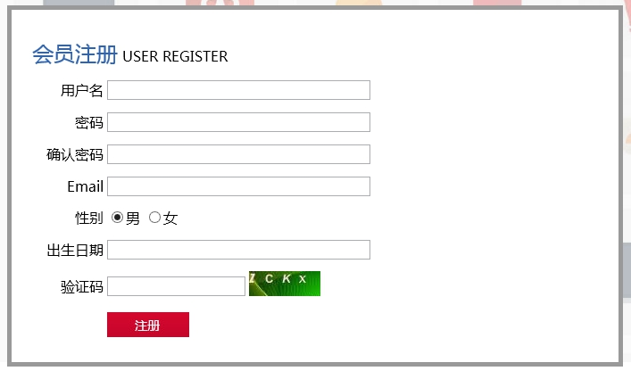
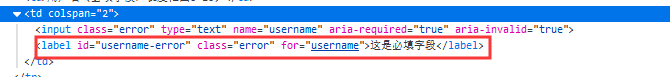
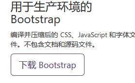
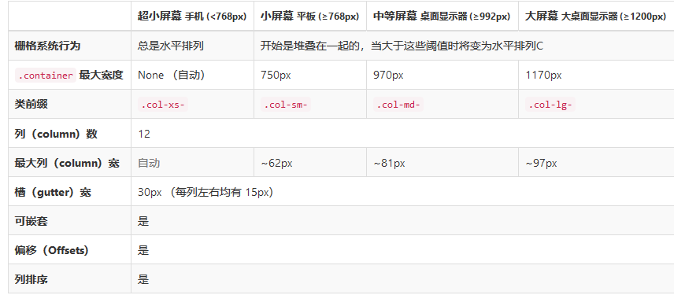
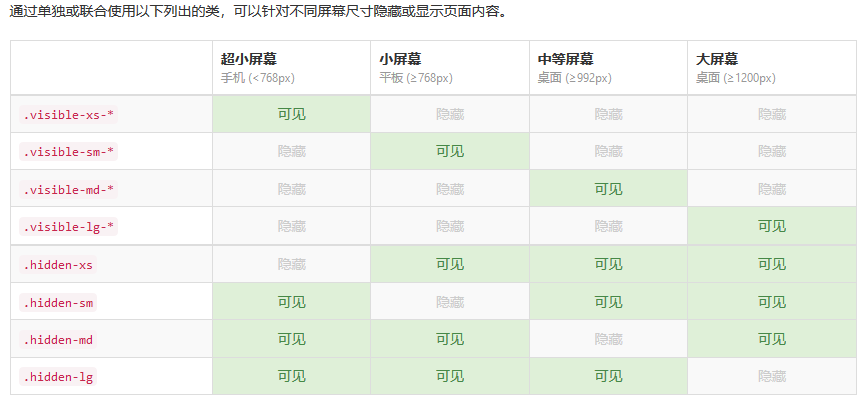
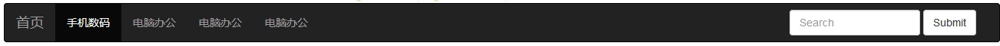

# Day06笔记

昨日内容回顾：

1、 请解释slidedown(参数1，参数2)中两个参数的意思(jq动画效果)

参数一：动画效果的持续时间

参数二：动画效果完成后回过来调用的函数

2、 层级选择器中：A  B、A>B分别代表什么意思

A B   A>B   A+B   A~B

3、 <input type=”text” value=”嘿嘿嘿”/>

根据type属性获取该元素：$(“[type]”)

根据嘿嘿嘿获取该元素：$(“[value=嘿嘿嘿]”)

[value*=A]

4、 请写出你知道的过滤选择器

:first :last :odd :even  :eq() :lt()  :gt()   :not(..)

5、 :checked 和 :selected的区别

6、 <input type=”text” id=”abc”/>

请给该元素对象追加一个class=blueDiv的样式：

Js方式：document.getElementById("abc").className="blueDiv"

Jq方式：$("#abc").addClass("blueDiv")

请将该元素对象的class样式移除：

  Jq:$("#abc").removeClass("blueDiv")

7、 <input type=”text” value=”嘿嘿嘿”id=”bb”/>

获取该元素对象的value值(两种)：val()、prop(value)

设置元素对象的value值(两种)：val(值),prop(value,值)

8、 请写出jq数组遍历的两种方式以及如何取得该数组的索引和元素：

​	jq数组.each(function(index){

​		//index  索引

​		//this   当前元素        js对象

​	})

​	$.each(jq数组，function(){})

9、 .html()  和 .html(“v”)的区别，.html()和.text()的区别

10、 请描述追加元素内容体的几种方式(头部追加&尾部追加)

​	头部追加：A.prepend(B)   B.prependTo(A)

​	尾部追加：A.append(B)  B.appendTo(A)

11、 请描述省市联动的实现思路

# **1、案例1：重写表单校验**

## **1.1、需求说明与分析**



> 要求：
>
> 1、用户名、密码、确认密码、Email、出生日期不能为空
>
> 2、用户名的长度在6-12之间
>
> 3、密码和确认密码必须保持一致
>
> 4、email必须符合邮箱格式
>
> 5、出生日期必须符合日期格式

## **1.2、JQuery插件-validation**

### **1.2.1、插件简述 **

- 先导入jquery
- 导入jquery.validate.js(dist目录下)
- 导入messages_zh.js（dist/localization目录下）

### **1.2.2、插件导入**

```javascript
<script type="text/javascript" src="../js/jquery-3.3.1.js" ></script>
<script type="text/javascript" src="../js/jquery.validate.js" ></script>
<script type="text/javascript" src="../js/messages_zh.js" ></script>
```


**准备代码：**

```html
<form id="f1">
			<table border="1" width="100%" cellpadding="0" cellspacing="0">
				<tr>
					<td colspan="3"><font color="cornflowerblue" size="5">测试						表单</font></td>
				</tr>
				<tr>
					<td>用户名（必填字段，长度范围6~10）</td>
					<td colspan="2">
						<input type="text" name="username"  />
					</td>
				</tr>
				<tr>
					<td>Email（符合邮件格式）</td>
					<td colspan="2">
						<input type="text" name="email" />
					</td>
				</tr>
				<tr>
					<td>出生日期（日期格式）</td>
					<td colspan="2">
						<input type="text" name="birthday" />
					</td>
				</tr>
				<tr>
					<td>薪资（数字）</td>
					<td colspan="2">
						<input type="text" name="sal" />
					</td>
				</tr>
				<tr>
					<td>一天工作时长（值范围6~16）</td>
					<td colspan="2">
						<input type="text" name="workForday" />
					</td>
				</tr>
				<tr>
					<td>密码（必须填写）</td>
					<td colspan="2">
						<input type="text" name="pwd" id="pwd"/>
					</td>
				</tr>
				<tr>
					<td>确认密码（必须填写，且与密码值要相同）</td>
					<td colspan="2">
						<input type="text" name="repwd" />
					</td>
				</tr>
				<tr>
					<td></td>
					<td colspan="2">
						<input type="submit" value="注册" />
					</td>
				</tr>
			</table>
		</form>
```

### **1.2.3、为指定表单加入校验**

validate需要手动的声明，对那个表单进行校验，及需要手动调用validate()方法。

```javascript
<script type="text/javascript">
	$(function () {
		//为指定表单加入校验
		$("#表单ID").validate();
	});
</script>
```

### **1.2.4、为校验加入规则**

**validate()方法中可以指定添加规则:**

```javascript
<script type="text/javascript">
	 $(function () {
		//为指定表单加入校验
		$("#表单ID").validate({
                rules:{
                  //name1 为那个input加入校验规则  代表input的name属性值
                   name1:{
                       规则1:规则值,
                       规则2：规则值
					},
				  name2:{
                       规则1:规则值,
                       规则2：规则值
					}
				}
			});
		});
</script>
```

- **规则速查表**

| 校验类型            | 取值           | 描述                                       |
| --------------- | ------------ | ---------------------------------------- |
| **required**    | true\|false  | 必填字段                                     |
| **email**       | true\|false  | 邮件地址                                     |
| **date**        | true\|false  | 日期，适用于通过的日期格式YYYY   YYYY-MM       YYYY-MM-dd    YYYY/MM/ddYYYY/MM/dd hh:mm:ss |
| dateISO         | true\|false  | 日期（YYYY-MM-dd）                           |
| **number**      | true\|false  | 数字（负数，小数）                                |
| digits          | true\|false  | 整数                                       |
| minlength       | 填写具体数字       | 最小长度                                     |
| maxlength       | 填写具体数字       | 最大长度                                     |
| **rangelength** | [minL,maxL]  | 长度范围                                     |
| min             |              | 最小值                                      |
| max             |              | 最大值                                      |
| **range**       | [min,max]    | 值范围                                      |
| **equalTo**     | jQuery选择器表达式 | 两个值相同.值相同允许，值不同不允许                       |
| **remote**      | url路径        | ajax校验                                   |
| **url**         |              | 路径                                       |

问题：将提示信息修改为红色



```css
<style>
			label{
				color: red;
			}
		</style>
```

### 1.2.5、为规则自定义错误信息

**messages可以为已经定好的规则自定义错误信息：**

```javascript
<script type="text/javascript">

	$(function () {
		//为指定表单加入校验
		$("#表单ID").validate({
             //rules：人家提供好的规则
                rules:{
                   name1:{
                       规则1:规则值,
                       规则2:规则值
					}		
				},
             //自定义错误信息
                messages:{
                   name1:{
                       规则1:"自定义错误信息"
              		  }
				}
			});
		});
</script>
```

range:[2,16]:

{0}  动态取出第一个值

{1} 动态取出第二个值

### **1.2.6、自定义校验规则（扩展-了解）**

如果希望自定义校验规则，需要在为表单加入校验之前，使用$.validator.addMethod完成。

**$.validator.addMethod(name , method , message);**

​	**参数1：name：**校验规则的名称。例如：required  range

​	**参数2：method：**执行校验时调用的函数。

​			//参数value：表单项的value值。

​			//参数ele：被校验的表单项对象。  一般不用

​			//参数params：使用当前校验规则传递的值。例如：rules : { 规则1: 规则值		            params }

​		function(value , ele , params ){

​			//该方法必须返回true或者false

​			//返回true，意味着符合规则

​			//返回false，意味着不符合规则，阻止表单提交，同时展示错误信息

} 

​	**参数3：message：**校验未通过时的提示信息

```javascript
//页面加载完成事件
			$(function(){
				//自定义校验规则
				$.validator.addMethod("idNumber",function(value,ele,params){
					//定义身份证正则表达式
					var req = /^[1-9]\d{7}((0\d)|(1[0-2]))(([0|1|2]\d)|3[0-1])\d{3}$|^[1-9]\d{5}[1-9]\d{3}((0\d)|(1[0-2]))(([0|1|2]\d)|3[0-1])\d{3}([0-9]|X)$/;
					return req.test(value);
				},"身份证号不合法!!!");
				
				//为表单加入校验
				$("#f1").validate({
					//加入规则
					rules:{
						//用户名
						username:{
							required:true,
							/*minlength:6,
							maxlength:10*/
							rangelength:[6,10]
						},
						//邮件
						email:{
							email:true
						},
						//出生日期
						birthday:{
							date:true
						},
						//薪资
						sal:{
							number:true
						},
						//工作时长
						workForday:{
							range:[2,16]
						},
						//密码
						pwd:{
							required:true
						},
						//确认密码
						repwd:{
							required:true,
							equalTo:pwd
						},
						//身份证
						idNumber:{
							idNumber:true
						}
					},
					//自定义提示信息
					messages:{
						//用户名
						username:{
							required:"亲，用户名必须填写喔！"
						},
						//密码
						pwd:{
							required:"亲，密码必须填写喔！~"
						},
						workForday:{
							range:"亲，一天工作不要少于{0}个小时，也不要多于{1}个小时"
						}
					}
				})
			})
```


作业：自定义一个校验手机号的规则！！！！

## **1.3、代码实现**

```javascript
<script>
			//为表单加入校验
			$(function(){
				$("#abc").validate({
					//加入规则
					rules:{
						username:{
							required:true,
							rangelength:[6,12]
						},
						pwd:{
							required:true
						},
						repwd:{
							required:true,
							equalTo:pwd
						},
						email:{
							required:true,
							email:true
						},
						birthday:{
							required:true,
							date:true
						}
					},
					messages:{
						username:{
							required:"用户名必填"
						}
					}
				})
			})
		</script>
```


# **2、BootStrap完成网站首页**

## **2.1、需求说明**

将使用Bootstrap写首页，整个案例中将使用到Bootstrap各种模块，为了方便编程，将采用拆分的原则，各个模块单独编写，最后组合。


## **2.2、知识讲解-BootStrap（一）**

### **2.2.1、bootstrap概述	**

#### **2.2.2.1、什么是bootstrap？bootstrap的作用？**

Bootstrap，基于 HTML、CSS、JAVASCRIPT 的**前端框架**。

该框架已经预定义了一套CSS样式和与样式对应的JS代码。

开发人员只需要编写HTML结构（div），添加bootstrap固定的class样式，就可以轻松完成指定效果的实现。(div class="")

作用：

① Bootstrap 使得 Web 开发更加快捷，高效。

② BootStrap支持响应式开发，解决了移动互联网前端开发问题

官网：http://www.bootcss.com/

#### **2.2.2.2、什么是响应式布局？响应式布局解决的问题？**

BootStrap

- 响应式布局：一个网站的展示能够兼容多个终端(手机、iPad、PC等)，而不需要为每个终端单独做一个展示版本。5.5寸，展示5.5寸的样式。7.9寸，展示7.9寸的样式

- 此概念专为解决移动互联网浏览而诞生的。

  响应式布局，使得网站仅适用一套样式，就可以在不同分辨率下展示出不同的舒适效果，大大降低了网站开发维护成本，并且能带给用户更好的体验性

### **2.2.2、bootstrap环境搭建**

#### **2.2.2.1、下载资源**



#### **2.2.2.2、bootstrap的通用简洁模板**

帮助手册位置：起步--基本模板

```html
<link rel="stylesheet" href="../../css/bootstrap.css" />
		<script type="text/javascript" src="../../js/jquery-3.3.1.js" ></script>
<script type="text/javascript" src="../../js/bootstrap.js" ></script>
```

测试是否引入成功：按钮(全局CSS样式-按钮)

## **2.3、案例一：首页之topbar**

### **2.3.1、需求说明**

> 1. 顶部导航中 显示对应图片和列表	
> 2. 顶部导航距离浏览器的两边要有距离
> 3. PC“大屏幕”整个topbar划分比例：1:1:1
> 4. IPAD“中等屏幕”，普通手机“小屏幕”, “超小屏幕”每个区域各占一行
> 5. 中间区域只在“大屏幕”显示


### **2.3.2、知识讲解-BootStrap（二）**

#### **2.3.2.1、布局容器**

BootStrap必须需要至少一个布局容器，才能为页面内容进行封装和方便的样式控制。

帮助手册位置：全局CSS样式-------》概览-------》布局容器

任意元素使用了布局容器的样式，都会成为一个布局容器，建议使用div作为布局容器 

​		

```html
<!--两端有留白-->	
<div class="container">
	</div>
<!--占据视口的100%-->	
	<div class="container-fluid">
		
	</div>
```
#### **2.3.2.2、栅格**

##### **2.3.2.2.1、简述栅格系统**

为了方便在布局容器中进行网页的布局操作。

BootStrap提供了一套专门用于响应式开发布局的栅格系统。

栅格系统将一行分为**12列**，通过设定元素占用的列数来 布局元素在页面上的展示位置。

帮助手册位置：全局CSS样式-----栅格系统

作用：

​	可以让开发人员更加轻松进行网页布局，并且轻松进行响应式开发。

##### **2.3.2.2.2、栅格系统的特点及入门案例**

- **栅格特点**
  - “行（row）”必须包含在 **.container** （固定宽度）或 .container-fluid （100% 宽度）中-
  - 行使用的样式“**.row**”，列使用样式“**col-\*-***” 元素内容应当放置于“列（column）”内
  - 基本的书写方式必须是：**容器(table)——---行(tr)---列(td)---内容**
- 栅格参数：“**col-屏幕尺寸-占用列数**”   
- 示例1：一个元素占一行


- 示例2：三个元素平分一行


- 示例3：六个元素平分一行


如果列数相加超过了12，超过的会另起一行

##### **2.3.2.2.3、栅格屏幕尺寸设置**

  帮助手册位置：全局CSS样式-----栅格系统--栅格参数



超小：xs

小：sm

中等：md

大屏幕：lg

 示例：中等屏幕尺寸，平分一行；小屏幕各占一行

##### **2.3.2.2.4、设置屏幕尺寸时的注意事项**

如果设置某个屏幕尺寸的样式，比该屏幕尺寸大的屏幕会沿用该屏幕尺寸的样式，比该屏幕尺寸小的屏幕默认占12列

需求：在任何屏幕尺寸下都平分一行！

```html
<!--容器-->
		<div class="container">
			<!--行-->
			<div class="row">
				<div class="col-xs-4">
					111111
				</div>
				<div class="col-xs-4">22222</div>
				<div class="col-xs-4">33333</div>
				
			</div>
			
		</div>
```

##### **2.3.2.2.5、列偏移**

通常情况下我们需要将元素居中显示，需要左边空出一定的空白区域，这里我们就可以使用列偏移来达到效果。

| .col-屏幕尺寸-offset-* | 在指定屏幕尺寸下，向右偏移*个列 |
| ------------------ | ---------------- |
|                    |                  |

**代码准备：**

```html
<style>
	div{
		border:1px solid red;
		height:100px;
	}
</style>
<!--要求：元素居中展示 -->
<div class="container">
			<div class="row">
				<div class="col-xs-4">111111</div>
			</div>
</div>

```

#### **2.3.2.3、响应式工具**

为针对性地在移动页面上展示和隐藏不同的内容，bootStrap提供响应式工具。

可以让开发人员通过该工具决定，在何种屏幕尺寸下，隐藏或者显示某些元素

帮助手册位置：全局CSS样式---响应式工具

 

**代码准备：**

```html
<style>
	div{
		border:1px solid red;
		height:100px;
	}
</style>
<!--要求：中间元素在大尺寸屏幕可见  超小屏幕尺寸隐藏-->
<div class="container">
			<div class="row">
				<div class="col-xs-4">111111</div>
				<div class="col-xs-4">222222</div>
				<div class="col-xs-4">333333</div>
			</div>
</div>
```

### **2.3.3、案例实现**

>   1、顶部导航中 显示对应图片和列表	
>
>   2、顶部导航距离浏览器的两边要有距离
>
>   3、PC“大屏幕”整个topbar划分比例：1:1:1
>
>   4、IPAD“中等屏幕”，普通手机“小屏幕”, “超小屏幕”每个区域各占一行
>
>   5、中间区域只在“大屏幕”显示

## **2.4、案例二：首页之导航**

### **2.4.1、需求说明**



### **2.4.2、知识讲解-BootStrap（三）**

#### **2.4.2.1、导航条**

BootStrap已经提供了完整的导航条实例，通常情况下，我们仅需进行简单修改即可使用。

帮助手册位置：组件-------导航条

### **2.4.3、案例实现**

## **2.5、案例三：首页之轮播图**

### **2.5.1、需求说明**

> 1、轮播三张图片
>
> 2、每2秒换一次图

### **2.5.2、知识讲解-BootStrap（四）**

#### **2.5.2.1、轮播图**

BootStrap已经提供了完整的轮播图实例，通常情况下，我们仅需进行简单修改即可使用。

帮助手册位置：JavaScript插件--- Carousel

### **2.5.3、案例实现**

## **2.6、案例四：首页之热门商品**

### **2.6.1、需求说明**

> 1、横着的大图只在大屏幕尺寸显示
>
> 2、竖着的大图在超小屏幕尺寸下隐藏


### **2.6.2、案例分析**

### **2.6.3、案例实现**

## **2.7、案例五：首页之footer**

### **2.7.1、需求说明** 


### **2.7.2、案例分析**

文本对齐：全局CSS样式----排版---对齐	

### **2.7.3、案例实现**

 

 