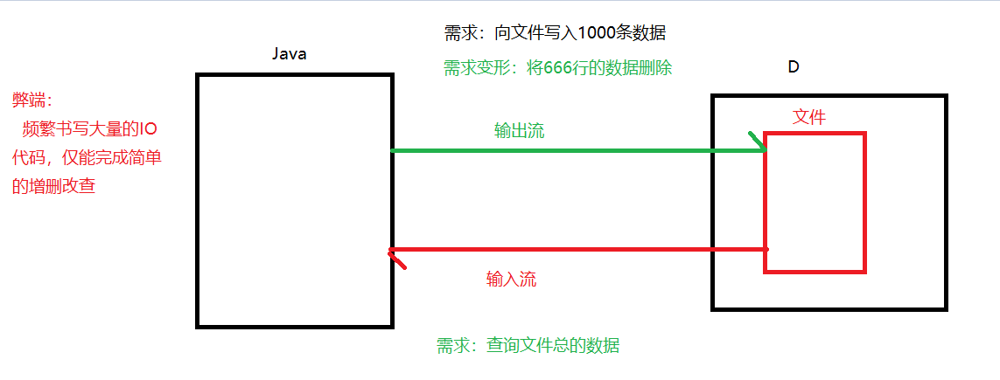
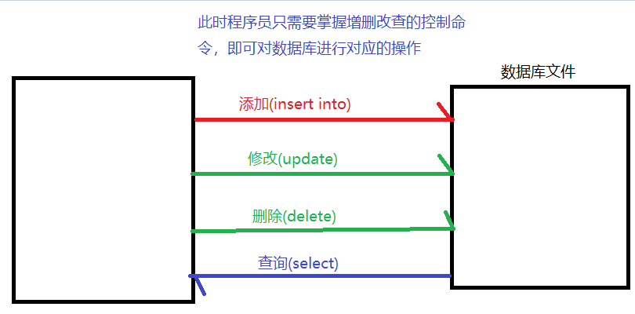
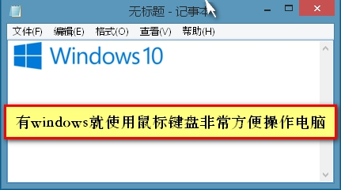
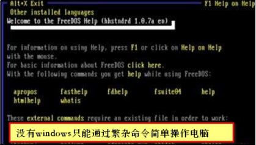
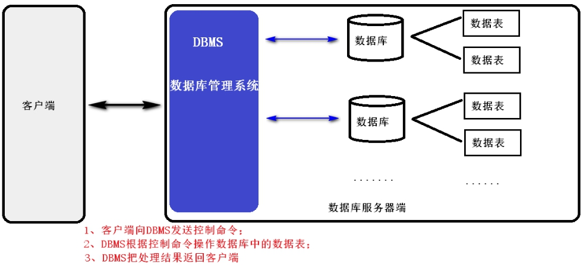
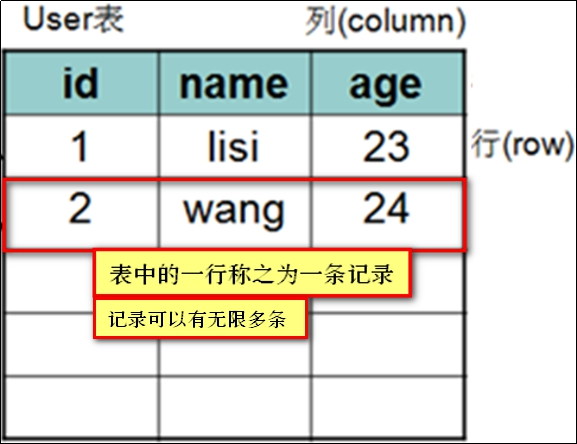
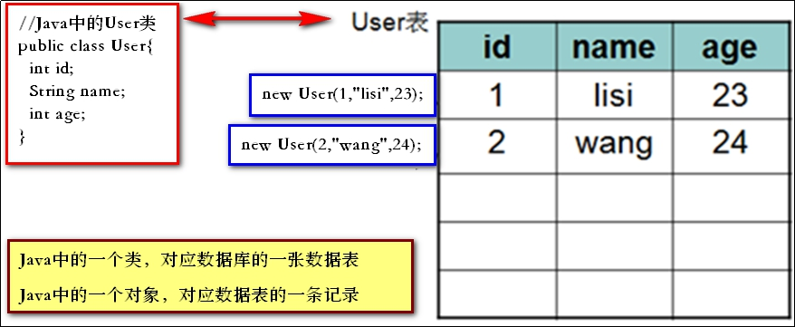
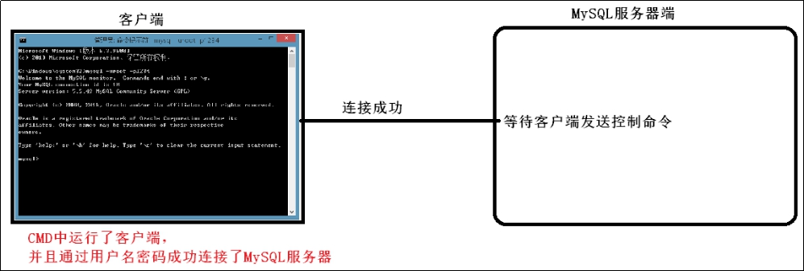
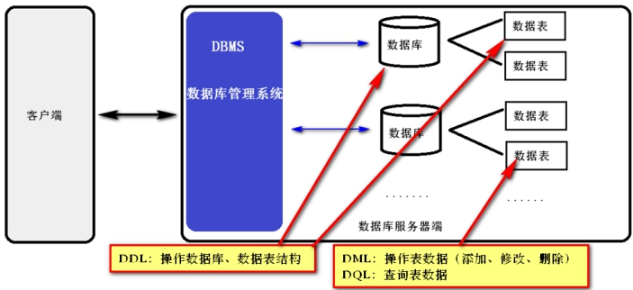

# **Day07 笔记-MySQL入门-单表**

# 1、**数据库介绍** 

## **1.1、数据库简述**

- 什么是数据库

数据库就是存储数据的仓库，其本质是一个文件系统，数据按照特定的格式将数据存储起来(格式无需程序员关注)

使得用户可以对非常方便对数据库中的数据进行增加，修改，删除及查询操作(程序员重点关注的)。

CRUD

- 为什么使用数据库

  原始IO流的形式：

  

  数据库形式：

  

## 1.2、数据库结构及原理

为了方便数据库服务端的管理和控制，数据库中专门有一套数据库管理系统来维持服务器端的运作。

数据库为了防止做复杂的事情，做了一个数据库管理系统，将命令翻译成C++IO代码

好比是为了方便操作电脑，有windows图形化操作系统一样

 



 

- 什么是数据库管理系统

数据库管理系统（DataBase Management System，DBMS）：指一种操作和管理维护数据库的大型软件。

用于对数据库服务器 进行统一管理和控制，以保证数据库的安全性和完整性。

客户端通过DBMS访问数据库中的数据。

 

开发一个小米商城的项目：xiaomi (user)

开发OA办公管理系统：OA (user)

数据库相当于文件夹，数据表相当于文件


问题：数据是直接存在数据库中还是数据表中？

​	直接存在数据表中

## 1.3、数据表结构及原理

数据表的构成：

​	表名(user)		--->对应类名

​	字段(id、name、age)  --->对应类中的属性  

​	记录			---> 对应类中一条对象  User user = new User(1,"lisi",23);



  


## **1.4、开发常见数据库管理系统**

关系型数据库

非关系型数据库

| 数据库名       | 说明                                       |
| ---------- | ---------------------------------------- |
| **MySQL**  | 开源免费的数据库，因为免费开源、运作简单的特点，常作为中小型的项目的数据库首选。MySQL1996年开始运作，sun公司经( [斯坦福](https://baike.baidu.com/item/%E6%96%AF%E5%9D%A6%E7%A6%8F)大学校园网手)，目前已经被Oracle公司收购了.发布了目前开发极为常用的的MySQL5.5版本MySQL6.x版本开始收费。 |
| **Oracle** | 收费的大型数据库，Oracle公司的核心产品。安全性极高。Oracle收购SUN公司，进而收购MYSQL产品。 |
| **DB2**    | IBM公司的数据库产品,收费的超大型数据库。性能极高，可以说同类数据库产品中已达到到极致性能常应用在银行、金融系统中。DB2运作成本极其高昂，需要和IBM服务器连用搭建分布式，才可发挥其极致性能。.DB2学习成本也很高，必须要求程序员已经有一定的工作造诣，才可由此入门 |
| SQLServer  | MicroSoft 微软公司收费的中型的数据库。C#、.net等语言常使用。但该数据库只能运行在windows机器上，扩展性、稳定性、安全性、性能都表现平平。 |
| SQLite     | 嵌入式的超小型数据库，主要应用在手机端。                     |
| SyBase     | 已经退出历史舞台。但提供了一个非常专业数据建模的工具PowerDesigner，广泛应用在数据库设计阶段。 |

oracle(神谕、预言)：甲骨文

apache

阿里巴巴

# 2、数据库安装及配置

## **2.1、数据库安装**

> 详见mysql安装与卸载文档
>

## **2.2、数据库登录**

MySQL是一个需要账户名密码登录的数据库，登陆后使用，它提供了一个默认的root账号，使用安装时设置的密码即可登录。

| 命令                     | 说明                                       |
| ---------------------- | ---------------------------------------- |
| **mysql -u用户名 -p密码**   | 使用指定用户名和密码登录当前计算机中的MySQL数据库。mysql -uroot -p1234（本地登录） |
| mysql -h主机名 -u用户名 -p密码 | 使用指定用户名和密码登录 网络上指定主机中 的MySQL数据库。例如：mysql -h127.0.0.1（ip地址） -uroot -p1234(本地登录可以省略  -hIp地址)127.0.0.1 本机的ip地址远程连接   使用root用户，密码1234登录网络上127.0.0.1主机的MySQL数据库 |

- 连接原理图：

  


Can't connect to MySQL server on 'localhost' (10061)    检查mysql服务

启动服务：net  start mysql（win10系统用管理员身份登录）

关闭服务：net  stop mysql

## 2.3、SQLYog**

# **3、SQL语句**

## **3.1、SQL语句简述**

### **3.1.1、SQL语句介绍**

> 结构化查询语言(Structured Query Language)简称SQL，是一种特殊目的的编程语言，是一种数据库查询和[程序设计语言](https://baike.baidu.com/item/%E7%A8%8B%E5%BA%8F%E8%AE%BE%E8%AE%A1%E8%AF%AD%E8%A8%80/2317999)，用于存取数据以及查询、更新和管理[关系数据库系统](https://baike.baidu.com/item/%E5%85%B3%E7%B3%BB%E6%95%B0%E6%8D%AE%E5%BA%93%E7%B3%BB%E7%BB%9F)。
>
> 结构化查询语言是高级的非过程化编程语言，允许用户在高层[数据结构](https://baike.baidu.com/item/%E6%95%B0%E6%8D%AE%E7%BB%93%E6%9E%84/1450)上工作。它不要求用户指定对数据的存放方法，也不需要用户了解具体的数据存放方式，所以具有完全不同底层结构的不同[数据库系统](https://baike.baidu.com/item/%E6%95%B0%E6%8D%AE%E5%BA%93%E7%B3%BB%E7%BB%9F/215176), 可以使用相同的结构化查询语言作为数据输入与管理的接口。结构化查询语言语句可以嵌套，这使它具有极大的灵活性和强大的功能。

### **3.1.2、SQL语句分类**

**SQL分类：**

- 数据定义语言：简称DDL(Data Definition Language)，用来定义数据库对象：数据库，表，列等。针对的是结构上的改变（create、drop、alter）


- 数据操作语言：简称DML(Data Manipulation Language)，用来对数据库中表的记录进行更新。结构上没有变化，数据变化了（insert、update、delete）
- 数据查询语言：简称DQL(Data Query Language)，用来查询数据库中表的记录。（结构和数据都没变化）select
- 数据控制语言：简称DCL(Daat Control Language)，用来定义数据库的访问权限和安全级别，及创建用户。（DBA数据库管理员）（了解）
- ​




### **3.1.3、SQL通用语法**

- SQL语句可以单行或多行书写，以分号结尾
- 可使用空格和缩进来增强语句的可读性
- MySQL数据库的SQL语句不区分大小写，关键字建议使用大写，而数据库名，数据表名，列名建议使用小写
- 同样可以使用/**/的方式完成多行注释（MySQL还可以使用#作为单行注释）


- MySQL中的我们常使用的数据类型如下

| 类型      | 描述               |
| ------- | ---------------- |
| int     | 整型               |
| double  | 浮点型              |
| varchar | 字符串型             |
| date    | 日期类型，只有年月日，没有时分秒 |

时间详细的数据类型如下(不建议详细阅读！)

| **分类**       | **类型名称 **                                | **说明 **         |
| ------------ | ---------------------------------------- | --------------- |
| **整数类型**     | tinyInt                                  | 很小的整数           |
| smallint     | 小的整数                                     |                 |
| mediumint    | 中等大小的整数                                  |                 |
| int(integer) | 普通大小的整数                                  |                 |
| **小数类型**     | float                                    | 单精度浮点数          |
| double       | 双精度浮点数                                   |                 |
| decimal（m,d） | 压缩严格的定点数                                 |                 |
| **日期类型**     | year                                     | YYYY  1901~2155 |
| time         | HH:MM:SS  -838:59:59~838:59:59           |                 |
| date         | YYYY-MM-DD 1000-01-01~9999-12-3          |                 |
| datetime     | YYYY-MM-DD HH:MM:SS 1000-01-01 00:00:00~ 9999-12-31 23:59:59没有限制。 |                 |
| timestamp    | YYYY-MM-DD HH:MM:SS  1970~01~01 00:00:01 UTC~2038-01-19 03:14:07UTC有限制 |                 |
| **文本、二进制类型** | CHAR(M)                                  | M为0~255之间的整数    |
| VARCHAR(M)   | M为0~65535之间的整数                           |                 |
| TINYBLOB     | 允许长度0~255字节                              |                 |
| BLOB         | 允许长度0~65535字节                            |                 |
| MEDIUMBLOB   | 允许长度0~167772150字节                        |                 |
| LONGBLOB     | 允许长度0~4294967295字节                       |                 |
| TINYTEXT     | 允许长度0~255字节                              |                 |
| TEXT         | 允许长度0~65535字节                            |                 |
| MEDIUMTEXT   | 允许长度0~167772150字节                        |                 |
| LONGTEXT     | 允许长度0~4294967295字节                       |                 |
| VARBINARY(M) | 允许长度0~M个字节的变长字节字符串                       |                 |
| BINARY(M)    | 允许长度0~M个字节的定长字节字符串                       |                 |

## **3.2、DDL-操作数据库结构**

### **3.2.1、创建数据库**

| 命令                                      | 说明                                       |
| --------------------------------------- | ---------------------------------------- |
| create database 数据库名;                   | 在当前服务器下创建指定名称的数据库。配置数据库时我们指定了utf8，那么数据库默认字符集就是utf8 |
| create database 数据库名 character set 字符集; | 在当前服务器下创建指定名称的数据库，并且指定数据库的字符集            |

代码准备：

\#创建数据库day07_1 数据库中数据的编码采用的是安装数据库时指定的默认编码 utf8

\#创建数据库day07_2 并指定数据库中数据的编码为gbk

### **3.2.2、查看/选中数据库**

| 命令                         | 说明                |
| -------------------------- | ----------------- |
| **use 数据库名;**              | 切换数据库。            |
| select database();         | 查看当前正在操作使用的数据库名称。 |
| show databases;            | 查看MySQL服务器中有哪些数据库 |
| show create database 数据库名; | 查看某个数据库的定义的信息     |

代码准备：

\#切换到day07_1数据库

\#查看当前正在操作哪个数据库

\#查看服务器下的所有数据库

\#查看day07_1数据库的定义信息

### **3.2.3、删除数据库**

| 命令                   | 说明                  |
| -------------------- | ------------------- |
| drop database 数据库名称; | 从MySQL服务器中永久删除某个数据库 |

代码准备：

\#删除day07_2数据库

## **3.3、DDL-操作数据表结构**

### **3.3.1、创建表**

格式：

​	create table 表名(

​	 字段1 类型(长度),

​	字段2  类型(长度),

​	......

​	)

/*

1、创建分类表

分类表名称：category

分类表中有：分类ID和分类名称两个字段

分类ID：cid,为整型，

分类名称：cname,为字符串类型，最大允许填写100长度的字符串

*/

/*

2、创建测试表

测试表名称：test1

测试表中有：测试ID和测试时间两个字段

测试ID：tid,为整型

测试时间：tdate,为年月日的日期类型 

*/

### **3.3.2、查看表**

| 命令           | 说明             |
| ------------ | -------------- |
| show tables; | 查看当前数据库中的所有表名; |
| desc 表名;     | 查看某张数据表的表结构    |

代码准备：

\#查看当前数据库中有哪些表

\#查看category表的表结构 

### **3.3.3、删除表**

| 命令             | 说明             |
| -------------- | -------------- |
| drop table 表名; | 从当前数据库中永久删除某张表 |

\#删除测试表test1

DROP TABLE test1;

### **3.3.4、修改表结构格式：（了解）**

| 命令                 | 说明         |
| ------------------ | ---------- |
| alter table 表名 关键字 | 修改某张表的某些字段 |

**一般修改表结构，最多进行字段的添加操作**

- alter table 表名 add 列名 类型(长度) [约束];	

作用：修改表添加列. 

例如：

\#1，为分类表添加一个新的字段为 分类描述 cdesc varchar(20)

ALTER TABLE category ADD cdesc VARCHAR(20);

- alter table 表名 modify 列名 类型(长度) 约束; 

作用：修改表修改列的类型长度及约束.

例如：

\#2, 为分类表的描述字段进行修改，类型varchar(50) 

ALTER TABLE category MODIFY cdesc VARCHAR(50);

- alter table 表名 change 旧列名 新列名 类型(长度) 约束; 

作用：修改表修改列名.

例如：

\#3, 为分类表的分类名称字段进行更换 更换为 description varchar(30)

ALTER TABLE category CHANGE cdesc description VARCHAR(30);

- alter table 表名 drop 列名;	

作用：修改表删除列.

例如：

\#4, 删除分类表中description这列

ALTER TABLE category DROP description;

- rename table 表名 to 新表名; 

作用：修改表名

例如：

\#5, 为分类表category 改名成 category2

RENAME TABLE category TO category2;

- alter table 表名 character set 字符集(了解);

作用：修改表的字符集

例如：

\#6, 为分类表 category 的编码表进行修改，修改成 gbk

ALTER TABLE category CHARACTER SET gbk;

## **3.4、DML-更新表记录(2成)**

### **3.4.1、插入表记录：insert into**

代码准备：

\#创建分类表，用以练习

CREATE TABLE category(

​	cid INT,

​	cname VARCHAR(100)

);

```sql
INSERT INTO category(cid,cname) VALUES(1,'手机');
INSERT INTO category(cid) VALUES(3);
#默认给所有字段添加值
INSERT INTO category VALUES(3,'电脑');
```

**注意：**

- 值与字段必须对应，个数相同，类型相同
- 值的数据大小必须在字段的长度范围内
- 除了数值类型，其它的字段类型的值必须使用单引号/双引号引起（varchar、date）。
  - 如果要插入空值，可以忽略不写字段，或者插入 null。	

### **3.4.2、更改表记录：update**

用来修改指定条件的数据，将满足条件的记录指定列修改为指定值

- 语法：

--更新所有记录的指定字段

update  表名  set 字段1 = 值1，字段2 = 值2

--更新符合条件记录的指定字段

update  表名  set 字段1 = 值1，字段2 = 值2 where 条件

- 注意：

  列名的类型与修改的值要一致.

  修改值得时候不能超过最大长度.

  除了数值类型外，其它的字段类型的值必须使用引号引起

### **3.4.3、删除表记录：delete from**

- 语法：

  --逐条删除表中所有记录

  delete from 表名;	

  --逐条删除表中符合条件的记录 

  delete from 表名 where 条件;	

> truncate (摧毁表结构，然后创建一张一模一样的表)
>
> delete   只是删除表中的数据，表结构还在

## **3.5、DQL-查询数据(8成)**

### **3.5.1 准备工作**

```sql
#创建员工表
CREATE TABLE emp (
id INT,
NAME VARCHAR(10),
gender CHAR(1), 
salary DOUBLE,
join_date DATE, 
dept_name VARCHAR(32)
);
INSERT INTO emp VALUES(1,'孙悟空','男',7200,'2013-02-04','教学部');

INSERT INTO emp VALUES(2,'猪八戒','男',3600,'2010-12-02','教学部');

INSERT INTO emp VALUES(3,'唐僧','男',9000,'2008-08-08','教学部');

INSERT INTO emp VALUES(4,'白骨精','女',5000,'2015-10-07','市场部');

INSERT INTO emp VALUES(5,'蜘蛛精','女',5000,'2011-03-14','市场部');

INSERT INTO emp VALUES(6,'玉兔精','女',200,'2000-03-14','市场部');

INSERT INTO emp VALUES(7,'林黛玉','女',10000,'2019-10-07','财务部');

INSERT INTO emp VALUES(8,'黄蓉','女',3500,'2011-09-14','财务部');

INSERT INTO emp VALUES(9,'吴承恩','男',20000,'2000-03-14',NULL);

```

### **3.5.2 语法**

查询并展示表中所有记录

select * from 表名

查询并展示表中符合要求的记录

select * from 表名 where 条件

**代码准备：**

\#查询emp表中所有记录

\#查询emp表中所有记录，仅显示id和name字段

\#查询emp表中所有市场部的员工

### **3.5.3 简单查询**

1. 别名查询.使用的关键字是：as

   列别名、表别名

   注意：

    - 别名的引号可加可不加
   - as 可以省略

2. 去掉重复值  关键字：distinct

3. 查询结果是表达式（运算查询）：将所有员工的工资+1000元进行显示.

### **3.5.4 条件查询-where**

| BETWEEN  ...AND... | 查询某一区间的值  between 50 and 100   >=50  <=100 |
| ------------------ | ---------------------------------------- |
| IN(set)            | 满足集合中任意条件    in (1,2,3,4)                |
| LIKE ‘张pattern’    | 模糊查询   %  任意字符 ‘%张%’    _ 一个字符   '张_'    |
| IS NULL            | 判断是否为空                                   |
| and                | 多个条件同时满足                                 |
| or                 | 满足任意一个条件即可                               |
| not                | 除了                                       |

> \#查询员工姓名为黄蓉的员工信息：
>
> \#查询薪水价格为5000的员工信息
>
> \#查询薪水价格不是5000的所有员工信息
>
> \#查询薪水价格大于6000元的所有员工信息
>
> \#查询薪水价格在5000到10000之间所有员工信息
>
> \#查询薪水价格是3600或7200或者20000的所有员工信息
>
> \#查询含有'精'字的所有员工信息
>
> \#查询以'孙'开头的所有员工信息
>
> \#查询第二个字为'兔'的所有员工信息
>
> \#查询没有部门的员工信息
>
> \#查询有部门的员工信息 

```sql
#查询员工姓名为黄蓉的员工信息：
SELECT * FROM emp WHERE NAME = '黄蓉';
#查询薪水价格为5000的员工信息
SELECT * FROM emp WHERE salary = 5000;
#查询薪水价格不是5000的所有员工信息
SELECT * FROM emp WHERE salary != 5000;
SELECT * FROM emp WHERE NOT salary = 5000;
SELECT * FROM emp WHERE  salary <> 5000;
#查询薪水价格大于6000元的所有员工信息
SELECT * FROM emp WHERE salary > 5000;
#查询薪水价格在5000到10000之间所有员工信息
SELECT * FROM emp WHERE salary >= 5000 AND salary <= 10000;
SELECT * FROM emp WHERE salary BETWEEN 5000 AND 10000;
#查询薪水价格是3600或7200或者20000的所有员工信息
SELECT * FROM emp WHERE salary IN(3600,7200,20000);
SELECT * FROM emp WHERE salary = 3600 OR salary = 7200
OR salary = 20000;
#查询含有'精'字的所有员工信息
SELECT * FROM emp WHERE NAME LIKE '%精%';
#查询以'孙'开头的所有员工信息
SELECT * FROM emp WHERE NAME LIKE '孙%';
#查询第二个字为'兔'的所有员工信息
SELECT * FROM emp WHERE NAME LIKE '_兔%'
#查询没有部门的员工信息
SELECT * FROM emp WHERE dept_name IS NULL;
#查询有部门的员工信息 
SELECT * FROM emp WHERE dept_name IS NOT NULL;
```

# **4、单表操作**

## **4.1、排序 **

order by  字段   需要写在sql语句的最后

升序：asc(默认)

降序：desc

1.使用薪水排序(降序)

SELECT * FROM emp ORDER BY salary DESC

2.在薪水排序(降序)的基础上，以id排序(降序)

\#即若薪水相同，相同薪水格的数据以id降序排序

SELECT * FROM emp ORDER BY salary DESC,id DESC;

## **4.2、聚合函数**

之前我们做的查询都是横向查询，它们都是根据条件一行一行的进行判断，而使用聚合函数查询是纵向查询，它是对某一列的值进行计算，然后返回一个单一的值；

另外聚合函数会忽略null空值。

今天我们学习如下五个聚合函数：

- **count(字段)**：统计指定列不为NULL的记录行数；、
- **sum(字段)**：计算指定列的数值和 
- **max(字段)**：计算指定列的最大值
- **min(字段)**：计算指定列的最小值
- **avg(字段)**：计算指定列的平均值 


> 代码准备：
>
> \#1 查询员工的总数
>
> \#查看员工总薪水、最高薪水、最小薪水、薪水的平均值
>
> \#2 查询薪水大于4000员工的个数
>
> \#3 查询部门为'教学部'的所有员工的个数
>
> \#4 查询部门为'市场部'所有员工的平均薪水 

```sql
#1 查询员工的总数
SELECT COUNT(gender) FROM emp;
#查看员工总薪水、最高薪水、最小薪水、薪水的平均值
SELECT SUM(salary) FROM emp;
SELECT MAX(salary) FROM emp;
SELECT MIN(salary) FROM emp;
SELECT AVG(salary) FROM emp;
#2 查询薪水大于4000员工的个数
SELECT COUNT(*) FROM emp WHERE salary > 4000;
#3 查询部门为'教学部'的所有员工的个数
SELECT COUNT(*) FROM emp WHERE dept_name = '教学部';
#4 查询部门为'市场部'所有员工的平均薪水 
SELECT AVG(salary) FROM emp WHERE dept_name = '市场部';
```

## **4.3、分组    **

按部门分组、按小组分组、分类名称

分组查询是指使用group by字句对查询记录进行分组运算。

格式：

SELECT 字段1,字段2… FROM 表名 **GROUP BY** 分组字段;

统计每个部门的人数：


SELECT 字段1,字段2… FROM 表名 GROUP BY分组字段 **HAVING 分组条件**;

分组操作中的having子语句，是用于在分组后对数据进行过滤的，作用类似于where条件。


where 和 having的区别：

​	1、where 是分组前对条件进行过滤，having是分组后对条件进行过滤

​		where age > 22 group by sex

​		group by sex having age > 22

​	2、where后不能跟聚合函数，having后可以跟上聚合函数

```sql
#统计每个部门的人数：
SELECT COUNT(*) 个数,dept_name 部门 FROM emp GROUP BY dept_name;
#统计每个部门员工大于2个的人数：
SELECT COUNT(*) 个数,dept_name 部门 FROM emp   GROUP BY dept_name
HAVING COUNT(*) > 2;
```


## **4.4、select总结** 

**书写顺序(重点)：**

​			**SELECT 字段 FROM 表名 WHERE 条件 GROUP BY 字段 HAVING 条件 ORDER BY 字段;**

​			其中，SELECT字段，FROM表名为 必写，其余均可根据情况而定

执行顺序：（了解）

1. From 表名

2. Where  条件

3. Group by 字段   字段值相同的数据会划分成一组

4. Having 条件     对每一组分别进行一次运算

5. Select 字段      把每组中第一条数据取出来。合并成一张新伪表展示这个新伪表上的部分字段

6. order by 字段    对新伪表进行最后排序

# **5、数据库的备份与还原**

## **5.1、命令行**

备份：mysqldump -uroot -p1234  数据库名>文件位置(无需登录)

还原：登录进去、创建一个空数据库、选中数据库、执行source 文件位置命令

## **5.2、图形界面**


 

 

 

 