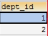

# Day08笔记 mysql-多表

昨日内容回顾：

1、什么是数据库，数据库的作用

2、数据库服务器和数据库的关系、数据库和数据表的关系

3、数据表是如何存储数据的、表和类可以如何建立关系？

行和列的形式

4、登陆mysql的命令是什么

​	本地登录：mysql -uroot -p密码

​	远程登录：mysql -hIP地址 ....

5、开启服务、关闭服务的命令

net start mysql、net stop mysql

6、Sql语句的分类有哪几种？各自代表什么意思

DDL：结构上的变化

DML：数据的更新

DQL：查询

DCL：

7、创建数据库、选中数据库、删除数据库的sql语句

create database xx    use xx; drop database xx;

8、创建数据表的格式

create table xx(

 字段名称1  类型(长度),

字段名称2   类型(长度)

)

9、写出两种排序的关键字

order  by   asc    desc

10、请写出五种聚合函数个代表什么意思

count() max()  min()  sum() avg()

11、分组的关键字

group  by 

12、Where 和 having的区别

13、请解释like、%、_ 各代表什么意思

like 模糊查询    %   '王%'   '%天%'     '张_'

is null 、and 、or、in(set)、between ... and

# 1、**SQL约束与策略**

对表中的数据进行进一步的限制，从而保证数据的正确性、有效性、完整性

## 1.1、**主键约束**

### 1.1.1、**添加主键约束** 

关键字：primary key

特点：唯一且不能为空

作用：为了标识每一条记录是唯一的

> 问：一个表中是否可以添加多个主键呢？
>
> 答：一个表中只能有一个主键

方式一：

​	uid INT PRIMARY KEY

方式二：

> 联合主键：多个字段共同组成一个主键

PRIMARY KEY(uid,uname)

方式三：

ALTER TABLE USER ADD PRIMARY KEY(uid);

### 1.1.2、**删除主键约束(了解)**

ALTER TABLE USER DROP PRIMARY key

## 1.2、**非空约束**

not null

## **1.3、唯一约束 **

### **1.3.1、添加唯一约束**

unique  

特点：唯一 (不对null做唯一校验)


主键约束和唯一约束的区别：

​	1、主键约束是唯一且不能为空(不允许有空值)，唯一约束允许有null值

​	2、表中最多有一个主键，但是可以有多个唯一约束

## 1.3、**默认值**

default '值'

## **1.4、外键约束**

FOREIGN KEY 表示外键约束，将在多表中学习。

## **1.5、自动增长-策略**

我们通常希望在每次插入新记录时，数据库自动生成字段的值。

我们可以在表中使用 auto_increment关键字，自动增长列类型必须是整形，自动增长列必须为键。

不加自动增长策略：程序员手动维护主键的值(太麻烦、容易出错)

加自动增长策略：mysql数据库帮我们维护主键的值

> delete 和 truncate的区别？

# **2、多表操作**

## **2.1、多表简述**

实际开发中，一个项目通常需要很多张表才能完成。

小米商城：用户表、分类表、商品表、订单表....

- 已知：

我们是有一张商品表（product）

 

 

- 需求：现在我们需要修改分类名称，将所有的“电脑办公” 修改为 “笔记本电脑”


  update product set category_name = '笔记本电脑'  where category_name = '电脑办公'

  此时修改了三条


- 需求变型：假如现在电脑办公的分类有十几万条

为了数据的使用和维护更为方便，我们将单表数据划分为多表。

分类数据保存在分类表中。商品数据保存在商品表中

			

					

- 需求：将所有的“电脑办公” 修改为 “笔记本电脑”    

  update category set cname = '笔记本电脑' where cname = '电脑办公';

  此时修改了一条

## **2.2、外键**

商品表和分类表数据通过外键category_cid相连。

- **主表：数据来源表/主键ID所在表**

例如：分类表----是分类名称数据的来源表，主键CID所在表

- **从表：数据引用表/外键所在表**

  例如：商品表---引用了分类表数据，外键category_cid所在表


**外键特点：**

- 从表外键指向主表主键
- 从表外键的数据类型和长度，必须和主表主键数据类型和长度 一致

## **2.3、外键约束**

```sql
数据准备：

create database day08_2;

use day08_2;

#创建分类表：

CREATE TABLE category(

	cid varchar(32) PRIMARY KEY,#主键ID

	cname VARCHAR(20)#分类名称

);

INSERT INTO category VALUES('c001','电脑办公');

INSERT INTO category VALUES('c002','服装');

#创建商品表：

CREATE TABLE product(

	pid INT PRIMARY KEY,#主键ID

	pname VARCHAR(20),#商品名称

	price DOUBLE,#商品价格

	category_cid VARCHAR(32)#外键

);

#导入数据

INSERT INTO product(pid,pname,price,category_cid) VALUES(1,'联想电脑',5000,'c001');

INSERT INTO product(pid,pname,price,category_cid) VALUES(2,'海尔电脑',3000,'c001');

INSERT INTO product(pid,pname,price,category_cid) VALUES(3,'雷神电脑',5000,'c001');

INSERT INTO product(pid,pname,price,category_cid) VALUES(4,'JACK JONES',800,'c002');

INSERT INTO product(pid,pname,price,category_cid) VALUES(5,'真维斯',200,'c002');

INSERT INTO product(pid,pname,price,category_cid) VALUES(6,'花花公子',440,'c002');

INSERT INTO product(pid,pname,price,category_cid) VALUES(7,'劲霸',2000,'c002'); 

```

```sql
INSERT INTO product VALUES(8,'iphone11',7000,'c003');
DELETE FROM category WHERE cid = 'c002';
```

1、当从表中添加一条主表中没有的数据时，导致数据的不完整

2、当从主表中删除从表正在引用的数据时，也导致数据的不完整

为了保证数据的完整、正确、有效、我们需要添加外键约束


- 声明外键约束：（是为从表添加）	

格式：alter  table 从表 add  [constraint  外键名称]  foreign  key (从表外键字段名) references 主表 (主表的主键);

```sql
#添加外键约束
ALTER TABLE product ADD FOREIGN KEY(category_cid) REFERENCES category(cid);
```


结论：

1、添加数据时，应该先添加分类表中的数据(数据来源表)

2、删除数据时，应该先删除商品表(从表)中的数据

为从表添加外键约束，必须保证：

- 从表外键的数据类型和长度，必须和主表主键数据类型和长度 一致
- 从表和主表为空，或者数据必须完整
- 删除外键约束：（了解，开发慎用）

alter table 从表 drop foreign key 外键名称

## **2.4、多表关系**

### **2.4.1、多表关系简述**

### **2.4.2、一对多（常见）**

常见的一对多关系：分类和商品、省份和城市、部门和员工

建表原则：


### **2.4.3、多对多(常见)**

常见的：老师和学生、订单和商品、演员和角色

建表原则：


### **2.4.4、一对一(不常见)**

常见的：丈夫和妻子

在实际的开发中应用不多.因为一对一可以合成一张表

建表方式：

外键唯一：主表的主键和从表的外键（唯一），形成主外键关系，外键唯一unique。 


# **3、多表关系实战**

## **3.1 实战1：省和市**

- 方案1：多张表，一对多

```sql
 CREATE TABLE province(
	id INT PRIMARY KEY,
	NAME VARCHAR(20),
	description VARCHAR(20)
);
CREATE TABLE city(
	id INT PRIMARY KEY,
	NAME VARCHAR(20),
	description VARCHAR(20)
);
```


```sql
CREATE TABLE city(
id INT PRIMARY KEY,
NAME VARCHAR(20),
description VARCHAR(20),
pid INT
);
#添加外键约束
ALTER TABLE city ADD FOREIGN KEY(pid) REFERENCES province(id);
```
## 3.2 实战2：演员和角色

- 多对多关系


```sql
create table actor(
	aid int primary key,
	name varchar(30)
);
create table role(
	rid int primary key,
	name varchar(30)
);
```

```sql
#创建中间表
CREATE TABLE actor_role(
    arid INT PRIMARY KEY,
    aid INT,
    rid INT
)
ALTER TABLE actor_role ADD FOREIGN KEY(aid) REFERENCES actor(aid);
ALTER TABLE actor_role ADD FOREIGN KEY(rid) REFERENCES role(rid);
```

作业：找到常见的一对多、多对多的实例，进行建表(并添加、删除数据)

# **4、多表查询**

## **4.1什么是多表查询**

同时查询多张表获取到需要的数据 比如：我们想查询到开发部有多少人，需要将部门表和员工表同时进行查询

## 4.2 多表查询的分类 

内连接：

- 显示内连接
- 隐式内连接

外连接：

- 左外连接
- 右外连接

## **4.3 笛卡尔积现象**

准备数据：见今日资料(入门.txt)

### **4.3.1什么是笛卡尔积现象**

左表中的记录一一和右表中的记录结合


需求：查询每个部门下有哪些人

### **4.3.2如何清除笛卡尔积**


```sql
SELECT * FROM emp,dept WHERE emp.dept_id = dept.id;
#表别名
SELECT * FROM emp e,dept d WHERE e.dept_id = d.id;
```

## **4.4、内连接**

多表查询的规律：

​	1、确定要查询的数据来自哪些表

​	2、确定要查询的条件是什么

​	3、确定要查询哪些字段

需求：查询唐僧的信息，显示员工id，姓名，性别，工资和所在的部门名称

```sql
#隐式内连接
SELECT e.id,e.NAME,e.gender,e.salary,d.NAME FROM emp e,dept d 
WHERE e.dept_id = d.id AND e.NAME = '唐僧';
#显式内连接
SELECT e.id,e.NAME,e.gender,e.salary,d.NAME FROM emp e INNER JOIN dept d
ON e.dept_id = d.id AND e.NAME = '唐僧';
```

- 隐式内连接     格式：select  *   from  A,B where 条件
- 显示内连接     格式：select * from A  [inner]  join  B  on 条件

## **4.5、外连接**

- 左外连接   格式：select * from A left [outer]  join B  on 条件

以左表为基准，去匹配右边中的数据，如果能匹配到，数据正常展示，如果匹配不到，展示左表中的，右边中展示为null

- 右外连接   格式：select * from A right[outer]  join B  on 条件

  以右表为基准，去匹配左边中的数据，如果能匹配到，数据正常展示，如果匹配不到，展示右表中的，左边中展示为null

```sql
#需求：查询每个部门下有哪些人，没有员工的部门也要查询出来
SELECT * FROM dept d LEFT OUTER JOIN emp e ON e.dept_id = d.id;
```

## **4.6、子查询**

概述：将上一条SELECT语句结果作为另一条SELECT语法一部分

子查询的三种情况：

**1、子查询的结果是一个值的时候**

  

需求：

1、查询工资最高的员工是谁？

2、查询工资小于平均工资的员工有哪些

```sql
#1、查询工资最高的员工是谁？
SELECT MAX(salary) FROM emp;
SELECT * FROM emp WHERE salary = (SELECT MAX(salary) FROM emp);
#2、查询工资小于平均工资的员工有哪些
SELECT * FROM emp WHERE salary < (SELECT AVG(salary) FROM emp);
```

**2、子查询结果是单列多行的时候**

 

需求：

1、查询工资大于5000的员工，来自于哪些部门的名字

2、查询开发部与财务部所有员工的信息 

```sql
#1、查询工资大于5000的员工，来自于哪些部门的名字
SELECT id,NAME FROM dept  WHERE id IN(SELECT dept_id FROM emp WHERE salary > 5000);
#2、查询开发部与财务部所有员工的信息 
SELECT * FROM emp WHERE dept_id IN(SELECT id FROM dept WHERE NAME = '开发部' OR NAME = '财务部')
```

**3、子查询的结果是多行多列**

 

需求：

1、查询出2011年以后入职的员工信息，包括部门名称

```sql
SELECT * FROM (SELECT * FROM emp WHERE join_date >= '2011-01-01') emp_new,dept d
WHERE emp_new.dept_id = d.id; 
```

结论：

子查询结果只要是 单列 ，肯定在 WHERE 后面作为 条件

SELECT 查询字段 FROM 表 WHERE 字段=（子查询）;

子查询结果只要是 多列 ，肯定在 FROM 后面作为 表

SELECT 查询字段 FROM （子查询） 表别名 WHERE 条件

# 5、**多表查询综合练习(四表联查)**

> \#练习1：查询所有员工信息。显示员工编号，员工姓名，工资，职务名称，职务描述
>
> \#练习2：查询所有员工信息。显示员工编号，员工姓名，工资，职务名称，职务描述，部门名称，部门位置
>
> \#练习3：查询所有员工信息。显示员工姓名，工资，职务名称，职务描述，部门名称，部门位置，工资等级
>
> \#练习4：查询经理的信息。显示员工姓名，工资，职务名称，职务描述，部门名称，部门位置，工资等级
>
> \#练习5：查询出部门编号、部门名称、部门位置、部门人数
>
> \#练习6：查询所有员工信息。显示员工信息和部门名称，没有员工的部门也要显示
>
> \#练习7：查询所有员工信息。显示员工姓名，员工工资，职务名称，工资等级，并按工资升序排序
>
> \#练习8：列出所有员工的姓名及其直接上级的姓名,没有领导的员工也需要显示
>
> \#练习9：查询入职期早于直接上级的所有员工编号、姓名、部门名称
>
> \#练习10：查询工资高于公司平均工资的所有员工信息。显示员工信息，部门名称，上级领导，工资等级

```mysql
#练习1：查询所有员工信息。显示员工编号，员工姓名，工资，职务名称，职务描述
SELECT e.id,e.ename,e.salary,j.jname,j.description FROM emp e,job j WHERE e.job_id = j.id;
#练习2：查询所有员工信息。显示员工编号，员工姓名，工资，
#职务名称，职务描述，部门名称，部门位置
SELECT e.id,e.ename,e.salary,j.jname,j.description,d.dname,d.loc
 FROM emp e,job j,dept d WHERE e.job_id = j.id AND e.dept_id = d.id;
#练习3：查询所有员工信息。显示员工姓名，工资，职务名称，
#职务描述，部门名称，部门位置，工资等级
SELECT e.id,e.ename,e.salary,j.jname,j.description,d.dname,d.loc,s.grade
FROM emp e,job j,dept d,salarygrade s
WHERE e.job_id = j.id AND e.dept_id = d.id AND e.salary BETWEEN s.losalary
AND s.hisalary;
#练习4：查询经理的信息。显示员工姓名，工资，职务名称，职务描述，
#部门名称，部门位置，工资等级
SELECT e.id,e.ename,e.salary,j.jname,j.description,d.dname,d.loc,s.grade
FROM emp e,job j,dept d,salarygrade s
WHERE e.job_id = j.id AND e.dept_id = d.id AND e.salary BETWEEN s.losalary
AND s.hisalary AND j.jname = '经理';
#练习5：查询出部门编号、部门名称、部门位置、部门人数
SELECT d.id,d.dname,d.loc,COUNT(*) FROM emp e,dept d WHERE e.dept_id = d.id GROUP BY d.id;
#练习6：查询所有员工信息。显示员工信息和部门名称，没有员工的部门也要显示
SELECT e.*,d.dname FROM emp e RIGHT JOIN dept d ON e.dept_id = d.id;
#练习7：查询所有员工信息。显示员工姓名，员工工资，职务名称，
#工资等级，并按工资升序排序
SELECT e.ename,e.salary,j.jname,s.grade FROM emp e,job j,salarygrade s WHERE e.job_id = j.id AND 
e.salary BETWEEN s.losalary AND s.hisalary ORDER BY e.salary ASC;
#练习8：列出所有员工的姓名及其直接上级的姓名,没有领导的员工也需要显示(自连接)
SELECT e.ename,l.ename  FROM emp e LEFT JOIN emp l ON e.mgr = l.id;
#练习9：查询入职期早于直接上级的所有员工编号、姓名、部门名称
SELECT e.id,e.ename,d.dname FROM emp e,emp l,dept d WHERE e.mgr = l.id AND e.dept_id = d.id
AND e.joindate < l.joindate;
#练习10：查询工资高于公司平均工资的所有员工信息。显示员工信息，
#部门名称，上级领导，工资等级
SELECT e.*,d.dname,l.ename,s.grade FROM 
emp e LEFT JOIN emp l ON e.mgr = l.id,dept d,salarygrade s 
WHERE e.dept_id = d.id AND  e.salary BETWEEN s.losalary
AND s.hisalary AND e.salary > (SELECT AVG(salary) FROM emp);

```


 

 