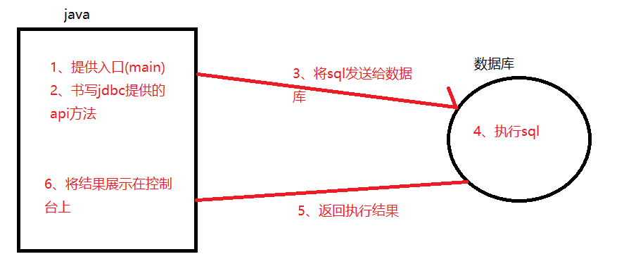

# Day09笔记-JDBC

昨日内容回顾：

1、 约束的作用是什么

确保数据的有效性、正确性、完整性

2、 常见的约束有哪些

唯一、主键、非空、外键、default

3、 主键约束和唯一约束的区别

4、 自动增长策略的作用

关键字：auto_increment

5、 何为外键，外键的作用是什么？

6、 常见的表关系有哪些？他们的建表原则分别是什么？

7、 添加外键约束的sql如何写

alter table 从表名 add foreign key(外键字段) references 主表(主键)

8、 何为笛卡尔积现象？如何清除笛卡尔积

where  等值连接

9、 内连接两种书写方式

​	显式：select * from A [inner] join  B  on 条件

​	隐式：select from A,B where 条件

10、 外连接两种书写方式

左外：select from A left [outer]  join  B on  条件

右外：select from A right [outer]  join  B on  条件

11、 外连接和内连接的区别

12、 何为子查询，子查询的三种返回结果方式

13、 多表查询的规律

# 1、**JDBC入门 **


## 1.1、 **JDBC简述及原理**

> JDBC（Java Data Base Connectivity,java数据库连接）是一种用于执行SQL语句的Java API，可以为多种关系数据库提供统一访问，它由一组用Java语言编写的类和接口组成。是Java访问数据库的标准规范

规范：接口

interface Person(){

​	eat ();

​	drink();

​	work();

}

Student  implements Person(){}

有规范的好处：


JDBC规范定义接口，具体的实现由各大数据库厂商来实现(以jar包的形式体现)

JDBC是Java访问数据库的标准规范。

数据库还需要具体的实现类，也就是数据库驱动。每个数据库厂商根据自家数据库的通信格式编写好自己数据库的驱动。所以我们只需要会调用JDBC接口中的方法即可。数据库驱动由数据库厂商提供。

需要学习：JDBC提供好的一套API使用方式

## 1.2、 **JDBC快速入门**

案例需求：使用eclipse将emp中的数据查出来，展示在控制台上

### **1.2.1、流程分析**



### **1.2.2、案例准备**

导入emp表、导入jar包

### **1.2.3、案例实现**

```java
public static void main(String[] args) throws Exception {
		//1、注册驱动
		Class.forName("com.mysql.jdbc.Driver");
		//2、获取连接对象
		Connection connection = DriverManager.getConnection("jdbc:mysql://localhost:3306/day09",
				"root", "1234");
		//3、获取发送sql语句的对象
		Statement st = connection.createStatement();
		//4、执行sql并返回结果
		String sql = "select * from emp";
		ResultSet rs = st.executeQuery(sql);
		//5、处理结果
		while(rs.next()) {
			System.out.println(rs.getString("name")+":"+rs.getString("join_date"));
		}
		//6、关闭资源
		rs.close();
		st.close();
		connection.close();
		
	}
```

# **2、JDBC-API详解**

## **2.1、注册驱动** 

```java
static {
        try {
          //DriverManager：驱动管理器
            java.sql.DriverManager.registerDriver(new Driver());
        } catch (SQLException E) {
            throw new RuntimeException("Can't register driver!");
        }
    }
```

## **2.2、获取连接**

```java
Connection connection = DriverManager.getConnection("jdbc:mysql://localhost:3306/day09",
				"root", "1234");
```

参数1：url   jdbc:mysql://ip地址:端口号/数据库名

参数2：username   用户名root

参数3：password   密码 1234

快速生成返回类型的快捷键：alt+shift+l


注意：

- 导包问题(要导入java.sql下的包)

  ```java
  import java.sql.Connection;
  import java.sql.DriverManager;
  import java.sql.ResultSet;
  import java.sql.Statement;
  ```

- 数据库名字没有异常

  ```java
  Unknown database 'day10'
  ```

- 用户名密码错误

```java
 Access denied for user 'root'@'localhost' (using password: YES)
```

- 驱动错误

  ```java
  No suitable driver found for jdbc:mysql//localhost:3306/day09
  ```

- 连接数据库失败

  ```java
  jdbc4.CommunicationsException: Communications link failure
  ```

## **2.3、获取发送SQL语句对象**（交通工具）

```java
Statement st = connection.createStatement(); 
```

## **2.4、执行/发送SQL语句并返回结果**

DML（insert、update、delete ）  DQL(select)

```java
String sql = "select * from emp";
		ResultSet rs = st.executeQuery(sql);
		//5、处理结果
		while(rs.next()) {
System.out.println(rs.getString("name")+":"+rs.getString("join_date"));
		}
```

| **executeQuery(String sql)**  | 执行查询的SQL语句。参数：SQL语句 返回值：ResultSet        |
| ----------------------------- | ---------------------------------------- |
| **executeUpdate(String sql)** | 执行更新的SQL语句。参数：SQL语句 返回值：int （影响的行数）      |
| e**xecute(String sql)**       | 执行任意语句。参数：SQL语句执行select 返回true执行insert into,update,delete from  返回false |

## **2.5、处理结果集**


## **2.6、释放资源** 

建议倒序释放：

```java
rs.close();
st.close();
connection.close();
```


# **3、完成JDBC增删改查操作**

## **3.1、从数据库查询所有数据**（入门案例）

## **3.2、向数据库增加数据**

```java
@Test
	//添加一条数据
	public void test1() throws Exception {
		//1、注册驱动
		Class.forName("com.mysql.jdbc.Driver");
		//2、获取连接对象
		Connection con = 
		DriverManager.getConnection("jdbc:mysql:///day09","root","1234");
		System.out.println(con);
		//3、获取发送sql语句的对象
		Statement st = con.createStatement();
		//4、执行sql并返回结果
		String sql = "insert into emp values(null,'小白龙','男',5000)";
		int result = st.executeUpdate(sql);
		//5、处理结果
		if(result >0) {
			System.out.println("添加数据成功！");
		}else {
			System.out.println("添加数据失败成功！");
		}
		//6、释放资源
		st.close();
		con.close();
	}
	
```

## **3.3、向数据库修改数据**

需求：将id为6的用户名修改为沙和尚

```java
@Test
	//修改添加一条数据
	public void test2() throws Exception {
		//1、注册驱动
		Class.forName("com.mysql.jdbc.Driver");
		//2、获取连接对象
		Connection con = 
		DriverManager.getConnection("jdbc:mysql:///day09","root","1234");
		//3、获取发送sql语句的对象
		Statement st = con.createStatement();
		//4、执行sql并返回结果
		String sql = "update emp set name = '沙和尚'  where id = 6";
		int result = st.executeUpdate(sql);
		//5、处理结果
		if(result >0) {
			System.out.println("修改数据成功！");
		}else {
			System.out.println("修改数据失败！");
		}
		//6、释放资源
		st.close();
		con.close();
	}
```


## **3.4、从数据库根据ID删除数据**

需求：将id为6的用户删除

```java
//4、执行sql并返回结果
		String sql = "delete from emp where id = 6";
		int result = st.executeUpdate(sql);
		//5、处理结果
		if(result >0) {
			System.out.println("删除数据成功！");
		}else {
			System.out.println("删除数据失败！");
		}
```


## **3.5、从数据库根据ID查询某条数据**

需求：查询id为5的用户

```java
//4、执行sql并返回结果
		String sql = "select * from emp where id = 5";
		ResultSet rs = st.executeQuery(sql);
		//5、处理结果
		if(rs.next()) {
			System.out.println("用户名为："+rs.getString("name"));
		}
```


## **3.6  使用@Before 和 @After改进**

```java
@Before
	public void before() {
		System.out.println("before方法执行了！！");
	}
	@Test
	public void test1() {
		System.out.println("test1方法执行了");
	}
	@Test
	public void test2() {
		System.out.println("test2方法执行了");
	}
	@After
	public void after() {
		System.out.println("after方法执行了！！");
	}
```

```java
@Before
	public void before() throws Exception {
		//1、注册驱动
		Class.forName("com.mysql.jdbc.Driver");
		//2、获取连接对象
		con = 
		DriverManager.getConnection("jdbc:mysql:///day09","root","1234");
		//3、获取发送sql语句的对象
		 st = con.createStatement();
	}
	
	@After
	public void after() throws SQLException {
		//6、释放资源
		    if(rs != null) {
			rs.close();
		    }
		    if(st !=null) {
			st.close();
		    }
		    if(con !=null) {
			con.close();
		    }
	}
```

## 3.7 定义一个方法，查询表中的数据将其封装为对象，然后装载集合，返回 

```java
@Test
	public void test2() throws SQLException {
		//获取连接
		Connection conn = JdbcUtils.getConnection();
		Statement st = conn.createStatement();
		//准备sql
		String sql = "select * from emp";
		ResultSet rs = st.executeQuery(sql);
		//定义集合
		List<Emp> elist = new ArrayList();
		//处理结果
		while(rs.next()) {
			//创建Emp对象
			Emp emp = new Emp();
			emp.setId(rs.getInt("id"));
			emp.setName(rs.getString("name"));
			emp.setGender(rs.getString("gender"));
			emp.setSalary(rs.getDouble("salary"));
			elist.add(emp);
		}
		System.out.println(elist);
		//释放资源
		JdbcUtils.close(rs, st, conn);
		
	}
```


# 4、**抽取工具类**

## **4.1  完成工具类抽取**

```java
public class JdbcUtils {
	private final static String className = "com.mysql.jdbc.Driver";
	private final static String url = "jdbc:mysql:///day09";
	private final static String user = "root";
	private final static String password = "1234";
	static {
		try {
			Class.forName(className);
		} catch (ClassNotFoundException e) {
			// TODO Auto-generated catch block
			e.printStackTrace();
		}
	}
	//获取连接
	public static Connection getConnection()  {
		try {
			return DriverManager.getConnection(url, user, password);
		} catch (SQLException e) {
			// TODO Auto-generated catch block
			e.printStackTrace();
			return null;
		}
	}
	//关闭资源
	public static void close(ResultSet rs,Statement st,Connection conn) {
		if(rs != null) {
			try {
				rs.close();
			} catch (SQLException e) {
				// TODO Auto-generated catch block
				e.printStackTrace();
			}
		}
		if(st != null) {
			try {
				st.close();
			} catch (SQLException e) {
				// TODO Auto-generated catch block
				e.printStackTrace();
			}
		}
		if(conn != null) {
			try {
				conn.close();
			} catch (SQLException e) {
				// TODO Auto-generated catch block
				e.printStackTrace();
			}
		}
		
	}

}
```

## **4.2、使用工具类改写以上案例（作业）	**

## **4.3、使用工具类完成用户登录操作**

需求：模拟用户输入账号、密码登录网站

实现效果：


## **4.4、SQL注入问题**

我们让用户输入的密码和SQL语句进行字符串拼接。用户输入的内容作为了SQL语句语法的一部分，改变了原有SQL真正的意义，以上问题称为SQL注入。 要解决SQL注入就不能让用户输入的密码和我们的SQL语句进行简单的字符串拼接

# 5、**JDBC预处理对象**

## **5.1 PreparedSatement简述**

> java.sql包中的PreparedStatement （可以解决sql注入问题）
> 接口继承了Statement，并与之在两方面有所不同：有人主张，在JDBC应用中，如果你已经是稍有水平开发者，你就应该始终以PreparedStatement代替Statement.也就是说，在任何时候都不要使用Statement

## **5.3 PreparedStatement 的使用**

获取PreparedStatement 对象：

PreparedStatement pred = conn.prepareStatement(sql);

如何给占位符赋值：

方法：

| setInt(int index,int value)           | 为占位符，赋予int值  第一个参数：占位符的索引(从1开始) 第二个参数：给占位符赋予的值 |
| ------------------------------------- | ---------------------------------------- |
| **setString(int index,String value)** | 为占位符，赋予String值                           |
| **executeQuery()**                    | 执行查询的SQL语句。                              |
| **executeUpdate()**                   | 执行更新的SQL语句。                              |

## **5.4使用PreparedStatement完成增删改查操作（作业）**

```java
@Test
	public void test1() throws SQLException {
		Connection conn = JdbcUtils.getConnection();
		String sql = "insert into emp values(?,?,?,?,?)";
		PreparedStatement pred = conn.prepareStatement(sql);
		//给占位符赋值
		pred.setString(1, null);
		pred.setString(2, "小白龙");
		pred.setString(3, "男");
		pred.setDouble(4, 20000);
		pred.setString(5, "666");
		//执行
		int result = pred.executeUpdate();
		if(result >0) {
			System.out.println("添加数据成功！");
		}else {
			System.out.println("添加数据失败成功！");
		}
	}
	
	@Test
	//将uid为10的用户修改为琵琶精
	public void test2() throws SQLException {
		Connection conn = JdbcUtils.getConnection();
		String sql = "update emp set name = ? where id = ?";
		PreparedStatement pred = conn.prepareStatement(sql);
		//给占位符赋值
		pred.setString(1, "琵琶精");
		pred.setInt(2, 10);
		//执行
		int result = pred.executeUpdate();
		if(result >0) {
			System.out.println("修改数据成功！");
		}else {
			System.out.println("修改失败成功！");
		}
	}
```

## **5.5使用PreparedStatement改造登录案例**

```java
Connection conn = JdbcUtils.getConnection();
		String sql = "SELECT * FROM emp WHERE NAME = ? AND PASSWORD = ?";
		PreparedStatement ps  = conn.prepareStatement(sql);
		ps.setString(1, username);
		ps.setString(2, password);
```


作业：创建一张product表，用今天所学知识完成增删改查

 

 

 

 

 

 