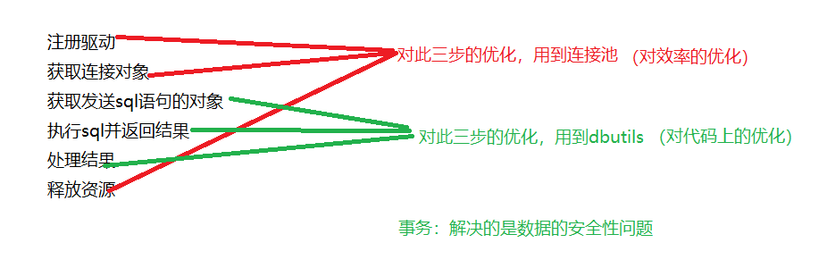
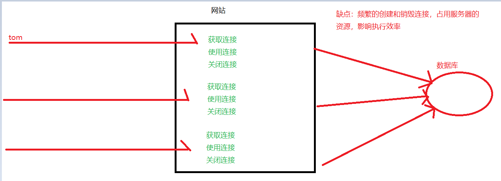
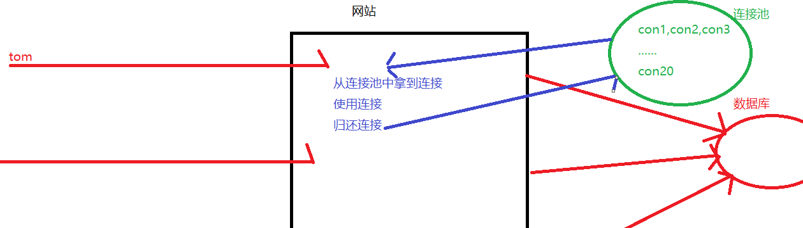
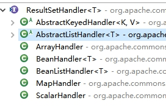

# Day10笔记  连接池&Dbutils&事务

昨日内容回顾：

1、 JDBC是什么

​	java数据库连接，是一套规范

2、 使用JDBC的好处(有规范的好处)

3、 写出注册驱动的代码

​	Class.forName("com.mysql.jdbc.Driver")

4、 写出获取连接的代码

​	DriverManager.getConnection(url,user,password)

​          jdbc:mysql://ip:端口号/数据库名

5、 获取发送sql语句的两种对象

​	conn.createStatement();            st.executeUpdate(sql);

​	conn.prepareStatement(sql)      ps.executeUpdate();

6、 Statement和PreparedStatement的区别

7、 执行更新、查询的方法分别是什么，返回类型分别是什么

​	更新：executeUpdate()    int

​	查询：executeQuery()    ResultSet

8、 抽取工具类的作用

9、 什么是sql注入问题，如何解决

10、 @Before   @Test    @After 分别代表什么意思？

今日课程安排：



## 1、**连接池**

### 1.1、**连接池**简述及原理**

原有方式：



连接池方式：



DataSource：是接口，是规范

具体的实现：由连接池厂商负责实现

​	三种连接池：dbcp、c3p0、druid

### 1.2、DBCP连接池

#### **1.2.1、简述**

DBCP也是一个开源的连接池，是Apache Common成员之一，在企业开发中也比较常见，tomcat内置的连接池。

DBCP连接池目前市面上极为**高效**的连接池。

DBCP连接池一秒钟可以创建并传递10万个左右的连接对象。

DBCP安全性并不高，有可能在高速运转丢失连接数据   (项目：对效率要求高，数据安全性方面要求低)

#### **1.2.2、连接池使用**

##### **1.2.1.1、导入jar包** 

##### **1.2.1.2、配置文件导入&代码实现   **

配置文件建议放在src下

```java
public static void main(String[] args) throws Exception {
		//创建Properties对象
		Properties prop = new Properties();
	InputStream in = 
		Demo1.class.getClassLoader().getResourceAsStream("dbcpconfig.properties");
		prop.load(in);
	//创建连接池对象
		DataSource dataSource = BasicDataSourceFactory.createDataSource(prop);
	//从连接池中获取连接
		Connection  conn = dataSource.getConnection();
		System.out.println(conn);
	}
```

##### **1.2.1.3、编写连接池工具** 

```java
public class DbcpUtils {

	static DataSource ds = null;
	static {
		//创建Properties对象
		Properties prop = new Properties();
	InputStream in = 
		Demo1.class.getClassLoader().getResourceAsStream("dbcpconfig.properties");
		try {
			prop.load(in);
			//创建连接池对象
			 ds = BasicDataSourceFactory.createDataSource(prop);
		} catch (Exception e) {
			// TODO Auto-generated catch block
			e.printStackTrace();
		}
	}
	//获取连接
	public static  Connection getConn() {
		try {
			return ds.getConnection();
		} catch (SQLException e) {
			// TODO Auto-generated catch block
			e.printStackTrace();
			return null;
		}
	}
}
```

##### **1.2.1.4、常见配置项-附录**

| 分类   | 属性                   | 描述                                       |
| ---- | -------------------- | ---------------------------------------- |
| 必须项  | **username**         | 用户名                                      |
|      | **password**         | 密码                                       |
|      | **driverClassName**  | 驱动                                       |
|      | **url**              | 路径                                       |
| 基本配置 | **acquireIncrement** | 连接池无空闲连接可用时，一次性创建的新连接数                   |
|      | initialPoolSize      | 连接池初始化时创建的连接数                            |
|      | maxPoolSize          | 连接池中拥有的最大连接数(50)                         |
|      | minPoolSize          | 连接池保持的最小连接数。                             |
|      | maxIdelTime          | 连接的最大空闲时间。如果超过这个时间，某个数据库连接还没有被使用，则会断开掉这个连接，如果为0，则永远不会断开连接。 |

参考文档：http://commons.apache.org/proper/commons-dbcp/configuration.html

### **1.3、C3P0连接池**

#### **1.3.1、简述**

C3P0开源免费的连接池！目前使用它的开源项目有：Spring、Hibernate等。

特点：效率比dbcp低，但安全性更高

#### **1.3.2、连接池使用**

##### **1.3.2.1、导入jar包**

##### **1.3.2.2、配置文件引入**

##### **1.3.2.3、编写连接池工具---默认配置**

##### **1.3.2.4、编写连接池工具---命名配置（了解)** 

```java
public static void main(String[] args) throws SQLException {
		//创建连接池对象
		//会去src下找名字固定的c3p0-config.xml
		//默认配置
		DataSource ds = new ComboPooledDataSource();
		//命名的配置
		//DataSource ds = new ComboPooledDataSource("offcn");
		System.out.println(ds.getConnection());
	}
```

### **1.4、Druid连接池**

#### **1.4.1 简述**

​	Druid是阿里巴巴开发的号称为监控而生的数据库连接池，Druid是目前最好的数据库连接池。在功能、性能、扩展性方面，都超过其他数据库连接池，同时加入了日志监控，可以很好的监控DB池连接和SQL的执行情况。Druid已经在阿里巴巴部署了超过600个应用，经过一年多生产环境大规模部署的严苛考验

#### **1.4.2 连接池的使用**

```java
public static void main(String[] args) throws Exception {
		//创建Properties对象
		Properties prop = new Properties();
	InputStream in = 
		Demo1.class.getClassLoader().getResourceAsStream("druid.properties");
		prop.load(in);
	//创建连接池对象
		DataSource dataSource = DruidDataSourceFactory.createDataSource(prop);
	//从连接池中获取连接
		Connection  conn = dataSource.getConnection();
		System.out.println(conn);
	}
```


## **2、DBUtils工具**

### **2.1、DBUtils工具简述及导入**

DBUtils是java编程中的数据库操作实用工具，小巧简单实用。

**目的：简化Jdbc代码的开发**

Dbutils核心功能介绍

- QueryRunner中提供对sql语句操作的API().

  查询：executeQuery() ResultSet、query()(根据需求封装结果集)

  更新：executeUpdate()、update()  返回的也是int

- ResultSetHandler接口，用于定义select操作后，怎样封装结果集.



 

### **2.2、DBUtils核心类-QueryRunner创建**

手动模式：

```java
	QueryRunner qr = new QueryRunner();
```

自动模式：

QueryRunner qr = new QueryRunner(C3p0Utils.getDataSource());

### **2.3、使用DBUtils核心类完成数据更新操作**

| **自动模式：update(String sql,Object…param)** | 执行数据库的更新语句              |
| ---------------------------------------- | ----------------------- |
| **手动模式：update(Connection con,String sql,Object…param) ** | 执行数据库的更新语句 第三个参数：给占位符赋值 |

 ```java
@Test
	public void test1() throws SQLException {
		//手动模式
		//创建QueryRunner对象
		QueryRunner qr = new QueryRunner();
		//准备sql
		String sql = "insert into emp values(?,?,?,?,?)";
		//给占位符赋值
		Object [] param = {null,"小白龙","男",8000,"1234"};
		//插入一条数据
		int result = qr.update(C3p0Utils.getConn(), sql,param);
		if(result > 0) {
			System.out.println("插入成功");
		}
	}
	@Test
	public void test2() throws SQLException {
		//自动模式
		//创建QueryRunner对象
		QueryRunner qr = new QueryRunner(C3p0Utils.getDataSource());
		//准备sql
		String sql = "insert into emp values(?,?,?,?,?)";
		//给占位符赋值
		Object [] param = {null,"小白龙","男",8000,"1234"};
		//插入一条数据
		int result = qr.update(sql,param);
		if(result > 0) {
			System.out.println("插入成功");
		}
	}
	//更新数据
	@Test
	public void test3() throws SQLException {
		//1、创建核心类QueryRunner
		QueryRunner qr = new QueryRunner(C3p0Utils.getDataSource());
		//2、准备sql
		String sql = "update emp set name = ? where id = ?";
		//3、给占位符赋值
		Object [] param = {"琵琶精",13};
		//4、执行
		int i = qr.update(sql, param);
		//5、处理结果
		if(i >0) {
			System.out.println("更新成功！！");
		}
	}
 ```

### **2.4、使用DBUtils核心类完成数据查询操作**

#### **2.4.1、ResultSetHandler接口简介**

QueryRunner

| **query(String sql,handler,Object[] param) ** | 执行查询语句 |
| ---------------------------------------- | ------ |
| **query(Connection con,String sql,handler,Object[] param)** | 执行查询语句 |

ResultSetHandler  结果集处理程序：

| **BeanHandler**     | 将结果集中第一条记录封装到一个指定的javaBean中。             |
| ------------------- | ---------------------------------------- |
| **BeanListHandler** | 将结果集中每一条记录封装到指定的javaBean中，将这些javaBean在封装到List集合中 |
| **MapHandler**      | 将结果集中第一条记录封装到了Map<String,Object>集合中，key就是字段名称，value就是字段值 |
| **MapListHandler**  | 将结果集中每一条记录封装到了Map<String,Object>集合中，key就是字段名称，value就是字段值，在将这些Map封装到List集合中。 |
| **ScalarHandler**   | 它是用于单数据。查询总记录数                           |


#### 2.4.2、JavaBean

> JavaBean 是一种JAVA语言写成的可重用组件。为写成JavaBean，类必须是具体的和公共的，并且具有无参数的[构造器](https://baike.baidu.com/item/%E6%9E%84%E9%80%A0%E5%99%A8/9844976)。JavaBean 通过提供符合一致性设计模式的公共方法将内部域暴露成员属性，set和get方法获取。众所周知，属性名称符合这种模式，其他Java 类可以通过自省机制(反射机制)发现和操作这些JavaBean 的属性。

Java类只要满足以下条件，就是一个JavaBean：

1、私有化属性

2、提供公共的get、set方法

3、显示提供无参构造

4、实现可序列号接口Serializable

#### **2.4.3、BeanHandler**

```java
//需求：查询id为13的用户，并将查询结果封装到Emp对象中
	@Test
	public void test1() throws SQLException {
		//1、创建QueryRunner对象
		QueryRunner qr = new QueryRunner(C3p0Utils.getDataSource());
		//2、准备sql
		String sql = "select * from emp where id = ?";
		//3、给占位符赋值  当占位符是一个时可以不用定义Object[]，直接传值
		//Object [] param = {13};
		//4、执行查询   通过javaBean中的setXxx方法赋值(字段名要和setXxx名字操持一致)
		Emp emp = qr.query(sql, new BeanHandler<Emp>(Emp.class),13);
		System.out.println(emp);
	}
```

#### **2.4.4、BeanListHandler**

//需求：查询emp表所有数据，将其封装到List<Emp>中

```java
@Test
public void test2() throws SQLException {
	//1、创建QueryRunner对象
	QueryRunner qr = new QueryRunner(C3p0Utils.getDataSource());
	//2、准备sql
	String sql = "select * from emp";
	//3、给占位符赋值  当占位符是一个时可以不用定义Object[]，直接传值
	//Object [] param = {13};
	//4、执行查询   通过javaBean中的setXxx方法赋值(字段名要和setXxx名字操持一致)
	List<Emp> elist = qr.query(sql, new BeanListHandler<Emp>(Emp.class));
	System.out.println(elist);
}
```
#### **2.4.5、MapHandler**

```java
@Test
public void test3() throws SQLException {
	//1、创建QueryRunner对象
	QueryRunner qr = new QueryRunner(C3p0Utils.getDataSource());
	//2、准备sql
	String sql = "select * from emp";
	//3、给占位符赋值
	//Object [] param = {13};
	//4、执行查询
	  Map<String, Object> map = qr.query(sql, new MapHandler());
	System.out.println(map);
}
```
#### **2.4.6、MapListHandler** 

```java
@Test
	public void test4() throws SQLException {
		//1、创建QueryRunner对象
		QueryRunner qr = new QueryRunner(C3p0Utils.getDataSource());
		//2、准备sql
		String sql = "select * from emp";
		//3、给占位符赋值
		//Object [] param = {13};
		//4、执行查询
		  List<Map<String, Object>> map = qr.query(sql, new MapListHandler());
		System.out.println(map);
	}
```

#### **2.4.7、ScalarHandler** 

```java
@Test
	public void test5() throws SQLException {
		//1、创建QueryRunner对象
		QueryRunner qr = new QueryRunner(C3p0Utils.getDataSource());
		//2、准备sql
		String sql = "select count(*) from emp";
		//3、给占位符赋值
		//Object [] param = {13};
		//4、执行查询
		Long count =  qr.query(sql, new ScalarHandler<Long>());
		System.out.println(count);
	}
```

## **3、事务**

### **3.1 事务的应用场景说明**

在实际的业务开发中，有些业务操作要多次访问数据库。一个业务(转账)要发送多条SQL语句给数据库执行。需要将多次访问数据库的操作视为一个整体来执行，要么所有的SQL语句全部执行成功。如果其中有一条SQL语句失败，就进行事务的回滚，所有的SQL语句全部执行失败。

### **3.2 操作事务**

#### **3.2.1自动提交事务(默认)**

每执行一条sql，sql会执行成功，对结果产生影响

#### **3.2.2 手动提交事务**

开启事务：start transaction

回滚事务：rollback    执行失败时回滚,回滚到事务开启的地方

提交事务：commit  执行成功时提交

### **3.3 事务原理**

概述：事务开启之后, 所有的操作都会临时保存到事务日志, 事务日志只有在得到commit命令后才会同步到数据表中，其他任何情况都会清空事务日志(rollback，断开连接)

原理图(见资料)

### **3.4 回滚点**

概述：在某些成功的操作完成之后，后续的操作有可能成功有可能失败，但是不管成功还是失败，前面操作都已经成功，   可以在当前成功的位置设置一个回滚点。可以供后续失败操作返回到该位置，而不是返回所有操作，这个点称之为  回滚点。

设置回滚点：savepoint  回滚点名字

回滚到指定位置：rollback to 回滚点名字

### **3.5 事务的四大特性（ACID）**

| **事务特性**         | **含义**                                   |
| ---------------- | ---------------------------------------- |
| 原子性（Atomicity）   | 事务是一个不可分割的工作单位，事务中的操作要么都发生，要么都不发生。（转账业务） |
| 一致性（Consistency） | 事务前后数据的完整性必须保持一致                         |
| 隔离性（Isolation）   | 是指多个用户并发访问数据库时，一个用户的事务不能被其它用户的事务所干扰，多个 并发事务之间数据要相互隔离，不能相互影响。隔离级别(课下扩展) |
| 持久性（Durability）  | 指一个事务一旦被提交（commit），它对数据库中数据的改变就是永久性的，接下来即使数据库发 生故障也不应该对其有任何影响 |

## **4、使用JDBC完成转账(使用java代码)**

 要求：使用dbutils完成

```java
public static void main(String[] args)  {
		Connection conn = null;
		try {
			 conn = C3p0Utils.getConn();
			//开启事务
			conn.setAutoCommit(false);
			//转账业务
			//提交事务
			conn.commit();
		} catch (SQLException e) {
			//回滚事务
			try {
				conn.rollback();
			} catch (SQLException e1) {
				// TODO Auto-generated catch block
				e1.printStackTrace();
			}
			e.printStackTrace();
		}
	}
```


 

 