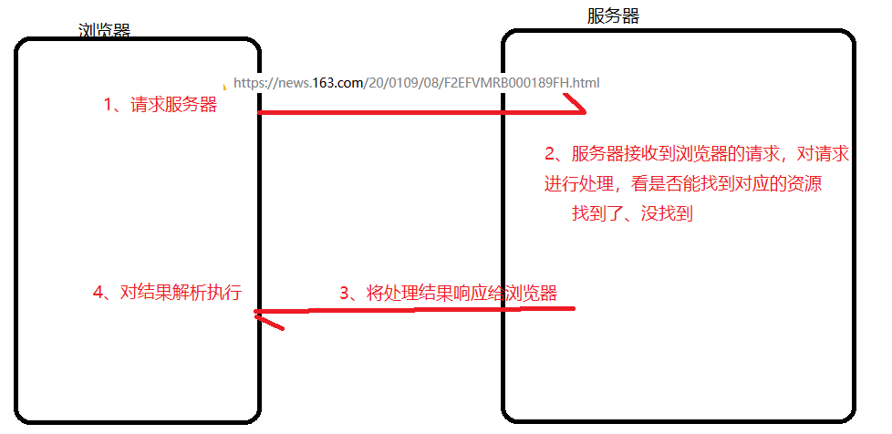
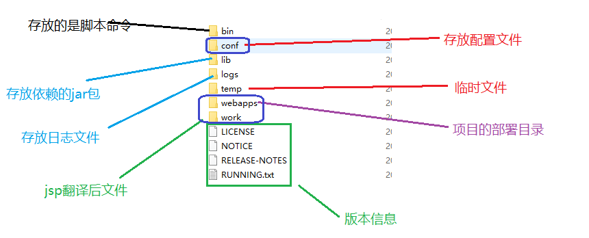
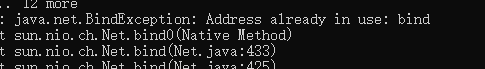
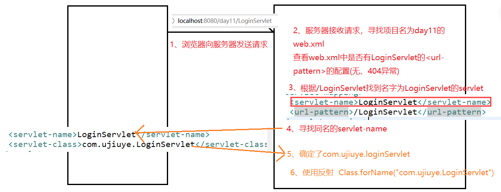
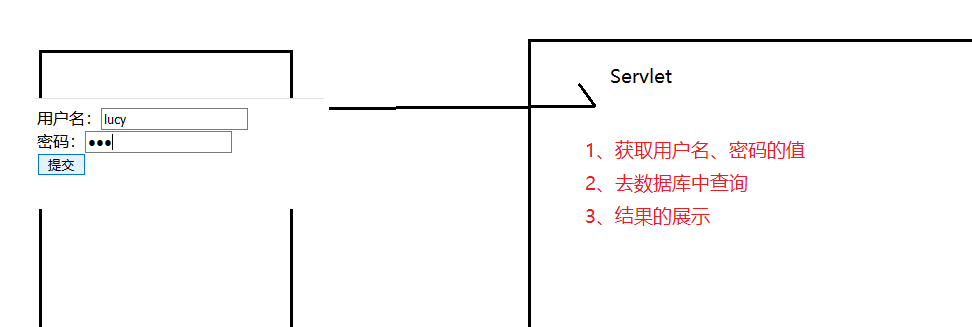

# Day11笔记

昨日内容回顾：

1、 使用连接池的好处

2、 常见的三种连接池以及使用步骤

​	dbcp：导包、配置文件、...

​        c3p0：......            DataSource ds = new Com.....();

​        druid:...........

3、 Dbutils的作用

​	相对于jdbc，就相当于jquery对js

4、 使用Dbutils完成用户的添加操作，写核心代码(user表)

​	1、创建和核心类(QueryRunner qr = new QueryRunner(datasource));

​	2、准备sql

​	3、给占位符赋值 (Object [] )

​	4、执行更新   qr.update(sql,param);  执行查询:qr.query(...)

5、 使用Dbutils完成单个用户的查询、多个用户的查询、总记录数的查询

​	Emp emp =  new BeanHandel(Emp.class)、BeanListHandler

​	ScalarHandler

6、 事务主要解决什么问题

7、 手动开启事务、提交事务、回滚事务的关键字

​	start transaction、commit、rollback

8、 回滚点的作用、设置、回滚

​	savepoion aa;  rollback to aa;

9、 事务的四大特性（ACID）

​	原子性、一致性、隔离性、持久性

10、 使用jdbc开启事务、提交事务、回滚事务的代码

# 1、 **WEB开发概述**

## 1.1、 **WEB资源介绍 **  

Web：网页/网站     web开发：网页/网站开发

在互联网上看到的一切资源都是web资源

分类：静态资源、动态资源


**静态资源**：一般客户端发送请求到web服务器，web服务器从内存在取到相应的文件，返回给客户端，客户端解析并渲染显示出来。

特点：代码不变，展示效果就不变

常见的技术：HTML、CSS、JS、图片、视频....

**动态资源**：一般客户端请求的动态资源，先将请求交于web容器，web容器连接数据库，数据库处理数据之后，将内容交给web服务器，web服务器返回给客户端解析渲染处理。

特点：展示效果由程序控制

常见的技术：Servlet、Jsp、php...

## **1.2、软件架构**

目前市场上有两种流行的软件架构：

 **C/S架构（client-server）**

 常见应用：qq、王者荣耀

 **优点：**

1. 用户体验好，效果炫
2. 信息安全的控制较强


3. 应用服务器运行数据负荷较轻，部分计算功能在客户端完成。

 **缺点：** 

1. 占用硬盘空间  
2. 维护麻烦(2019、2018......2007)


3. 安装使用依赖其他条件

**B/S架构**：(Browser-server)

**常见应用：** 12306

**优点：**

1. 维护和升级简单，无缝升级。

2. 不用必须安装程序，操作系统内置了浏览器。大大减少了使用成本

3. 不占用硬盘空间

**缺点：**

1. 动画效果受浏览器限制

2. 对信息安全控制较差。例如：网银就需要使用U盾，在浏览器端加密。

3. 应用服务器运行数据负荷较重。大部分计算都在服务器端，增加服务器压力。

## 1.3、 **WEB通信模式 **

采用BS架构



1、先有请求，再有响应

2、一次请求对应一次响应(相当于问答模式)

## 1.4、 **URL请求路径**

URL （Uniform Resource Locator） ，**统一资源定位符**，是对互联网上资源位置的一种表示，互联网上的每个文件都有一个唯一的URL。

用于标识互联网上某个资源的具体位置，相当于内网路径中的绝对路径

完整格式如下：

jdbc:mysql://ip

**协议://域名:端口号/资源位置?参数=值**

​	协议，http、https、ftp等  【必须写】

​	域名，域名或IP地址，都可以访问WEB资源【必须写】

​	端口号，程序必须使用端口号，才可以让另一个计算机访问

​	资源位置，用于描述WEB资源再服务器上的位置。

​	参数=值，浏览器和服务器交互传递的数据

例如：

常见路径

https://www.taobao.com/?spm=a2e15.8261149.1581860521.1.5c6e29b4nROeKy

百度搜索“中公教育”

http://bj.offcn.com/

## **1.5、WEB服务器软件**

服务器：电脑上装了服务器软件后

J2EE 企业级开发Java规范。标准规范包括：servlet、jsp、jdbc、xml、jta、javamail等。在java中规范就是接口。J2EE又称为JavaEE。

​	WEB服务器对JavaEE规范部分或全部支持（实现），也就是WEB服务器实现部分或全部接口。

常见的WEB服务器：

- **tomcat**：Apache组织提供一个免费的小型的服务器软件。支持Servlet和JSP规范。(选用)

- WebLogic：Bea公司的一个收费的大型的服务器软件，后被Oracle收购。支持EE的所有的规范

  运算能力较强、稳定性较高

- WebSphere：IBM公司的一个收费的超大型的服务器软件，支持EE的所有的规范。

数据库使用DB2，机器使用IBM系列

银行、金融、证券

运算能力无人出其左右，

稳定性极强

- JBoss：是一个基于J2EE的开放源代码的应用服务器。JBoss是一个管理EJB的容器和服务器，JBoss核心服务不包括支持servlet/JSP的WEB容器，一般与Tomcat或Jetty绑定使用。（总体均一般）

# **2、TOMCAT**

## **2.1、概述**

Tomcat服务器是一个免费的开放源代码的Web应用服务器。Tomcat是Apache软件基金会（Apache SoftwareFoundation）的Jakarta项目中的一个核心项目，由Apache、Sun和其他一些公司及个人共同开发而成。由于有了Sun的参与和支持，最新的Servlet 和JSP规范总是能在Tomcat中得到体现。

因为Tomcat技术先进、性能稳定，而且免费，因而深受Java爱好者的喜爱并得到了部分软件开发商的认可，是目前比较流行的Web应用服务器

## **2.2、Tomcat版本**

tomcat 目前存在很多版本，希望大家了解tomcat的版本，从而知道自己的创建的项目使用的是几版本规范，不同版本的规范技术可能不同。

​    官网：http://tomcat.apache.org/

## **2.3、安装Tomcat**

直接解压即可，免安装

## **2.4、Tomcat目录结构** 



## **2.5、Tomcat启动和访问、关闭**

启动：双击 startup.bat启动

访问：在浏览器地址栏输入：http://localhost:8080/ 看到一只小猫，代表启动成功

关闭：正常关闭：双击shutdown.bat   非正常关闭：除了正常关闭以外都是非正常关闭

## **2.6、Tomcat常见问题**

### **2.6.1、JAVA_HOME的配置**

黑窗口出现一闪而过(闪退)，检查Java_home环境变量的配置

### **2.6.2、端口号冲突**



解决：

​	1、把开启的关掉

​	2、更换端口号

## 2.7、web项目目录结构

在JavaEE规范中，WEB项目存在一定的目录结构，具体结构如下：

​     项目名称  

​            |-----静态资源.HTML，CSS，JS、图片、视频.....

​            |-----**WEB-INF**   

​                       |----**web.xml**  当前WEB项目的核心配置，Servlet2.5必须有，3.0可省略。

​                       |----lib		  当前WEB项目所需要的第三方的jar的存放位置。

​                       |----classes  Java源码编译后生成class文件存放的位置。

WEB-INF是一个受保护的目录，不能通过浏览器直接访问该目录下的资源


## 2.8、 **eclipse和tomcat整合**


创建部署项目：

- 右键 -- new  Dynamic  web project
- 部署到tomcat中webapps目录
  - 右键tomcat ，选中add and remove
  - 右键选中的资源，run as --> run  as server

# 3、 **Servlet入门案例**

- 创建一个java类，继承HttpServlet
- 重写doGet、doPost方法

```java
public class HelloServlet extends HttpServlet{
@Override
protected void doGet(HttpServletRequest req, HttpServletResponse resp) throws ServletException, IOException {
	System.out.println("get方法执行了");
}
@Override
protected void doPost(HttpServletRequest req, HttpServletResponse resp) throws ServletException, IOException {
	System.out.println("post方法执行了");
}
```

}

- 在web.xml中配置映射路径

```java
<servlet>
  	<servlet-name>HelloServlet</servlet-name>
  	<servlet-class>com.ujiuye.HelloServlet</servlet-class>
  </servlet>
  <servlet-mapping>
  	<servlet-name>HelloServlet</servlet-name>
  	<url-pattern>/hello</url-pattern>
  </servlet-mapping>
```

测试表单：

```html
<form action="/day11/hello" method="post">
		<input type="submit" value="提交" />
	</form>
```

# **4、使用Servlet完成一个用户登录**

## **4.1、需求说明**

写一个登录页面：输入用户名、密码进行登录

## **4.2、需求分析**

## **4.3、知识讲解-Servlet**

### **4.3.1、什么是Servlet**

Servlet 运行在服务端的Java小程序，是sun公司提供一套规范，**用来处理客户端请求**、响应给浏览器的动态资源。

但servlet的实质就是java代码，通过java的API动态的向客户端输出内容

### **4.3.2、Servlet的作用 **

- 接收客户端发送过来的请求(入门)
- 调用业务层进行业务处理
- 将结果响应给浏览器

### **4.3.3、Servlet的入门**

#### **4.3.3.1、准备工作**

#### **4.3.3.2、编写步骤**

- 传统三步
- 直接new Servlet

#### **4.3.3.3、Servlet的执行的流程详解**

> 为什么在浏览器上访问http://localhost:8080/day11/LoginServlet就能执行到LoginServlet的doGet方法呢？




注意：

- <url-pattern>的路径需要加上 / 否则，报以下异常

   Invalid <url-pattern> [hello] in servlet mapping

- <servlet-name>Hello</servlet-name> 无需和类名保持一致，但是他们两个必须一致

- servlet-class写法问题

- 方法找不到问题

  ```java
  405 – Method Not Allowed
  ```

### **4.3.4、Request接收请求参数**

#### **4.3.4.1、Request接收请求参数的概述**

| 方法名                                   | 描述           |
| ------------------------------------- | ------------ |
| **String getParameter(String name) ** | 获得指定参数名对应的值。 |

没有指定的参数名：返回值是null

## **4.4、登录流程分析**



## **4.5、代码实现**

login.html

```html
<form action="/day11/login" method="get">
		用户名：<input type="text" name="username"><br/>
		密码：<input type="password" name="password"><br/>
		<input type="submit" value="提交" />
</form>
```

LoginServlet：

```java
protected void doGet(HttpServletRequest request, HttpServletResponse response) throws ServletException, IOException {
		try {
			//1、获取用户名和密码的值
			String username = request.getParameter("username");
			String password = request.getParameter("password");
			//2、去数据库中校验
			QueryRunner qr = new QueryRunner(C3p0Utils.getDataSource());
			String sql = "select * from emp where name =? and password = ?";
			Object [] param = {username,password};
			Emp emp = qr.query(sql, new BeanHandler<Emp>(Emp.class),param);
			//3、结果展示
			if(emp != null) {
				System.out.println("登录成功");
			}
			else {
				System.out.println("登录失败");
			}
		} catch (SQLException e) {
			// TODO Auto-generated catch block
			e.printStackTrace();
		}
	}
```

jdbc事务代码实现：

```java
public class TansferAccount {
	
	public static void main(String[] args)  {
		Connection conn = null;
		try {
			QueryRunner qr = new QueryRunner();
			//lucy -1000
			String sql1 = "update account set balance = balance - ? where aname = ?";
			//tom  +1000
			String sql2 = "update account set balance = balance + ? where aname = ?";
			Object [] param1 = {1000,"lucy"}; 
			Object [] param2 = {1000,"tom"}; 
			conn = C3p0Utils.getConn();
			//开启事务
			conn.setAutoCommit(false);
			//转账业务
			qr.update(conn,sql1,param1);
			//出现了异常
			int i = 1 / 0;
			qr.update(conn, sql2,param2);
			//提交事务
			conn.commit();
		} catch (Exception e) {
			//回滚事务
			try {
				conn.rollback();
			} catch (SQLException e1) {
				// TODO Auto-generated catch block
				e1.printStackTrace();
			}
			e.printStackTrace();
		}
	}

}

```


作业：写一个注册页面，通过Servlet技术将页面中的数据注册到数据库中

 

 

 

 