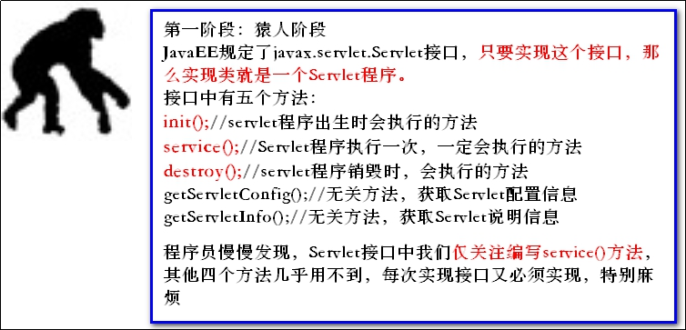
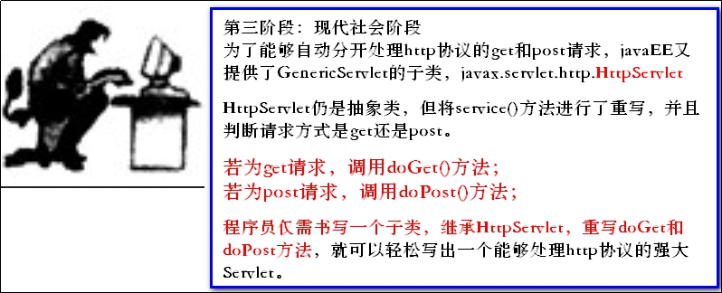
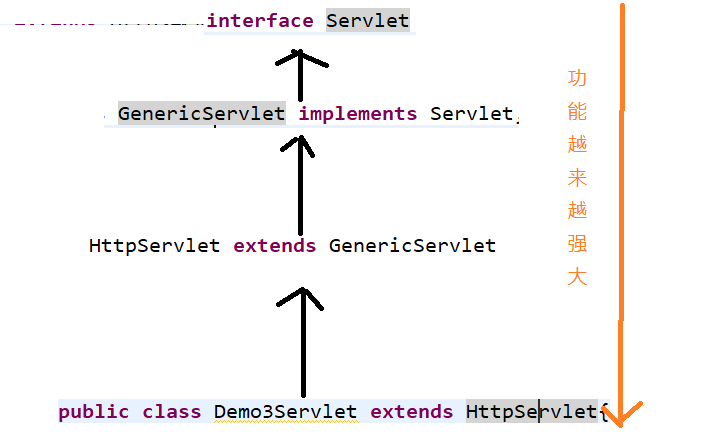
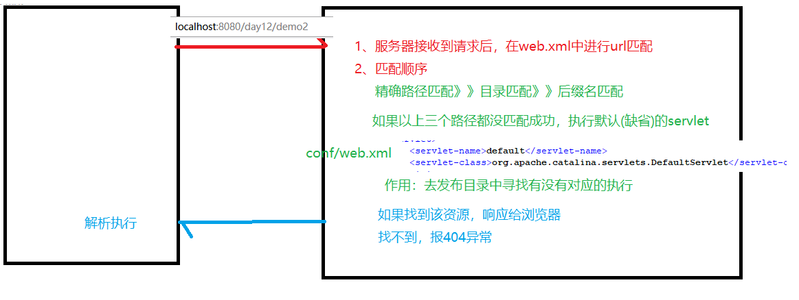
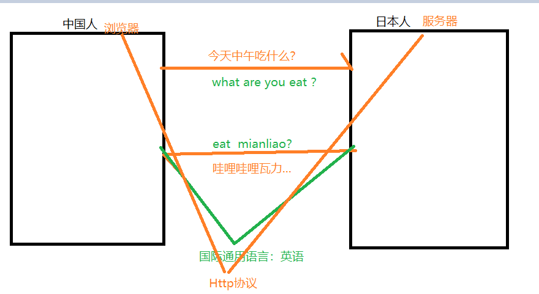
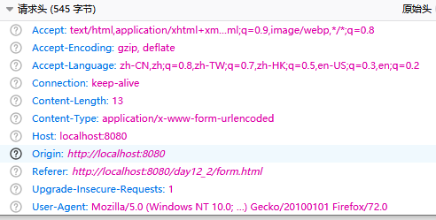
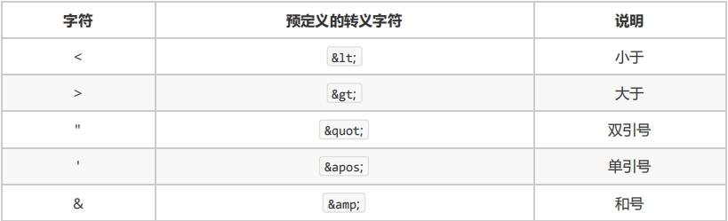
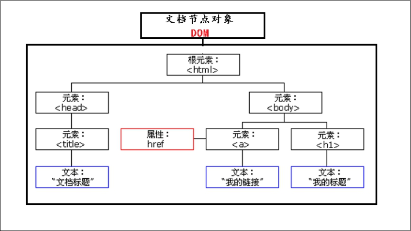
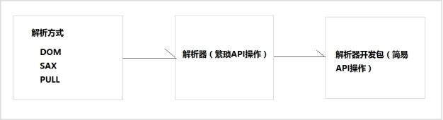

# Day12笔记 Servlet加强&HTTP协议&xml

昨日内容回顾：

1、 何为静态资源、动态资源

2、 简单描述BS架构和CS架构的区别

3、 简单描述浏览器和服务器是如何通信的

4、 何为URL、URL的格式是什么

​	协议名://主机名(ip地址、域名):端口号/资源位置?参数

5、 一个Web项目的目录结构应该是什么样

6、 编写的项目代码发布到服务器后.java代码还在不在，跑到哪里了？

7、 Servlet的作用是什么？

8、 创建一个Servlet要遵循的三个步骤分别是什么

​	继承HttpServlet、重写doGet、doPost、在web.xml中配置servlet

9、 如何获取页面提交过来的参数

​	request.getParameter("参数名")

10、 WEB-INF下的资源可否通过浏览器直接访问？

# **1、Servlet加强 **

## **1.1、Servlet的发展史及生命周期**

目前用的是HttpServlet

Servlet也是由复杂难用、功能单一，逐步发展到目前的操作简单，功能强大的。

Servlet的发展史，完全就是一部人类由猿人的进化史。

**发展史**

- Servlet接口

Servlet体系结构：

​	

## 1.2、 Servlet的生命周期

创建(出生)：servelt被第一次访问时创建，第二次以及以后访问不再创建，执行的是init方法

执行(工作)：每次请求过来都会执行service方法

销毁(死亡)：服务器关闭时销毁，执行的是detory方法

> 问题：servlet是单例对象还是多例对象？     单例

> 问题：能否在服务器启动时创建Servlet？
>
> <load-on-startup>1</load-on-startup>

## **1.3 、url-pattern **

> 1、多个Servlet能否配置同一个路径？  不能
>
> The servlets named [Demo1Servlet] and [Demo2Servlet] are both mapped to the url-pattern [/demo1] which is not permitted
>
> 2、一个Servlet能否配置多个路径？ 能够
>
> 3、路径写法的问题

匹配方式：

​	/demo1    只能匹配/demo1请求

​	/* 匹配所有请求

 	/admin/*   匹配admin目录下的所有请求

​	*.action     匹配后缀名为.action的所有请求(没有/)

匹配顺序：

## **1.4、Servlet3.0**

3.0以上版本，默认没有web.xml文件

@WebServlet("/hello")   通过注解形式配置映射路径，当路径只有一个值时，value属性可以省略不写

@WebServlet(value = {"/hello1","/hello2","/admin/*","*.action"})

​	当路径有多个值时，必须加上value属性，value属性值是数组的形式

# 2、**HTTP协议 **

## **2.1、HTTP协议的概述:** 

协议：是双方或者多方约定好遵循的共同的规则

### **2.1.1、什么是HTTP协议**

HTTP协议：超文本传输协议（HTTP，HyperText Transfer Protocol)是互联网上应用最为广泛的一种网络协议。

HTTP协议：专门用来进行超文本信息传输的  规定和规范，可以使得超文本传递更为快捷高效

该协议是为了使得浏览器和服务器之间 请求-响应传递的 超文本信息更加快捷高效。

### **2.1.2、HTTP协议的作用及特点**

**HTTP协议的作用**

HTTP协议是学习JavaWEB开发的基石，不了解HTTP协议，就不能说掌握了WEB开发，更无法管理和维护一些复杂的WEB站点。

**HTTP协议的特点**

基于请求/响应模型。请求和响应必须成对；先有请求后有响应。

### **2.1.3、HTTP协议的版本**

HTTP/1.0：创建连接---连接资源----断开连接(效率低下)

HTTP/1.1：复用连接（效率高）

### **2.1.4、HTTP协议的组成：**

请求协议：

​	  请求行、请求头、请求体

响应协议

​	响应行、响应头、响应体

## **2.2、HTTP协议入门**

### **2.2.1、HTTP请求的详解**

**请求行组成**：

​	url：http://localhost:8080/day12_2/hello1?username=lucy

​	请求方式：GET、POST

​	协议版本：HTTP/1.1

**Get和Post的区别：**

- 数据的提交方式不同

  get提交的数据在请求行上，post提交的数据在请求体中

- 安全性方面

  get不安全，post相对安全

- 提交数据量方面

  get提交的数据有限，post无限

**请求头：**

浏览器通知服务器一些事情

由代表特定含义的键值对组成：

​	

| 常见请求头             | 描述（了解）                                   |
| ----------------- | ---------------------------------------- |
| Referer           | 浏览器通知服务器，当前请求来自何处。防盗链                    |
| Cookie            | 与会话有关技术，用于存放浏览器缓存的cookie信息。(day15)       |
| User-Agent        | 浏览器通知服务器，客户端浏览器与操作系统相关信息                 |
| Connection        | 保持连接状态。Keep-Alive 连接中，close 已关闭          |
| Host              | 请求的服务器主机名                                |
| Content-Length    | 请求体的长度                                   |
| Content-Type      | 如果是POST请求，会有这个头，默认值为application/x-www-form-urlencoded，表示请求体内容使用url编码 |
| Accept：           | 浏览器可支持的MIME类型。MIME类型：互联网上为了具体传递文件类型的一种方式。扩展名类型：硬盘上为了保存数据的一种文件类型方式，例如：*.html,*.jpgMIME格式：大类型/小类型[;参数]例如：   text/html ，*.html，html格式的文本    text/css，*.css， css格式的文本   image/JPEG，*.jpg ， JPEG格式的图片 |
| Accept-Encoding   | 浏览器通知服务器，浏览器支持的数据压缩格式。如：GZIP压缩           |
| Accept-Language   | 浏览器通知服务器，浏览器支持的语言。各国语言（国际化i18n）          |
| If-Modified-Since | 浏览器通知服务器，本地缓存的最后变更时间。与另一个响应头组合控制浏览器页面的缓存。（目前使用频率不高） |
|                   |                                          |

**请求体：**

post请求的数据在请求体中

### 2.2.3、HTTP响应的详解

**响应行：**

​	版本：HTTP/1.1

​	状态码：200

​	状态描述：ok

常见的状态码：

​	200：响应成功

​	404：路径错误

​	500：服务器内部异常

​	405：方法找不到(权限)

​	304：缓存

​	302：重定向

响应头：由代表特定含义的键值对组成（服务器通知浏览器一些事情）

| 常见响应头                   | 描述(了解)                                   |
| ----------------------- | ---------------------------------------- |
| **Location**            | 重定向的路径指定响应的路径，需要与状态码302配合使用，完成跳转。(day13) |
| **Content-Type**        | 响应正文的类型（MIME类型）                          |
| **Content-Disposition** | 正文-配置。   在文件下载时才会使用通过浏览器以下载方式解析正文取值：attachment;filename=xx.zip（day13） |
| **Set-Cookie**          | 与会话相关技术。服务器向浏览器写入cookie(day15)           |
| Content-Encoding        | 服务器使用的压缩格式取值：gzip                        |
| Content-length          | 响应正文的长度                                  |
| Server                  | 指的是服务器名称，默认值：Apache-Coyote/1.1。可以通过conf/server.xml |
| Last-Modified           | 服务器通知浏览器，文件的最后修改时间。与If-Modified-Since一起使用。（目前不用） |

**响应体：**

​	html:响应体就是html......

# 3、XML

## **3.1  什么是xml**

HTML：预定义好了一些标签，直接使用，不能自定义标签

> XML 指可扩展标记语言（e**X**tensible **M**arkup **L**anguage）。
>
> - XML 指可扩展标记语言（EXtensible Markup Language）。
> - XML 是一种很像HTML的标记语言。
> - XML 的设计宗旨是传输数据，而不是显示数据。
> - XML 标签没有被预定义。您需要自行定义标签。
> - XML 被设计为具有自我描述性。
> - XML 是 W3C 的推荐标准。

和HTML的区别：

XML 不是 HTML 的替代。

XML 和 HTML 为不同的目的而设计：

- XML 被设计用来传输和存储数据，其焦点是数据的内容。
- HTML 被设计用来显示数据，其焦点是数据的外观。

HTML 旨在显示信息，而 XML 旨在传输信息

## **3.2  xml的作用**

- 用来传输数据(用JSON进行替代)
- 存储数据
- 用来做配置文件(重点)

## **3.3  如何书写xml**

XML文件数据由5个组成元素构成，分别为文档声明、 元素element、 属性、注释、CDATA区域

### **3.3.1 文档声明**

<?xml version="1.0" encoding="utf-8"?>

- 文档声明必须放在xml的首行
- 开头以<?xml，以?>结尾
- version：声明xml的版本
- encoding：声明文档的编码

### **3.3.2 元素element**

1. 元素是XML文档中最重要的组成部分；

2. 普通元素的结构由开始标签、元素体、结束标签组成。

3. 元素体：元素体可以是元素，也可以是文本

4. 空元素：空元素只有标签，而没有结束标签，但元素必须自己闭合   

5. 元素命名区分大小写

   不能使用空格，不能使用冒号不建议以XML、xml、Xml开头

6. 格式化良好的XML文档，必须只有一个根元素。

### **3.3.3 属性**

1. 属性是元素的一部分，它必须出现在元素的开始标签中
2. 属性的定义格式：属性名=“属性值”，其中属性值必须使用单引或双引号括起来
3. 一个元素可以有0~N个属性，但一个元素中不能出现同名属性
4. 属性名不能使用空格、冒号等特殊字符，且必须以字母开头

### **3.3.4 注释**

和HMTL注释一样 <!---->

### **3.3.5 CDATA区域**

格式：<![CDATA[]]>

作用：如果有一些特殊字符不想转义，就可以将其写在CDATA区域中，写在该区域中的内容会原样输出

常见转义字符：

## **3.4  XML解析**

### **3.4.1 解析概述**

​	当将数据存储在XML后，我们就希望通过程序获取XML的内容。

​	c3p0-config.xml 中的数据  driverClass、url、user、password

如果我们使用Java基础所学的IO知识是可以完成的，不过你需要非常繁琐的操作才可以完成，且开发中会遇到不同问题（只读、读写）。人们为不同问题提供不同的解析方式，使用不同的解析器进行解析，方便开发人员操作XML。

### **3.4.2 解析方式**

开发中比较常见的解析方式有三种，如下：

1、DOM：要求解析器把整个XML文档装载到内存，并解析成一个Document对象 

a）优点：元素与元素之间保留结构关系，故可以进行增删改查操作。

b）缺点：XML文档过大，可能出现内存溢出

2、SAX：是一种速度更快，更有效的方法。她逐行扫描文档，一边扫描一边解析。并以事件驱动的方式进  行具体解析，每执行一行，都触发对应的事件。（了解）

a）优点：处理速度快，可以处理大文件

b）缺点：只能读，逐行后将释放资源，解析操作繁琐。  

### **3.4.3 解析器**

就是根据不同的解析方式提供具体实现。有的解析器操作过于繁琐，为了方便开发人员，有提供易于操作的解析开发包、

 

常见的解析开发包：

- JAXP：sun公司提供支持DOM和SAX开发包Dom4j：比较简单的的解析开发包
- Dom4j：很强大
- Jsoup：功能强大DOM方式的XML解析开发包，尤其对HTML解析更加方便。

### **3.4.4 dom4j解析**

dom4j 必须使用核心类SaxReader加载xml文档获得Document，通过Document对象获得文档的根元素，然后就可以操作了。

常用API如下：

**1. SaxReader对象**

a) read(…) 加载执行xml文档

2. **Document对象**

a) getRootElement() 获得根元素

**3. Element对象**

a) elements(…) 获得指定名称的所有子元素。可以不指定名称

b) element(…) 获得指定名称第一个子元素。可以不指定名称

c) getName() 获得当前元素的元素名

d) attributeValue(…) 获得指定属性名的属性值

e) elementText(…) 获得指定名称子元素的文本值

f) getText() 获得当前元素的文本内容

XML约束：

作业：

​	1、解析c3p0-config.xml中的内容

​	2、将web.xml中<servlet-class>中的值解析出来

​	3、自定义一个xml，进行解析(练习以上的api)

 

 