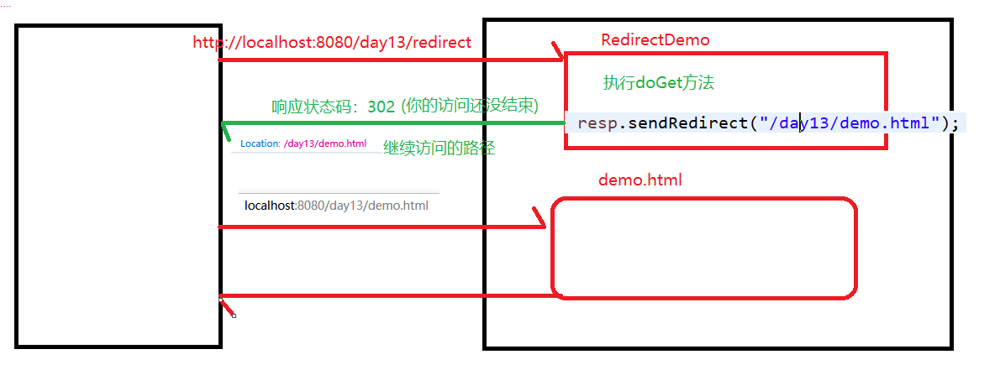
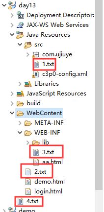

# Day13笔记-response

昨日内容回顾：

1、 请描述Servlet的生命周期

​	创建：第一次访问该Servlet时创建，执行init()

​		    服务器启动时创建：<load-on-starup>

​	执行：每次访问都会执行service()

​	销毁：服务器关闭时

2、 Servlet接口的弊端？GericServlet的弊端？

​	第一阶段：实现Servlet接口，需要重写里面的五个方法

​	第二阶段：继承GericServlet，只需要重写service（），不能处理Http协议

​	第三阶段：继承HttpServlet

3、 请描述url-pattern的匹配顺序

​	完全路径---》目录匹配--》扩展名匹配---》默认(DefaultServlet)匹配

4、 何为Http协议，为什么要使用http协议

​	超文本传输协议，使得浏览器和服务器传递数据更加快捷高效

分类：

​	请求协议、响应协议

5、 Get和post方式提交数据分别是以什么形式提交？

​	请求协议：请求行、头、体

​	get：请求行上

​	post：请求体中

6、 请求头的作用

​	浏览器通知服务器一些事情

7、 常见响应的状态码以及意思

​	200、302、304、404、405、500

8、 响应头的作用(服务器通知浏览器一些事情)

9、 XML是什么，有什么作用

可扩展的标记语言

作用：

​	传输数据(json)

​	存储数据

​	配置文件

10、 XML的组成部分

文档的声明、元素、属性、注释、CDATA区域

11、 Xml两种解析方式

​	DOM、SAX

# **1、案例1：记录网站的登录成功人数**

## **1.1、需求说明**


登录成功后,5秒后跳转到某个页面,在页面中显示您是第x位登录成功的用户.

## **1.2、知识讲解-ServletContext**

是什么：是web工程独一无二的身份证对象

生命周期：

​	创建：服务器启动时创建

​	销毁：服务器关闭时销毁

如何获取：

```java
//获取ServletContext对象	
	ServletContext context1 = req.getServletContext();
	ServletContext context2 = this.getServletContext();
	System.out.println(context1 == context2);//true
```
作用：

ServletConfig：某个Servlet独一无二的身份证对象

- 可以获取到web.xml中的全局参数

  ```java
   <context-param>
    	<param-name>encoding</param-name>
    	<param-value>utf-8</param-value>
    </context-param>
  ```

- 可以获取该web工程下的资源路径(案例2讲)

  context.getRealPath("")

- **作为域对象进行存、取、移除数据(作用范围)**

| 方法名                                      | 描述                                       |
| ---------------------------------------- | ---------------------------------------- |
| **setAttribute(String name,Object object)** | 向ServletContext中存数据，相当于map.put(key,value) |
| **getAttribute(String name)**            | 从ServletContext中取数据,map.get(key)         |
| **removeAttribute(name)**                | 从ServletContext中移除数据,map.remove(key)     |

 ```java
ServletContext1：
//存数据
context1.setAttribute("uname", "xiaoming");
ServletContext2：
		//获取ServletContext对象
		ServletContext context1 = req.getServletContext();
		//取数据
		String uname = (String)context1.getAttribute("uname");
		System.out.println(uname);
		//移除数据
		context1.removeAttribute("uname");
		String value = (String)context1.getAttribute("uname");
		System.out.println(value);
 ```

## **1.3、知识讲解-response**

​	Response对象封装了响应行、头、体三部分信息，我们可以通过调用response对象的方法，来轻松控制服务器向浏览器写响应信息

```java
public interface HttpServletResponse extends ServletResponse 
```

### **1.3.1、response对象操作响应行**

之前的状态码，服务器自动生成的(底层封装了对应的状态码)

- **setStatus(int status);**

  该方法用于设置HTTP响应消息的状态码，并生成响应状态行。由于响应状态行中的状态描述信息直接与状态码相关，而HTTP版本由服务器确定，因此，只要通过setStatus(int status)方法设置了状态码，即可实现状态行的发送。

  若未设置状态码，且服务器运行正常，Web服务器会默认产生一个状态码为200的状态行。

  手动设置状态码：resp.setStatus(444);

- **sendError(int sc,String errorMsg);**

该方法用于发送表示错误信息的状态码。

resp.sendError(500,"除零异常");

### **1.3.2、response对象操作响应头**

当Servlet向客户端发送响应消息时，由于HTTP协议的响应头字段有很多种，为此，在HttpServletResponse接口中，定义了一系列设置HTTP响应头字段的方法，如表4-1所示。

表1-1 设置响应消息头字段的方法

| 方法声明                                     | **功能描述**                                 |
| ---------------------------------------- | ---------------------------------------- |
| void addHeader(String name, String value) | 这两个方法都是用来设置HTTP协议的响应头字段，其中，参数name用于指定响应头字段的名称，参数value用于指定响应头字段的值。不同的是，addHeader()方法可以增加同名的响应头字段，而setHeader()方法则会覆盖同名的头字段 |
| **void setHeader(String name, String value)   ** |                                          |
| **void setCharacterEncoding(String charset)** | 该方法用于设置输出内容使用的字符编码，对HTTP 协议来说，就是设置Content-Type头字段中的字符集编码部分。 |
| **void setContentType(String type)**     | 该方法用于设置Servlet输出内容的MIME类型，对于HTTP协议来说，就是设置Content-Type响应头字段的值。例如，如果发送到客户端的内容是jpeg格式的图像数据，就需要将响应头字段的类型设置为“image/jpeg”。需要注意的是，如果响应的内容为文本，setContentType()方法的还可以设置字符编码，如：text/html;charset=UTF-8 |
| v**oid** **addIntHeader**(**String** name,int value) | 这两个方法专门用于设置包含整数值的响应头。避免了使用addHeader()与setHeader()方法时，需要将int类型的设置值转换为String类型的麻烦 |
| v**oid** **set**Int**Header(String name,int** value) |                                          |
| void setContentLength(int len)           | 该方法用于设置响应消息的实体内容的大小，单位为字节。对于HTTP协议来说，这个方法就是设置Content-Length响应头字段的值**无需手动设置，由服务器自行设置** |

```java
		resp.addHeader("uname", "lucy");
		resp.addHeader("uname", "jack");
		resp.setHeader("sex", "man");
		resp.setHeader("sex", "woman");
```


### **1.3.3、response对象操作响应体**

```java
//3、response操作响应体
		//获取字节输出流
		//ServletOutputStream out = resp.getOutputStream();
		//向浏览器输出信息
		//out.write("hello world".getBytes());
		//获取字符输出流
		PrintWriter writer = resp.getWriter();
		//输出一个普通字符串
		//writer.write("today is 2020/1/13 ");
		//输出html形式
		writer.write("<font color='red' size='7'>i am red font!!!</font>");
		//输出js代码
		writer.write("<script>alert('hahahha')</script>");
```

三个问题：

1、字节输出流和字符输出流可否同时使用？

不能，否则报以下异常

```java
IllegalStateException: getOutputStream() has already been called for this response
```

一山不容二虎，除非使用if .. else

2、中文乱码问题？

​	乱码的原因、解决方案

​	响应体的默认编码方式为：ISO8859-1

​	设置响应体的编码为gbk：resp.setCharacterEncoding("gbk"); 只能解决部分乱码问题

> resp.setCharacterEncoding("utf-8"); 设置响应体的编码为utf-8,
>
> resp.setContentType("text/html;charset=utf-8"); 设置响应体的编码为utf-8,并通知浏览器以utf-8的方式进行解码。可以解决全部乱码问题

解决乱码的代码建议放在首行

3、流是否需要关闭？

不需要，因为服务器帮咱们进行管理

## 1.4、知识讲解-资源跳转-重定向

两种跳转方式：

- 重定向

  立即重定向：

  ​	原理图：

  

  - 可以重定向到html中
  - 可以重定向到另一个Servlet
  - 可以多级重定向
  - 不可以重定向到WEB-INF目录下的资源
  - 可以重定向到外网

  代码：

  ​	resp.sendRedirect(url)

  **延迟重定向：**

  ​	resp.setHeader("refresh","x;url=地址值")

  ​	name：refresh

  ​	x:单位是秒

  ​	url = 地址

- 请求转发(明天讲)

## **1.5、流程分析**

 

## **1.6、案例代码实现**

LoginServlet：

```java
if(emp != null) {
				count++;
				//域对象中存数据
				this.getServletContext().setAttribute("count", count);
				//重定向
				response.getWriter().write("<h2>3秒后跳转到登录成功的提示信息页面！！！</h2>");
				response.setHeader("refresh", "3;url=/day13/show");
			}
```

ShowServlet：

```java
	//解决响应乱码
		response.setContentType("text/html;charset=utf-8");
		//从sErvletContext中取数据
		Integer count = (Integer) this.getServletContext().getAttribute("count");
		//将其响应给浏览器
		if(count != null) {
			response.getWriter().write("您是第"+count+"位登录成功的用户！！！");
		}
```


# **2、案例2：读取WEB工程下的资源文件**

## **2.1、需求说明**



## **2.2、案例代码实现-JavaSE**

```java
public class JavaSe {
	
	public static void main(String[] args) throws Exception {
		//读取1.txt
		//相对路径
		//print("src/1.txt");
		//绝对路径
		//print("G:\\java\\workspace1\\day13\\src\\1.txt");
		//读取2.txt
		print("WebContent\\2.txt");
		//读取3.txt
		print("WebContent\\WEB-INF\\3.txt");
		//读取4.txt
		print("4.txt");
	}
	//读取资源的方法
	public static void print(String path) throws IOException {
		BufferedReader reader = new BufferedReader(new FileReader(path));
		String line = reader.readLine();
		System.out.println(line);
	}

}
```

## **2.3、案例分析-JavaEE**

是部署到tomcat上的结构

## **2.4、案例代码实现-JavaEE**

```java
protected void doGet(HttpServletRequest request, HttpServletResponse response) throws ServletException, IOException {
	print("G:\\java\\apache-tomcat-8.5.29\\webapps\\day13\\WEB-INF\\classes\\1.txt");
	//获取项目的绝对路径
	String path = 	request.getServletContext().getRealPath("");
	//读取1.txt
	print(path+"/WEB-INF/classes//1.txt");
	//读取2.xt
	print(path+"/2.txt");
	//读取3.xt
	print(path+"/WEB-INF/3.txt");
	//读取4.xt(没有发布到tomcat中)
	}
```

# **3、案例3：文件下载**

## **3.1、需求说明**


超链接下载：

```java
<a href="/day13/download/hello.txt">hello.txt</a>
	<a href="/day13/download/mao.jpg">mao.jpg</a>
	<a href="/day13/download/hello.zip">hello.zip</a>
```

​	如果要查看的资源文件的格式能够直接打开查看，此时在浏览器上直接显示查看

​	如果要查看的资源文件的格式不能直接打开，此时提供下载窗口的形式下载查看(zip)

自定义下载：


文件复制的原理：


问题：

​	1、根据点击的文件名下载对应的资源

​	2、以下载窗口的形式下载资源

​	3、中文乱码的解决

## **3.2、案例代码实现**

//下载名会直接显示在下载的窗口中

​		response.setHeader("Content-Disposition", "attachment;filename="+filename);

down.html

```html
<a href="/day13/down?filename=hello.txt">hello.txt</a>
	<a href="/day13/down?filename=mao.jpg">mao.jpg</a>
	<a href="/day13/download/hello.zip">hello.zip</a>
	<a href="/day13/down?filename=骷髅头.jpg">骷髅头.jpg</a>
```

DownServlet：

```java
protected void doGet(HttpServletRequest request, HttpServletResponse response) throws ServletException, IOException {
		//获取文件名
		String filename = request.getParameter("filename");
		//读取要下载的资源文件(文件位置)
		String path = request.getServletContext().getRealPath("/download");
		//调用解决中文乱码的方法
		String downFileName = base64EncodeFileName(filename, request);
		//以下载窗口的形式弹出
		response.setHeader("Content-Disposition", "attachment;filename="+downFileName);
		//字节输入流
		InputStream in = new FileInputStream(path+"/"+filename);
		//字节输出流
		OutputStream out  = response.getOutputStream();
		//边读边写
		byte [] b = new byte[1024];
		int len = 0;
		while((len = in.read(b)) != -1) {
			out.write(b, 0, len);
		}
		//关闭流
		in.close();
	}
```

# 4、案例4：点击切换验证码

## **4.1、需求说明**

验证码的本质：一张图片

作用：用户输入验证码的时间就是服务器喘口气的事件
​	   防止恶意登录

难易程度：取决于网站的流量

## **4.2、案例原型准备 **

生成图片验证码工具：（无需手写，直接使用）

## **4.3、案例代码实现**

```java
验证码：<br>

<script type="text/javascript">
	//切换验证码
	function changeImg(){
		//获取图片对象
		var img = document.getElementById("img");
		//修改src
		img.src= "/day13/vs?time="+new Date().getTime();
	}
</script>
```


 

 

 

 

 

 

 

 

 