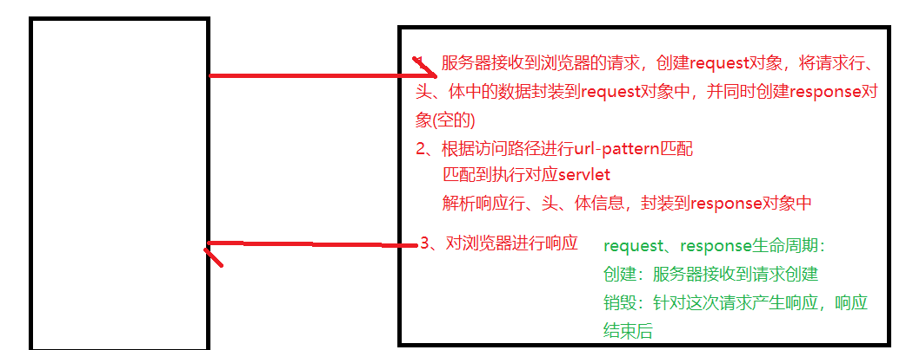
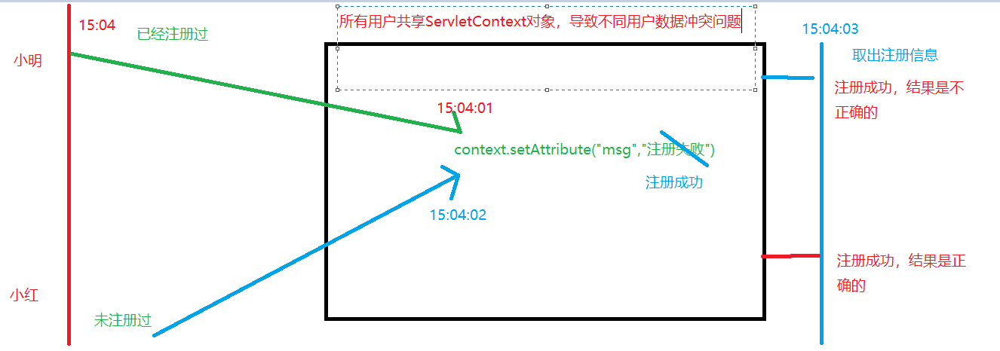
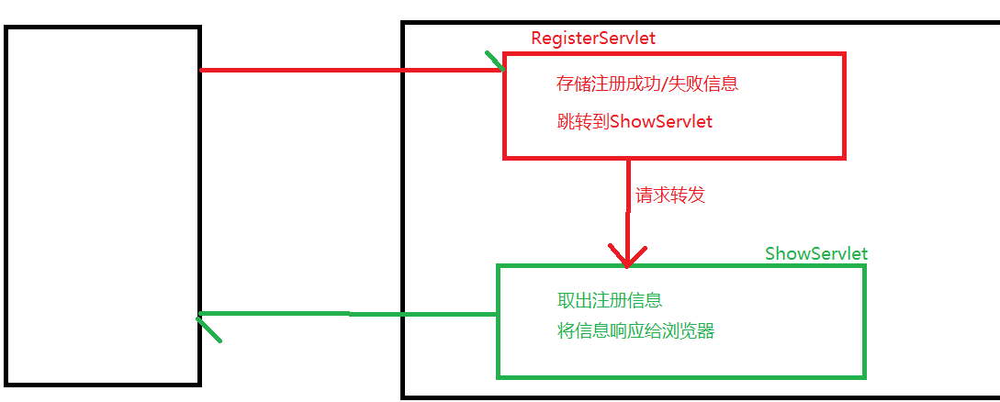

# Day14笔记-request

昨日内容回顾：

1、 ServletContext是什么？如何获取？同一个项目中不同的Servlet中获取的该对象是否是同一个？

​	是工程独一无二的身份证对象

获取：

​	this.getServletContext()；request.getServletConext()

ServletConfig：

2、 ServletContext的生命周期

​	创建：服务器启动时

​	销毁：服务器关闭时

作用：

​	1、获取web.xml中配置的全局参数

​	2、获取项目的绝对路径   context.getRealPath("")

​	3、作为域对象

3、 请写出域对象的三个方法

​	存数据：setAttribute(name,value)

​	取数据：getAttribute(name)   返回类型：Object

​	移除数据：removeAttribute(name)

4、 乱码的原因是什么，如何解决中文响应乱码？

​	响应体的默认编码方式：iso8859-1

​	response.setCharacterEncoding("utf-8")

​	response.setContentType("text/html;charset=utf-8")

5、 重定向的两种代码方式是什么

​	立即重定向：response.sendRedirect("/url")

​		响应行：302状态码   响应头：location

​	延迟重定向：response.setHeader("refresh","x;url=");

6、 如何获取项目的绝对路径

​	context.getRealPath("")

7、 请描述下载的流程

8、 如何清除验证码的缓存

```java
public interface HttpServletRequest extends ServletRequest
```

# 1、 **案例一：用户注册**

## 1.1、 **流程分析** 

- 分析业务
- 对页面进行整理
- 分析数据表，创建对应的JavaBean
- 搭建连接池环境

## 1.2、 **代码实现**

register.html(省略)

RegisterServlet：

```java
protected void doGet(HttpServletRequest request, HttpServletResponse response) throws ServletException, IOException {
		//1、获取数据
		String username = request.getParameter("username");
		String password = request.getParameter("password");
		String name = request.getParameter("name");
		String sex = request.getParameter("sex");
		String email = request.getParameter("email");
		String birthday = request.getParameter("birthday");
		//将数据封装到user对象中
		User user = new User();
		user.setUsername(username);
		user.setPassword(password);
		user.setSex(sex);
		user.setEmail(email);
		user.setName(name);
		user.setBirthday(birthday);
		//手动设置uid值
		user.setUid(UUIDUtils.getUUID());
		//2、业务处理
		RegisterDao rd = new RegisterDao();
		int result = rd.saveUser(user);
		//3、结果展示
		if(result >0) {
			System.out.println("注册成功！！");
		}else {
			System.out.println("注册失败！！");
		}
	}
```

## 1.3、 **代码优化**

### **1.3.1、问题：每一个表单参数就要写一个getParameter()，不利于开发**

| 方法声明                                     | **功能描述**                                 |
| ---------------------------------------- | ---------------------------------------- |
| String **getParameter**(String name)     | 该方法用于获取某个指定名称的参数值，如果请求消息中没有包含指定名称的参数，getParameter()方法返回null；如果指定名称的参数存在但没有设置值，则返回一个空串；如果请求消息中包含有多个该指定名称的参数，getParameter()方法返回第一个出现的参数值 |
| String[] **getParameterValues**(String name) | HTTP请求消息中可以有多个相同名称的参数（通常由一个包含有多个同名的字段元素的FORM表单生成），如果要获得HTTP请求消息中的同一个参数名所对应的所有参数值，那么就应该使用getParameterValues()方法，该方法用于返回一个String类型的数组 |
| Map **getParameterMap**()                | getParameterMap()方法用于将请求消息中的所有参数名和值装入进一个Map对象中返回 |

String  getParameter(name)    获取指定参数的单个值

String[] getParameterValues(String name)    获取指定参数的多个值

Enumeration<String> getParameterNames();  获取所有的参数名

Map<String, String[]> getParameterMap();  获取整个参数列表(包括参数名和参数值)

使用BeanUtils进行优化：

```java
//将数据封装到user对象中
User user = new User();
//获取整个参数列表
Map<String,String[]> map = request.getParameterMap();
//使用BeanUtils工具类
//map中的参数名和User中的属性名对应，将参数值赋值到属性上
BeanUtils.populate(user, map);
```

**BeanUtils进行封装时**过程：

​	map中存参数名和参数值(获取key:参数名   获取value：参数值)

​	user：属性、set方法    user.set参数名(参数值)

- 页面提交过来的参数名需要和bean中的setXxx保持一致

- 页面提交过来的参数参数类型需要和bean中属性类型保持一致，否则报以下异常

  ```java
  DateConverter does not support default String to 'Date' conversion.
  ```

### 1.3.2、问题：将生日改为日期类型(了解)

java.util.Date

```java
//日期转换器
			DateConverter conver = new DateConverter();
			conver.setPatterns(new String[] {"yyyy-MM-dd","yyyy-MM-dd hh:mm:ss"});
			//注册日期转换器
			ConvertUtils.register(conver, java.util.Date.class);
```

在数据库中，表示日期类型的有：timestrap、date、datetime、time

JavaBean：表示日期的类型有：String、java.util.Date、java.sqlDate

总结：

​	java.sql.Date   只支持年月日，不支持时分秒     需要用到日期转换器

​	java.util.Date  支持年月日，也支持时分秒    需要用到日期转换器

​	String            支持年月日，也支持时分秒  不用写日期转换器

### 1.3.3、问题：中文乱码

为什么get不乱码，而post方式乱码了!

get：提交的参数数据在请求行上(tomcat8之后服务器将get乱码解决了)

post：请求体中    请求体的默认编码方式是iso8859-1

```java
	//设置请求体的编码方式为utf-8
    request.setCharacterEncoding("utf-8");
```


## **1.4、讲解：request对象**

在Servlet API中，定义了一个HttpServletRequest接口，它继承自ServletRequest接口，专门用来封装HTTP请求消息。由于HTTP请求消息分为请求行、请求消息头和请求消息体三部分，因此，在HttpServletRequest接口中定义了获取请求行、请求头和请求消息体的相关方法，接下来，本节将针对这些方法进行详细地讲解。

### **1.4.1、request继承树**

ServletRequest		请求的顶层接口。  规定了普通请求的操作方法。 无法处理http协议

HttpServletRequest   是ServletRequest的子接口。  可以处理http协议

### **1.4.2、request操作请求行**

| **方法声明**                     | **功能描述**                                 |
| ---------------------------- | ---------------------------------------- |
| String **getMethod**()       | 该方法用于获取HTTP请求消息中的请求方式（如GET、POST等         |
| String getRequestURI()       | 该方法用于获取请求行中资源名称部分，即位于URL的主机和端口之后、参数部分之前的部分 仅获取资源名，不包含参数列表 应用场景：登录权限判断 |
| String getQueryString()      | 该方法用于获取请求行中的参数部分，也就是资源路径后面问号（?）以后的所有内容   |
| String getProtocol()         | 该方法用于获取请求行中的协议名和版本，例如，HTTP/1.0或HTTP/1.1  |
| String **getContextPath**()  | 该方法用于获取请求URL中属于WEB应用程序的路径，这个路径以“/”开头，表示相对于整个WEB站点的根目录，路径结尾不含“/”。如果请求URL属于WEB站点的根目录，那么返回结果为空字符串（""） 动态获取项目名称 |
| String getServletPath()      | 该方法用于获取Servlet的名称或Servlet所映射的路径  /demo1  |
| String **getRemoteAddr**()   | 该方法用于获取请求客户端的IP地址，其格式类似于“192.168.0.3” 本机：0:0:0:0:0:0:0:1localhost127.0.0.1 统计IP |
| String getRemoteHost()       | 该方法用于获取请求客户端的完整主机名，需要注意的是，如果无法解析出客户机的完整主机名，该方法将会返回客户端的IP地址 |
| [int getRemotePort()]()      | 该方法用于获取请求客户端网络连接的端口号                     |
| String getLocalAddr()        | 该方法用于获取Web服务器上接收当前请求网络连接的IP地址            |
| String getLocalName()        | 该方法用于获取Web服务器上接收当前网络连接IP所对应的主机名          |
| int getLocalPort()           | 该方法用于获取Web服务器上接收当前网络连接的端口号接收请求的端口号       |
| String getServerName()       | 该方法用于获取当前请求所指向的主机名，即HTTP请求消息中Host头字段所对应的主机名部分 |
| int getServerPort()          | 该方法用于获取当前请求所连接的服务器端口号，即如果HTTP请求消息中Host头字段所对应的端口号部分发送响应的端口号 |
| String getScheme()           | 该方法用于获取请求的协议名，例如http、https或ftp           |
| StringBuffer getRequestURL() | 该方法用于获取客户端发出请求时的完整URL，包括协议、服务器名、端口号、资源路径等信息，但不包括后面的查询参数部分。注意，getRequestURL()方法返回的结果是StringBuffer类型，而不是String类型，这样更便于对结果进行修改 获取到包含http协议的资源路径，不包含参数列表 |

### **1.4.3、request操作请求头（了解）**

| **方法声明**                            | **功能描述**                                 |
| ----------------------------------- | ---------------------------------------- |
| String getHeader(String name)       | 该方法用于获取一个指定头字段的值，如果请求消息中没有包含指定的头字段，getHeader()方法返回null；如果请求消息中包含有多个指定名称的头字段，getHeader()方法返回其中第一个头字段的值 |
| Enumeration getHeaders(String name) | 该方法返回一个Enumeration集合对象，该集合对象由请求消息中出现的某个指定名称的所有头字段值组成。在多数情况下，一个头字段名在请求消息中只出现一次，但有时候可能会出现多次 |
| Enumeration getHeaderNames()        | 该方法用于获取一个包含所有请求头字段的Enumeration对象         |
| int getIntHeader(String name)       | 该方法用于获取指定名称的头字段，并且将其值转为int类型。需要注意的是，如果指定名称的头字段不存在，返回值为-1；如果获取到的头字段的值不能转为int类型，将发生NumberFormatException异常 |
| Long getDateHeader(String name)     | 该方法用于获取指定头字段的值，并将其按GMT时间格式转换成一个代表日期/时间的长整数，这个长整数是自1970年1月1日0点0分0秒算起的以毫秒为单位的时间值 |

### **1.4.4、request操作请求体**

只有post有请求体，提交的数据

getParameter(name)   获取指定参数的单个值 ，返回类型是String

getParameterValues(name)  获取指定参数的多个值，返回类型是String[]

getParameterMap()   获取整个参数列表   返回类型是Map<String,String[]>

​	key：参数名   value：参数值

getParameterNames()  获取所有的参数名，返回类型是Enumeration

### **1.4.5、request和response的执行流程** 



# 2、 **案例二：用户注册信息回显前端**

另一种资源跳转方式：请求转发

## 2.1、流程分析

## **2.2、代码实现**

## **2.3、代码优化**

不同用户回显数据冲突问题：



冲突的原因：ServletContext作用范围太大了，所有人共享该域对象


解决：缩小作用范围，使用request域对象

出现了另一个问题：request生命周期短暂，导致数据取不出来

解决：使用请求转发方式跳转

代码：request.getRequestDispatcher(url).forward(request,response)




域对象：ServletContext和request

共同点：

​	都有setAttribute、get...、removeA..三个方法

不同点：

​	作用范围不同(生命周期)

request作用范围：一次请求有效

## 2.4、讲解：请求转发和重定向的区别

区别：

1. 使用对象：

   重定向：response  请求转发：request


2. 路径写法：

   重定向：客户端路径(需要写项目名)    请求转发：服务器路径(无需写项目名)


3. 能否外网跳转： 


   重定向：能

   请求转发：不能(服务器内部进行请求转发的)

4. 响应次数： 

   重定向：重定向n次，响应n+1次

   请求转发：请求转发n次，响应1次

5. 地址改变与否：

   重定向：改变地址栏

   请求转发：不改变地址栏


6. 安全特性：

   重定向：不安全，暴露要访问的资源路径

   请求转发：安全


7. 网速及效率：

   重定向：依赖网速，效率低

   请求转发：不依赖网速，效率高


8. request作用域：

   重定向：不能使用request域

   请求转发：可以使用


9. 受保护(WEB-INF)目录资源访问

   重定向：不可以

   请求转发：可以访问(服务器内部)


何时使用请求转发？

① 要求安全，不暴露程序路径

② 要求高效

③ 使用request作用域  

④ 访问受保护目录资源

 

何时使用重定向？

① 跳转外网资源

② 改变地址栏路径

只要不是上述六点，请求转发和重定向是可以相互替代的

 

 

 

 

 

 