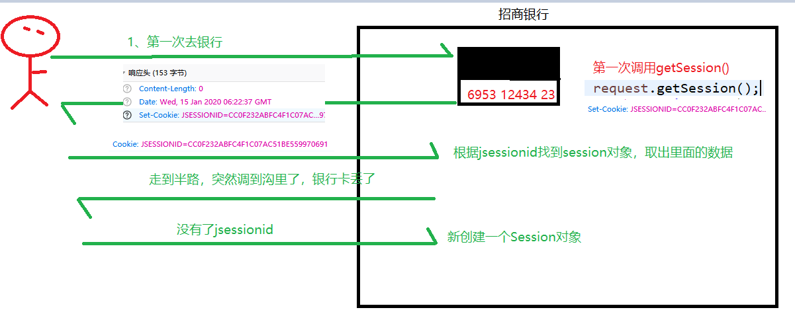
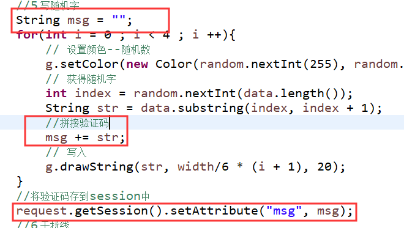

# Day15笔记Cookie和Session

昨日内容回顾：

1、 动态获取项目名的代码

request.getContextPath();    context.getRealPath()

2、 获取指定响应头的值

getHeader(头)、getHeaderNames();

3、 请写出获取参数的三个方法，分别代表什么意思

​	getParamenter(name)  getParamenterValues(name)  getParamenterMap()

4、 Beanutil.populate(user,map)的作用，需要注意的问题有哪些？

​	map中key：参数名

​	注意：1、参数名和setXxx 保持一致 2、类型需要和user中属性类型保持一致(Integer)

5、 为什么get提交参数不会乱码，而post提交则发生乱码

​	get：请求行    post：请求体

6、 如何解决请求乱码和响应乱码？

​	request.setCharacterEncoding(编码)

​	response.setContentType("text/html;charset=编码")

7、 Request和response的执行流程、生命周期

​	创建：服务器接收到请求后

​	销毁：针对请求产生响应结束后

8、 请求转发代码的书写

​	request.getRequestDispatcher(url).forward(request,response);

9、 请求转发和重定向的区别

​	使用对象、路径写法、相应次数、安全效率、是否可以访问web-inf、request域...

10、 目前学了几种域对象？有什么不同

​	ServletContext、request

​	不同：作用范围不同

11、 SerlvetContext为什么会导致数据冲突问题？

12、 request域对象为何不可以和重定向一块使用

## 1、 **案例一：记录用户的上次访问时间**

### 1.1、 **流程及技术分析**


> ## 什么是会话？
>
> 会话是浏览器和服务器之间的多次请求和响应
> 为了实现某一个功能(比如买东西)，浏览器和服务器之间可能会产生多次的请求和响应，从浏览器访问服务器开始，到访问服务器结束，浏览器关闭为止，这期间产生的多次请求和响应加在一起就称之为浏览器和服务器之间的一次会话

会话技术就相当于打电话


会话：针对的是某个浏览器的n次请求

会话开启：浏览器访问服务器开始，相当于拨通电话

会话数据

会话关闭：访问服务器结束，浏览器关闭为止，相当于挂断电话


会话数据存在哪？

​	存在浏览器端：cookie

​	存在服务器端：session

### 1.2、 **讲解：cookie**

#### **1.2.1、cookie简述**

cookie直译：小甜点、小饼干

cookie是浏览器和服务器传递的一张小纸条


服务器负责：

​	1、创建cookie并写给浏览器

​	2、解析cookie ，获取cookie中的数据

浏览器负责：

​	1、存储cookie

​	2、请求服务器向服务器传递cookie

#### **1.2.2、cookie入门案例**

##### **1.2.2.1、入门案例1：服务器给浏览器写cookie**

```java
//1、创建cookie对象
		Cookie cookie = new Cookie("uname", "lucy");
		//2、将cookie写给浏览器
		resp.addCookie(cookie);   //以响应头的形式将cookie写过来，浏览器存储cookie 
```

服务器关闭会不会销毁cookie ：不会

浏览器关闭会不会销毁:会(默认存储在浏览器内存中)

#### 1.2.2.2、入门案例2：浏览器携带cookie，服务器解析

```java
//1、获取所有的cookie
		Cookie [] cookies = req.getCookies();
		//2、获取cookie的名字和值
		if(cookies != null) {
			for(Cookie cookie : cookies) {
				//获取cookie名字
				String name = cookie.getName();
				String value = cookie.getValue();
				System.out.println(name+":"+value);
			}
		}
```

cookie随着浏览器的关闭而销毁，新打开一个浏览器是没有之前的cookie的

##### 1.2.2.2、入门案例2：浏览器把cookie传递给服务器，服务器解析	

#### **1.2.3、cookie原理**


#### **1.2.4、cookie使用注意  **

cookie存储数据是有限的：一般不超过4kb

一个网站的cookie数量是有限的：20-30个

一个浏览器上cookie数量也是有限的：200-300个


cookie应用场景：

​	1、浏览的历史记录(将商品的id存在cookie中)

​	2、七天自动登录(将用户名和密码存在cookie中)

#### **1.2.5、cookie种类**

分类：

​	会话级别的cookie：cookie存在浏览器内存中，随着浏览器的关闭而销毁(默认)

​	持久化级别的cookie：设置cookie的生存时间，cookie存在浏览器指定的硬盘空间中

​						只有时间没到期，cookie就会一直存在

设置cookie的生存时间：

| 方法名                       | 描述             |
| ------------------------- | -------------- |
| **setMaxAge**(int expiry) | 设置cookie的生存时间。 |

int的取值：

​	负数：会话级别的cookie

​	0：立即过期

​	正数：存活的时间        单位：秒

七天自动登录：

​	setMaxAge(60x60x24x7);

#### 1.2.6、cookie的有效路径

浏览器将cookie保存硬盘的路径，是各个浏览器自己制定，其他无法进行操作的。

有效路径：浏览器发送请求时，cookie的代入路径。

请求路径 等于或者包含cookie的有效路径，该cookie会在请求时被代入。

**请求路径是从资源位置开始进行判断**

| 方法名                               | 描述                                       |
| --------------------------------- | ---------------------------------------- |
| **setPath**(java.lang.String uri) | 设置有效路径。设置cookie允许被访问的路径。 携带cookie：访问设置的路径，以及子路径都被允许访问。 |

setPath("/aa")  访问/aa路径以及子路径时才会携带cookie

cookie1.setPath("/day15/aa");   uname

cookie2.setPath("/day15/aa/bb");  pwd

cookie3.setPath("/day15");  sex

访问路径1：http://localhost:8080/day15/

​	携带一个cookie：sex

访问路径2：http://localhost:8080/day15/qqq

携带一个cookie：sex

访问路径3：http://localhost:8080/day15/aa/www

携带两个cookie：uname、sex

访问路径4：http://localhost:8080/day15/aa/bb/www

携带三个cookie：uname\pwd sex

访问路径5：http://localhost:8080/day16

携带0个


不设置有效路径时：

​	是否默认是setPath("/day15")？  非也

如果Sevlet设置了该路径：@WebServlet("/www/cookie3")

只有访问/www目录下的路径才会携带cookie


需求：访问该项目下的所有资源都携带该cookie

手动设置：cookie.setPath(/项目名)

### 1.3、 **代码实现** 

```java
@WebServlet("/visit")
public class VisitServlet extends HttpServlet {
	protected void doGet(HttpServletRequest request, HttpServletResponse response) throws ServletException, IOException {
			//记录用户的访问时间
		Date date = new Date();
		//将当前访问时间存到cookie中
		Cookie cookie = new Cookie("lastTime", date.getTime()+"");
		response.addCookie(cookie);
	}

 @WebServlet("/show")
public class ShowServlet extends HttpServlet {
	protected void doGet(HttpServletRequest request, HttpServletResponse response) throws ServletException, IOException {
		response.setContentType("text/html;charset=utf-8");
		Cookie lastTime = null;
		//取出上次访问时间
		Cookie [] cookies = request.getCookies();
		if(cookies != null) {
			for(Cookie cookie:cookies) {
				//判断cookie名字是否等于lastTime
				if("lastTime".equals(cookie.getName())) {
					lastTime = cookie;
				}
			}
		}
		//将时间相应给浏览器
		if(lastTime != null) {
			String time = lastTime.getValue();
			Date date = new Date(Long.parseLong(time));
			response.getWriter().write("上次访问时间是："+date.toLocaleString());;
		}
	}
```


## 2、 **案例二：一次性验证码的校验**

### **2.1、讲解：session**

#### **2.1.1、session的简述**

会话数据存在服务器端的技术

和cookie的区别：

​	cookie：存在浏览器端，存储数据量小，安全性低

​	session：存在服务器端，存储数据量大，安全性高

#### **2.1.2、session的入门案例**

##### **2.1.2.1、入门案例-获取session查看执行现象**

request.getSession();

当第一次执行getSession()，会在响应头生成一个名字为JSESSIONID的一个cookie

当第二次以及以后执行getSession()，此时不再在响应头上生成JSESSION的cookie

第二次以及右后的请求，会以请求头的形式将JSESSIONID携带过去

##### **2.1.2.2、入门案例-使用session进行数据共享**

第三个域对象：

```java
//创建session对象
		HttpSession session = request.getSession();
		session.setAttribute("uname", "xiaohong");
HttpSession session = request.getSession();
		String uname = (String)session.getAttribute("uname");
		System.out.println(uname);
```


新打开一个浏览器，此时就是一个新的会话，拿到的就是一个新的session对象

浏览器关闭，会话结束。JSESSIONID销毁(会话级别的cookie)

#### **2.1.3、session的原理** 



#### 2.1.4、session的生命周期

创建：第一次调用request.getSession();

销毁：

- 非正常关闭服务器时销毁session

​	正常关闭，会将session序列化到指定的硬盘空间中

G:\java\apache-tomcat-8.5.29\work\Catalina\localhost\day15

​	再次启动时，反序列化到服务器中

- 手动调用invalidate()  可以销毁session

- 不操作session，30分钟后自动销毁

  tomcat/conf/web.xml

  ```java
     <session-config>
    <session-timeout>30</session-timeout>
    单位：分钟
  </session-config>
  ```

ServletContext、request、session（三个域对象）、Servlet	

#### 2.1.5、session常用API

public void invalidate();

public void setAttribute(String name, Object value);

get....、removeA..

### **2.2、流程分析** 

### **2.3、案例代码实现**

login.html

```html
<form action="/day15/check" method="get">
		用户名：<input type="text" name="username" /><br/>
		密码：<input type="password" name="password" /><br/>
		验证码：<input type="text" name="code"/>
		<br>
		<input type="submit" value="提交" />
	</form>
```

V.codeServle：



CheckServlet：

```java
protected void doGet(HttpServletRequest request, HttpServletResponse response) throws ServletException, IOException {
		//获取输入框的验证码
		String code = request.getParameter("code");
		//获取session中的验证码
		String msg = (String)request.getSession().getAttribute("msg");
		//作废验证码(一次性)
		request.getSession().removeAttribute("msg");
		if(code != null && code.equalsIgnoreCase(msg)) {
			System.out.println("验证码正确！！");
		}else {
			System.out.println("验证码错误");
		}
	}
```


 

 作业1：登录

​	登录成功：跳转到首页，在首页上显示：欢迎您：xxx(lucy)

​	登录失败：跳转到失败页面，在页面上显示您输入的用户名或者密码不正确

作业2：<a href="">查询所有用户</>

​	将数据库中所有用户查询来，展示到页面上！！(用表格进行展示)

​	用户id          用户名         性别          生日

​	1                  lucy                  女         1990-12


 

 

 