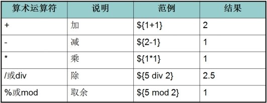

昨日内容回顾：

1. 以下方法是HttpSeesion中常用的方法的是（ABCDE）

   session是域对象

A． String getID();

B.  void invalidate(); 销毁session

C.  void setAttribute();

D. object getAttribute();

E． void removeAttribute();

2. 以下关于HttpSession对象的创建和销毁说法正确的是()CDEF

A．服务器一启动session对象就会被创建；第一次调用request.getSession()

B.关闭浏览器session就会被销毁；（jsessionid默认会话级别的cookie，浏览器关闭jsession会销毁，但session并未销毁）

C.服务器第一次调用的getSession()方法时，服务器创建session对象;

D．销毁session，可以手动调用invalidate()方法;

E．非正常关闭服务器，session会被销毁;

F．Session的默认有效时间是30分钟，过期会自动销毁;

3. 下列关于Cookie和Session说法正确的是（ABCDE）

A．Session是基于Cookie技术的；

B．Cookie是有大小和个数的限制的；

C．Session存到服务器端的技术没有大小和个数的限制

D．Cookie相对于Session来讲是不安全的

E．每一个Session在服务端有一个jsessionID作为标识

F. session的一次会话范围是一次请求和一次响应

4. 关于Cookie原理说法正确的是（ACD）

A  Cookie是基于客户端技术，默认把Cookie保存在客户端浏览器

​	分类：	会话级别的、持久化级别(setMaxAge(x))

B  Cookie对象是客户端浏览器创建的

Cookie cookie = new Cookie(name,value)

C  Cookie是基于Http协议

D  Cookie可以在客户端与服务器进行数据的传递

5. 关于持久级别Cookie说法正确的是（C）

A.持久级别Cookie是默认的

B.关闭浏览器就可以销毁持久Cookie   setMaxAge()

C.可以用 setMaxAge(int expiry)方法设置Cookie有效时长,超过了该时间后Cookie会自动销毁. 

D.持久Cookie是存储在浏览器缓存中的

今日内容：

1、JSP解决什么问题，好处

2、掌握JSP的语法

3、JSP三大指令

4、JSP九大内置对象

5、jsp四大域对象

6、EL表达式(重点)

7、JSTL标签(重点)

# **Day16笔记-JSP**

## 1、 **案例一：展示所有员工信息**

### 1.1、**流程分析**


准备环境：

- 页面上的超链接请求
- 数据库的表
- 包结构中的内容
- 测试数据库环境

### 1.2、**代码实现**

index.html：

```html
<a href="/day16/searchAll">查询所有员工信息！！</a>
```

Servlet：

```java
response.setContentType("text/html;charset=utf-8");
		//1、准备数据(暂无)
		//2、业务处理
		SearchEmpDao sed = new SearchEmpDao();
		List<Emp> elist = sed.searchAllEmp();
		//3、结果的展示
		PrintWriter writer = response.getWriter();
//省略拼接代码
 //遍历集合中的数据
		      for(Emp emp:elist) {
		      writer.write("\t\t<tr>\r\n");
		      writer.write("\t\t\t<td>"+emp.getId()+"</td>\r\n");
		      writer.write("\t\t\t<td>"+emp.getName()+"</td>\r\n");
		      writer.write("\t\t\t<td>"+emp.getGender()+"</td>\r\n");
		      writer.write("\t\t\t<td>"+emp.getSalary()+"</td>\r\n");
		      writer.write("\t\t\t<td>"+emp.getJoin_date()+"</td>\r\n");
		      writer.write("\t\t</tr>\r\n");
		      }
```

Dao:

```java
//查询所有员工信息
	public List<Emp> searchAllEmp(){
		QueryRunner qr = new QueryRunner(C3p0Utils.getDataSource());
		String sql = "select * from emp";
		try {
			return qr.query(sql, new BeanListHandler<Emp>(Emp.class));
		} catch (SQLException e) {
			// TODO Auto-generated catch block
			e.printStackTrace();
			return null;
		}
	}
```

做响应体输出的技术：Serlvet    

缺点：开发麻烦、维护麻烦，拼接了很多html代码，仅能完成简单的功能，吃力不讨好

解决：jsp

### 1.3、**JSP术**

#### 1.3.1、**JSP简述**

> **JSP**（全称**J**ava**S**erver **P**ages）是由[Sun Microsystems](https://baike.baidu.com/item/Sun%20Microsystems)公司主导创建的一种动态网页技术标准。JSP部署于网络服务器上，可以响应客户端发送的请求，并根据请求内容动态地生成[HTML](https://baike.baidu.com/item/HTML)、[XML](https://baike.baidu.com/item/XML)或其他格式文档的[Web](https://baike.baidu.com/item/Web)网页，然后返回给请求者。JSP技术以[Java](https://baike.baidu.com/item/Java)语言作为[脚本语言](https://baike.baidu.com/item/%E8%84%9A%E6%9C%AC%E8%AF%AD%E8%A8%80)，为用户的[HTTP](https://baike.baidu.com/item/HTTP)请求提供服务，并能与服务器上的其它Java程序共同处理复杂的业务需求。
>
> JSP将Java代码和特定变动内容嵌入到静态的页面中，实现以静态页面为模板，动态生成其中的部分内容。

JSP全名是Java Server Pages。Java 服务器  页面


从入门案例可以看出：

​	HTML：不能写Java代码，只能展示静态资源

​	JSP：里面可以写java代码，可以进行动态资源的开发  

​	JSP  =   Java  +  HTML

​	JSP和Servlet的区别：

​		Jsp：因为里面可以书写html  ，不用进行html的拼接

​		Servlet：java代码，进行HTML的拼接

它是建立在Servlet规范之上的动态网页开发技术。在JSP文件中，HTML代码与Java代码共同存在，其中，HTML代码用来实现网页中静态内容的显示，Java代码用来实现网页中动态内容的显示。为了与传统HTML有所区别，JSP文件的扩展名为**.jsp**。

##### **1.3.1.1  入门案例** 

创建jsp和html对比

##### **1.3.1.2  Jsp执行原理**


tomcat/conf/web.xml

```xml
  <servlet-mapping>
        <servlet-name>jsp</servlet-name>
        <url-pattern>*.jsp</url-pattern>扩展匹配成功Servlet
        <url-pattern>*.jspx</url-pattern>
    </servlet-mapping>
```

Jsp翻译后翻译成一个Java类，该类继承了HttpJspBase,HttpJspBase继承HttpServlet

```java
class rumen_jsp extends org.apache.jasper.runtime.HttpJspBase

class org.apache.jasper.runtime.HttpJspBase extends  javax.servlet.http.HttpServlet
```

Jsp本质：就是一个Servlet

替代Servlet做响应体输出(服务器帮咱们jsp中的html标签、java代码进行翻译，无需我们手动编写)

> 问题：翻译和编译会影响执行效率(是否每次访问jsp都会进行翻译和编译呢？)？

​	翻译时机：只有第一次访问该jsp以及修改jsp文件后

#### 1.3.2、**JSP开发模板修改** 


#### 1.3.3、**JSP脚本**

#### 1.3.4、**JSP注释** 

#### **1.3.5、JSP指令**

##### **1.3.5.1、指令简述**

##### **1.3.5.2、Page指令**

| **属性名称**        | **取值or范围**       | **描述**                                   |
| --------------- | ---------------- | ---------------------------------------- |
| pageEncoding    | 当前页面             | 指定页面编码格式                                 |
| **contentType** | 有效的文档类型          | 客户端浏览器根据该属性判断文档类型                        |
| **errorPage**   | 某个JSP页面的相对路径     | 指定一个错误页面，如果该JSP程序抛出一个未捕捉的异常，则转到errorPage指定的页面。errorPage指定页面的isErrorPage属性为true，且内置的exception对象为未捕捉的异常 **当前页面出现异常，跳转到哪个页面展示**** ** |
| **isErrorPage** | true / **false** | 指定该页面是否为错误处理页面，如果为true，则该JSP内置有一个Exception对象的exception，可直接使用。默认情况下，isErrorPage的值为false **设置当前页面是否为标准错误页面**标准错误页面：可以获取并展示跳转而来页面的错误信息isErrorPage设置为true以后，多出一个exception变量exception变量封装了跳转而来页面的异常信息 |
|                 |                  |                                          |
| **import**      | 任何包名、类名          | 指定在JSP页面翻译成的Servlet源文件中导入的包或类。import是唯一可以声明多次的page指令属性。一个import属性可以引用多个类，中间用英文逗号隔开。 |
| language        | java             | 指明解释该JSP文件时采用的语言，默认为Java                 |
|                 |                  |                                          |
|                 |                  |                                          |

##### **1.3.5.3、include指令** 

##### **1.3.5.4、taglib指令(JSTL中讲)	**

#### **1.3.6、JSP九大内置对象**

##### **1.3.6.1、九大内置对象简述**

_jspService()内部定义了一些变量/常量，让程序员方便使用

| **名称**          | **类型**                                 | **描述**                                   |
| --------------- | -------------------------------------- | ---------------------------------------- |
| out             | javax.servlet.jsp.JspWriter            | 用于页面输出JSP输出字符流                           |
| **request**     | javax.servlet.http.HttpServletRequest  | 得到用户请求信息。域对象，针对某次请求                      |
| response        | javax.servlet.http.HttpServletResponse | 服务器向客户端的回应信息                             |
| config          | javax**.servlet.ServletConfig**        | 服务器配置，可以取得初始化参数JSP配置信息的封装对象（一般不用）        |
| **session**     | javax.servlet.http.HttpSession         | 用来保存用户的信息域对象，针对某次会话N次请求                  |
| application     | javax.servlet.ServletContext           | 所有用户的共享信息域对象，针对整个项目的所有请求                 |
| page            | java**.lang.Object**                   | 指当前页面转换后的Servlet类的实例当前JSP对应的Servlet对象。（一般不用 |
| **pageContext** | javax.servlet.jsp.PageContext          | JSP的页面容器 域对象，是JSP独有的。普通Servlet是没有这个域对象最小的域对象，作用范围：是当前JSP页面 |
| **exception**   | java.lang.Throwable                    | 表示JSP页面所发生的异常，在错误页中才起作用 设置了isErrorPage=”true”才会出现。封装了上一个页面的错误信息。 |

##### **1.3.6.2、pageContext对象**

pageContext对象是JSP独有的，普通Servlet没有这个对象。

作用范围：当前JSP页面

作用：

- JSP最小的域对象
- 操作其他作用域 

##### **1.3.6.3、out对象** 

#### **1.3.7、JSP四大作用域总结**

### 1.4、**使用JSP优化案例代码**

## **2、案例二：展示所有员工信息**

### **2.1、讲解：EL表达式**

#### **2.1.1、EL简述**

EL是Expression Language的缩写，它是一种简单的数据访问语言。本节将针对EL表达式进行详细的讲解。

EL（Expression Language） 目的：为了使JSP写起来更加简单。表达式语言的灵感来自于 ECMAScript 和 XPath 表达式语言，它提供了在 JSP 中简化表达式的方法，让Jsp的代码更加简化。

#### **2.1.2、EL表达式使用**

##### **2.1.2.1、入门案例  简单使用EL表达式** 

##### **2.1.2.2、数据的读取**

##### **2.1.2.3、数据的运算 （域对象）**

对常量进行运算：   （不频繁）

对域对象数据进行运算： 频繁使用




##### 2.1.2.4、数据的判断

### **2.2、讲解：JSTL标签**

#### **2.2.1、JSTL标签的简述及导入**

JSTL标签和EL表达式的作用是一样的，简化大量的JSP脚本。

JSTL作用原理和EL表达式一样的，翻译成大段的Java代码来使用。

| **标签库**   | **标签库的URI**                            | **前缀** |
| --------- | -------------------------------------- | ------ |
| Core      | http://java.sun.com/jsp/jstl/core      | c      |
| I18N      | http://java.sun.com/jsp/jstl/fmt       | fmt    |
| SQL       | http://java.sun.com/jsp/jstl/sql       | sql    |
| XML       | http://java.sun.com/jsp/jstl/xml       | x      |
| Functions | http://java.sun.com/jsp/jstl/functions | fn     |
|           |                                        |        |

#### **2.2.2、<c:if>**

#### **2.2.3、<c:forEach> 		**

### **2.3、案例代码优化** 

 

