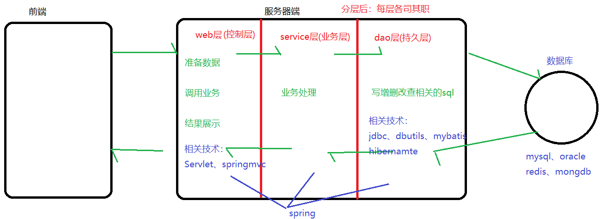
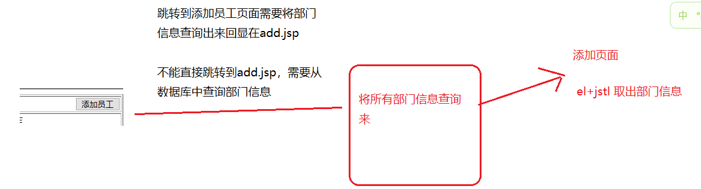
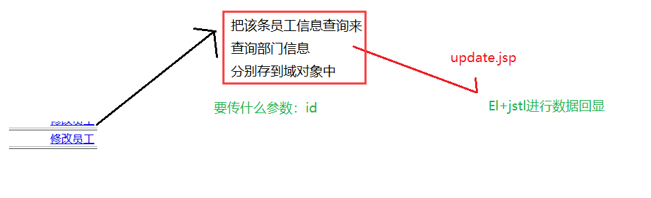
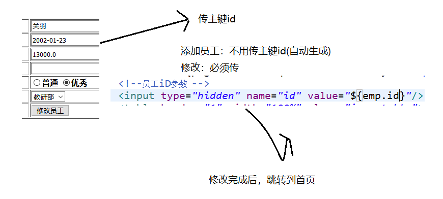

# Day17综合应用

昨日内容回顾：

1、使用Servlet作响应体输出的弊端

​	响应体输出：字节流、字符流

​	弊端：需要手动拼接html

2、JSP和HTML、Servlet的区别

​	jSP = HTML +  JAVA

3、为何说Jsp本质是个Servlet

​	jsp翻译后继承了HttpJspBase  ，又继承了HttpServlet

4、JSP的执行原理

5、Jsp何时进行翻译和编译

​	第一次访问或者修改后

6、指令的书写格式

​	三大指令：page、include、taglib

7、Page指令中有哪些属性，分别代表什么意思

​	contentType、errorPage、isErrorPage、import

8、include指令的作用，如何书写

​	<%@ 指令名 属性 = “值”%>

​	file

9、taglib指令的作用，何时用

​	<c:if>  <c:foreach>

10、Jsp的九大内置对象有哪些？

​	reqeust、response、session、application、page、pageContext

​	out、config、exception

11、jsp字符输出流和Servlet输出流的区别

​	out.write()

​	response.getWriter().write()

12、Jsp的四大作用域

​	pageContext、request、session、application

13、EL表达式的作用是什么

​	简化jsp的书写：${}

​	<%request.getAt.....%>

14、EL表达式可否取出变量的值？可否取出域中的值？

​	${2+2}

​	域存储的常见类型：

​	基本类型、数组、集合、JavaBean、List<JavaBean>

15、JSTL标签的作用

​	<%for%>

​	简化jsp的书写

​	使用：导入jar包、引入标签库

16、请分别写出<c:if>、<c:foreach>中每个属性代表的意思

​	test="${}"   判断条件是否成立

​	items="${}" 要遍历的集合/数组

​	var = ""

​	varStatus=""

## 1、 **项目分层**



包结构划分：

​	包名：公司域名倒写   com.ujiuye、com.offcn

​	dao：dao层

​	service：业务层

​	web：控制层

​	utils：工具层

​	pojo/domain/entity：JavaBean

## 2、 **案例一：查询所有员工信息**

### 2.1、 **流程分析**

### 2.2、 **案例代码实现**

Servlet动态获取项目名：request.getContextPath();

Jsp动态获取项目名：${pageContext.request.contextPath}

index.jsp

```html
<a href="${pageContext.request.contextPath}/searchAllEmp">查询所有员工信息</a>
```

SearchAllEmp：

```java
@WebServlet("/searchAllEmp")
public class SearchAllEmp extends HttpServlet {
	protected void doGet(HttpServletRequest request, HttpServletResponse response) throws ServletException, IOException {
		//1、准备数据(暂无)
		//2、调用业务
		EmpService es = new EmpService();
		List<Emp> elist = es.findElist();
		//3、结果展示
		request.setAttribute("elist", elist);
		request.getRequestDispatcher("/elist.jsp").forward(request, response);
	}
```

Service：

```java
//查询所有员工
		public List<Emp> findElist(){
			return ed.findElist();
		}
```

dao：

```java
//查询所有员工
	public List<Emp> findElist(){
		QueryRunner qr = new QueryRunner(C3p0Utils.getDataSource());
		String sql = "select * from emp";
		try {
			return qr.query(sql, new BeanListHandler<Emp>(Emp.class));
		} catch (SQLException e) {
			// TODO Auto-generated catch block
			e.printStackTrace();
			return null;
		}
	}
```

emp_list.jsp

```html
<c:if test="${not empty elist}">
		<c:forEach items="${elist}" var="emp" varStatus="vs">
		<tr>
			<td>${vs.count}</td>
			<td>${emp.ename}</td>
			<td>${emp.joindate}</td>
			<td>${emp.salary}</td>
			<td>${emp.bonus}</td>
			<td align="center">
				<a href="">修改员工</a>
				<a href="">删除员工</a>
			</td>
		</tr>
		</c:forEach>
		</c:if>
```

## 3、 **案例二：添加员工**

### **3.1、流程分析**

- 跳转到添加员工页面

  


- 添加员工信息

### 3.2、案例代码实现

跳转跳转到添加员工页面实现：

elist.jsp

```html
<input type="button" onclick="toAdd()" value="添加员工"/>
<script type="text/javascript">
	//跳转到添加员工页面
	function toAdd(){
		location.href = "${pageContext.request.contextPath}/toAdd";
	}
</script>
```

```java
@WebServlet("/toAdd")
public class ToAddEmp extends HttpServlet {
	protected void doGet(HttpServletRequest request, HttpServletResponse response) throws ServletException, IOException {
		//2、业务处理
		EmpService es = new EmpService();
		List<Dept> dlist = es.findDlist();
		request.setAttribute("dlist", dlist);
		request.getRequestDispatcher("/add.jsp").forward(request, response);
	}
```

Service：

```java
//查询所有部门
		public List<Dept> findDlist(){
			return ed.findDlist();
		}
```

Dao：

```java
//查询所有部门
	public List<Dept> findDlist(){
		QueryRunner qr = new QueryRunner(C3p0Utils.getDataSource());
		String sql = "select * from dept";
		try {
			return qr.query(sql, new BeanListHandler<Dept>(Dept.class));
		} catch (SQLException e) {
			// TODO Auto-generated catch block
			e.printStackTrace();
			return null;
		}
	}
```

add.jsp

```html
<th>所属部门</th>
				<th align="left">
					<select name="dept_id">
						<c:if test="${not empty dlist}">
							<c:forEach items="${dlist}" var="dept">
							<option value="${dept.id}">${dept.dname}</option>
							</c:forEach>
						</c:if>
						
					</select>
				
```


添加员工代码实现：

add.jsp  (注意：将name中的空格去掉)

```html
<form action="${pageContext.request.contextPath}/addEmp">
```

```java
@WebServlet("/addEmp")
public class AddEmp extends HttpServlet {
	protected void doGet(HttpServletRequest request, HttpServletResponse response) throws ServletException, IOException {
		try {
			//解决请求乱码
			request.setCharacterEncoding("utf-8");
			//1、准备数据
			Map<String, String[]> map = request.getParameterMap();
			Emp emp = new Emp();
			BeanUtils.populate(emp, map);
			EmpService es = new EmpService();
			es.addEmp(emp);
			//3、结果展示(跳转到首页)
			response.sendRedirect(request.getContextPath()+"/searchAllEmp");
			
		} catch (IllegalAccessException | InvocationTargetException e) {
			// TODO Auto-generated catch block
			e.printStackTrace();
		}
	}
```

Service：

```java
//添加员工
		public void addEmp(Emp emp) {
			ed.addEmp(emp);
		}
```

Dao：

```java
//添加员工
	public void addEmp(Emp emp) {
		QueryRunner qr = new QueryRunner(C3p0Utils.getDataSource());
		String sql = "insert into emp values(?,?,?,?,?,?,?)";
		try {
			Object [] param = {null,emp.getEname(),emp.getJoindate(),
					emp.getSalary(),emp.getBonus(),emp.getDept_id()
					,emp.getIs_good()};
			qr.update(sql, param);
		} catch (SQLException e) {
			// TODO Auto-generated catch block
			e.printStackTrace();
		}
	}
```

## 4、 **案例三：员工修改**

### **4.1、流程分析**

- 跳转到修改页面

  

- 修改员工信息

  

### 4.2、案例代码实现**

- 跳转到修改页面

elist.jsp

```html
<a href="${pageContext.request.contextPath}/toUpdate?id=${emp.id}">修改员工</a>
```

Servlet：

```java
@WebServlet("/toUpdate")
public class ToUpdateEmp extends HttpServlet {
	protected void doGet(HttpServletRequest request, HttpServletResponse response) throws ServletException, IOException {
		//1、准备数据
		String id = request.getParameter("id");
		//2、业务处理
		EmpService es = new EmpService();
		//查询部门信息
		List<Dept> dlist = es.findDlist();
		request.setAttribute("dlist", dlist);
		//根据id查询员工信息
		Emp emp = es.findEmpById(Integer.parseInt(id));
		request.setAttribute("emp", emp);
		request.getRequestDispatcher("/update.jsp").forward(request, response);
	}
```

Service：

```java
public Emp findEmpById(int id) {
			return ed.findEmpById(id);
		}
//查询部门信息省略
```

Dao：

```java
//根据id查询员工信息
	public Emp findEmpById(int id) {
		QueryRunner qr = new QueryRunner(C3p0Utils.getDataSource());
		String sql = "select * from emp where id = ?";
		try {
			return qr.query(sql, new BeanHandler<Emp>(Emp.class),id);
		} catch (SQLException e) {
			// TODO Auto-generated catch block
			e.printStackTrace();
			return null;
		}
	}
```

update.jsp

```html
<th>员工姓名</th>
				<th align="left">
					<input type="text" value="${emp.ename}" name="ename"/>
				</th>

<input type="radio" <c:if test="${emp.is_good == 0}">checked</c:if> name="is_good" value="0"/>普通
<input type="radio" <c:if test="${emp.is_good == 1}">checked</c:if> name="is_good" value="1"/>优秀

<select name="dept_id">
						<c:if test="${not empty dlist}">
							<c:forEach items="${dlist}" var="dept">
								<option <c:if test="${emp.dept_id == dept.id}">selected</c:if> value="${dept.id}">${dept.dname}</option>
							</c:forEach>
						</c:if>
						
					</select>
```

- 修改员工信息

  update.jsp（注意隐藏id的问题）

  ```java
  <form action="${pageContext.request.contextPath}/updateEmp" method="post">
  		<!--员工iD参数  -->
  		<input type="hidden" name="id" value="${emp.id}"/>
  ```

  Servlet：

  ```java
  @WebServlet("/updateEmp")
  public class UpdateEmp extends HttpServlet {
  	protected void doGet(HttpServletRequest request, HttpServletResponse response) throws ServletException, IOException {
  		try {
  			//解决请求乱码
  			request.setCharacterEncoding("utf-8");
  			//1、准备数据
  			Map<String, String[]> map = request.getParameterMap();
  			Emp emp = new Emp();
  			BeanUtils.populate(emp, map);
  			EmpService es = new EmpService();
  			es.updateEmp(emp);
  			//3、结果展示(跳转到首页)
  			response.sendRedirect(request.getContextPath()+"/searchAllEmp");
  			
  		} catch (IllegalAccessException | InvocationTargetException e) {
  			// TODO Auto-generated catch block
  			e.printStackTrace();
  		}
  	}
  ```

  Service：

  ```java
  public void updateEmp(Emp emp) {
  			ed.updateEmp(emp);
  		}
  ```

  Dao：

  ```java
  //修改员工信息
  	public void updateEmp(Emp emp) {
  		QueryRunner qr = new QueryRunner(C3p0Utils.getDataSource());
  		String sql = "update emp set ename=?,joindate=?,salary=?,bonus=?,"
  				+ "dept_id = ?,is_good = ? where id = ?";
  		try {
  			Object [] param = {emp.getEname(),emp.getJoindate(),
  					emp.getSalary(),emp.getBonus(),emp.getDept_id()
  					,emp.getIs_good(),emp.getId()};
  			qr.update(sql, param);
  		} catch (SQLException e) {
  			// TODO Auto-generated catch block
  			e.printStackTrace();
  		}
  	}
  ```

## 5、 **案例四：删除某个员工**

### **5.1、流程分析**

### **5.2、案例代码实现**

elist.jsp

```html
<a href="javascript:void(0)" onclick="delById(${emp.id})">删除员工</a>

//根据id删除
	function delById(id){
		//是否确认删除
		if(confirm("是否确认删除呢？？")){
			location.href = "${pageContext.request.contextPath}/delById?id="+id;
		}
	}
```

Servlet：

```java
@WebServlet("/delById")
public class DelById extends HttpServlet {
	
	protected void doGet(HttpServletRequest request, HttpServletResponse response) throws ServletException, IOException {
		//获取id
		String id = request.getParameter("id");
		EmpService es = new EmpService();
		es.delById(Integer.parseInt(id));
		//3、结果展示(跳转到首页)
		response.sendRedirect(request.getContextPath()+"/searchAllEmp");
	}
```

Service：

```java
public void delById(int id) {
			ed.delById(id);
		}
```

Dao:

```java
//根据id删除员工信息
	public void delById(int id) {
		QueryRunner qr = new QueryRunner(C3p0Utils.getDataSource());
		String sql = "delete from emp where id = ?";
		try {
			qr.update(sql, id);
		} catch (SQLException e) {
			// TODO Auto-generated catch block
			e.printStackTrace();
		}
	}
```

作业：批量删除

## 6、 **案例五条件查询**

elist.jsp

```html
<tr>
			<th colspan="7">
			<form action="/day17/searchByParam" method="get">
				员工姓名：<input type="text" value="${ename}" name="ename">
				&nbsp;&nbsp;&nbsp;
				工资区间：<input type="text" value="${minSalary}" name="minSalary">---
				<input type="text" value="${maxSalary}" name="maxSalary">
				<input type="submit" value="查询"> 
			</form>
			</th>
		</tr>
```

Servlet：

```java
@WebServlet("/searchByParam")
public class SearchByParam extends HttpServlet {
	
	protected void doGet(HttpServletRequest request, HttpServletResponse response) throws ServletException, IOException {
		//获取数据
		String ename = request.getParameter("ename");
		String minSalary = request.getParameter("minSalary");
		String maxSalary = request.getParameter("maxSalary");
		//调用业务
		EmpService es = new EmpService();
		List<Emp> elist = es.findByParam(ename,minSalary,maxSalary);
		request.setAttribute("elist", elist);
		request.setAttribute("ename", ename);
		request.setAttribute("minSalary",minSalary);
		request.setAttribute("maxSalary",maxSalary);
		request.getRequestDispatcher("/elist.jsp").forward(request, response);
	}
```

Service：

```java
public List<Emp> findByParam(String ename,String minSalary,String maxSalary){
			return ed.findByParam(ename,minSalary,maxSalary);
		}
```

```java
//条件查询
	public List<Emp> findByParam(String ename,String minSalary,String maxSalary){
		try {
			QueryRunner qr = new QueryRunner(C3p0Utils.getDataSource());
			//拼接sql
			StringBuffer sb = new StringBuffer("select * from emp where 1 = 1");
			if(ename != null && !"".equals(ename)) {
				sb.append(" and ename like '%"+ename+"%'");
			}
			if(minSalary != null && !"".equals(minSalary) && maxSalary != null
					&& !"".equals(maxSalary)) {
				sb.append(" and salary between '"+minSalary+"' and '"+maxSalary+"'");
			}
			
			return qr.query(sb.toString(), new BeanListHandler<Emp>(Emp.class));
		} catch (SQLException e) {
			// TODO Auto-generated catch block
			e.printStackTrace();
			return null;
		}
	}
```


##  7、Mysql分页

> 每页显示三条
> 参数1：起始索引(从0开始)
> 参数2：每页显示的条数
> 第一页
> SELECT * FROM emp LIMIT 0,2;
> 第二页
> SELECT * FROM emp LIMIT 2,2;

> 第一个公式：
>
> ​	起始索引 =  (当前页 - 1) * 每页显示的条数  
>
> ​	当前页数据从页面提交过来，每页显示的条数一般设置好
>
> 第二个公式：
>
> ​	总页数  =  总条数 % 每页显示的条数 == 0  ?  总页数 / 每页显示的条数：(总页数 / 每页显示的条数)+1

​				

 

 

 

 

 

 

 

 

 