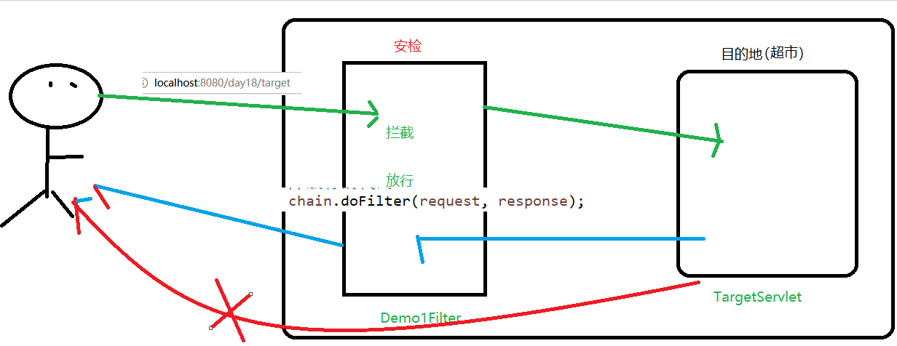
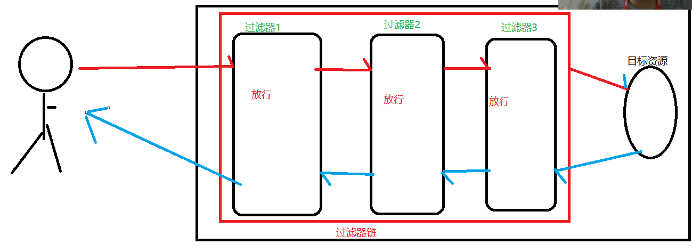

# **Day18笔记  Filter & Listener**

JavaWeb三大组件：

​	Servlet

​	Filter：过滤器    作用

​	Listener：监听器   作用

## **1、案例一、过滤非法字符**

### **1.1、案例需求：**

当用户发出非法言论的时候，提示用户言论非法

### **1.2、案例效果**

在表单中输入含有非法字符的言论，点击提交按钮

 


### **1.3、知识讲解：过滤器**

#### **1.3.1  为什么要使用过滤器**

​	比如：登录的判断   当你访问网站时，判断你是否进行登录了

​			登录：放行 ，访问目标资源

​			未登录：拦截，跳转到登录页面进行登录

​		   权限的判断：

​				判断用户的权限

​				管理员：访问后台管理页面

​				普通用户：对不起，您没有这个权限

​	在我们实际项目中，我们对访问某些资源的请求需要进条件的筛选、过滤。当这个请求满足特定的情况，才能让这 个请求访问目标资源，如果不满足条件，就不让访问目标资源。比如说：对于访问管理员功能的请求，我们应该对这样的请求进行管理员权限的判断。如果当前用户拥有管理员权限，可以访问。反之不可以。我们java开发中需要  很多这样过滤功能的操作，所以需要学习过滤器。

#### **1.3.2  什么是过滤器**

Servlet：一个java类去实现Servlet接口

Filter：一个Java类去实现Filter接口

```java
@WebFilter("/demo1")  过滤的路径
public class Demo1Filter implements Filter{
//重写init 、doFilter、destroy方法
```

Filter：是Java中预先定义好了的接口，可以过滤不同的内容，具体怎么过滤，需要使用者定义一个实现类，然后实现接口中的过滤方法，在方法中书写过滤的条件。filter是对客户端访问资源的过滤，符合条件放行，不符合条件不放行

#### **1.3.3、入门案例** 

#### **1.3.4、过滤器的生命周期**

回顾：

​	Servelt：

​		创建：第一次访问该Servlet（单例），执行init

​		执行：每次访问都会执行service

​		销毁：服务器关闭时执行destroy

​	request/response：

​		创建：请求过来时创建request、response

​		销毁：对该请求产生响应结束后销毁

​	session：

​		创建：会话开启，第一次调用request.getSession()

​		销毁：

​			1、手动调用invalidate()

​			2、服务器非正常关闭时

​			3、不操作默认30分钟

​	servletContext：

​		创建：服务器启动时

​		销毁：服务器关闭时

Filter：

创建：

​	服务器启动时创建，执行的是init方法

执行：

​	访问的路径能匹配上@WebFilter(url)，执行doFilter

销毁：

​	服务器关闭时销毁，执行的是destroy方法

```java
@WebFilter("/demo1")
public class Demo1Filter implements Filter{
	@Override
	//初始化方法
	public void init(FilterConfig filterConfig) throws ServletException {
		System.out.println("Demo1Filter的init方法执行了");
	}
	@Override
	//doFilter相当于Servlet中的service
	public void doFilter(ServletRequest request, ServletResponse response, FilterChain chain)
			throws IOException, ServletException {
		System.out.println("Demo1Filter的doFilter方法执行了");
		
	}
	@Override
	//销毁方法
	public void destroy() {
		System.out.println("Demo1Filter的destroy方法执行了");
	}
}
```

#### **1.3.5、单过滤器执行流程**

平常生活中我们坐地铁或者火车，登车的时候需要先经过安检，安检通过了才能检票，检票通过了才能登车。安检和检票都相当于我们今天学习的过滤器。

   

#### **1.3.6 映射路径**

回顾Servlet：url-pattern匹配

匹配顺序：完全路径----》目录匹配 --- 》扩展名匹配-----》缺省的Servlet----》404

##### **1.3.6.1 精确匹配模式**

@WebFilter("/target")  

##### **1.3.6.2 模糊匹配模式  **

目录匹配：/admin/*       比如：访问后台管理页面

扩展名匹配：*.action 或者  *.do       springmvc时

匹配所有：/*      解决请求响应乱码

#### **1.3.7 拦截方式**

通过浏览器访问时会进行拦截：

​	重定向：默认是会拦截的

​	请求转发：默认是不拦截的

默认只拦截客户端路径(从浏览器直接访问或者重定向)

有了上面学习的映射路径，我们可以控制过滤器过滤指定的内容，但是我们在访问资源的时候，有时是直接访问到 指定资源的，有时是以请求转发的方式访问到的，这就需要我们要让过滤器可以区分不同的访问资源的方式，有不同的拦截方式。

##### **1.3.7.1 request**

dispatcherTypes = DispatcherType.REQUEST  只拦截客户端路径(默认)

##### **1.3.7.2 forward**

按照过滤器默认的拦截方式，我们只能拦截浏览器对服务器的之间访问，但是，如果是服务器资源之间使用转发的方式，就无法访问了，因此，我们还有一种forward拦截方式：当前拦截方式表示只有在进行请求转发时，才会拦截请求进行过滤。


在@WebFilter上配置 dispatcherTypes = DispatcherType.FORWARD(拦截请求转发)

需求：即想拦截请求转发又想拦截客户端路径

```java
@WebFilter(value="/admin/*",dispatcherTypes = {DispatcherType.REQUEST,DispatcherType.FORWARD})
public class Demo1Filter implements Filter{
```

#### **1.3.8 过滤器链的执行流程**

过滤器链：

再次回到我们生活中坐地铁或者火车的例子 ,  登车的时候需要先经过安检，安检通过了才能检票，检票通过了才能登车 , 其中任意一个没有通过都是登不了车的 , 并且这两个过滤是有顺序。

同样，我们java代码中，有时需要对同一个请求，进行多次不同业务的过滤，所以我们java代码中需要多个过滤器。只有所有的过滤器都对请求进行了放行，请求才能访问到目标资源，只要多个过滤器中只有一个过滤器不放行   请求，那么这个请求都不能够访问到目标资源。多个过滤器组成的一个整体我们称为过滤器链。而且，过滤器链中的过滤器是一个一个的执行的，一个过滤器执行完毕之后，会执行下一个过滤器，后面没有过滤器了，才会访问到目标资源。只要其中一个过滤器没有放行，那么这个过滤器后面的过滤器也都不会执行了。



如果有多个过滤器，前面一个过滤器不放行，后面的过滤器就不会执行

只有所有的过滤器都放行了，才会执行到目标资源


多个过滤器的执行顺序跟什么有关？

​	3.0: 和类名的字符大小有关系（越小的越先执行，从第一个字母开始比较，如果第一个字母相同，再比较第二个字母的大小，以此类推）

​	2.5：和web.xml中的配置顺序有关(和类名无关)，越靠前的越小执行

### **1.4 案例分析 ** 

提交时先经过过滤器：

​	言论不含有非法字符：放行，访问目标资源，在目标资源里响应您发表成功了！！，内容是：xxx

​	言论含有非法字符：拦截，你发表的言论含有非法字符，请检查后再发表！！！


如何去定义哪些文字是非法字符呢？

​	定义一个专门存储非法字符的文本


读取非法字符的代码写到哪里？

### **1.5  案例实现**

form.jsp

```html
<form action="/day18/target" method="get">
		请发表你的言论：<input type="text" name="word"><br>
		<input type="submit" value = "发表">
	</form>
```

IllegalFilter：

```java
@WebFilter("/target")
public class IllegalFilter implements Filter {
	public void doFilter(ServletRequest request, ServletResponse response, FilterChain chain) throws IOException, ServletException {
		
		//获取发表的内容
		String word = request.getParameter("word");
		//判断里面是否含有非法字符
		for(String str :list) {
			if(word.contains(str)) {
				//含有非法字符
				response.getWriter().write("您发表的言论含有非法字符，请检查后重新发表");
				return;
			}
		}
		//不含有  放行
		chain.doFilter(request, response);
	}

	/**
	 * @see Filter#init(FilterConfig)
	 */
	List<String> list = new ArrayList();
	public void init(FilterConfig fConfig) throws ServletException {
		try {
			//读取illegal.txt中的非法字符
			String path = fConfig.getServletContext().getRealPath("");
			path = path + "/illegal.txt";
			BufferedReader br = new BufferedReader(new FileReader(path));
			String str = null;
			while((str = br.readLine()) != null) {
				list.add(str);
			}
		} catch (Exception e) {
			// TODO Auto-generated catch block
			e.printStackTrace();
		}
		
	}

}
```

TargetServlet：

```java
@WebServlet("/target")
public class TargetServlet extends HttpServlet {
	
	protected void doGet(HttpServletRequest request, HttpServletResponse response) throws ServletException, IOException {
		//获取发表的言论
		String word = request.getParameter("word");
		response.getWriter().write("发表成功啦！！内容是：："+word);
	}
```


## 2、**案例二：解决全站乱码**

### **2.1、案例需求**

通过过滤器将网站中所有的请求、响应乱码问题解决

### **2.2、案例分析**

程序中会出现请求(post)、响应乱码问题：

解决：

```java
		request.setCharacterEncoding("utf-8");
		response.setContentType("text/html;charset=utf-8");			
```

### **2.3、 案例实现** 

```java
@WebFilter("/*")
public class EncodingFilter implements Filter {

	public void doFilter(ServletRequest request, ServletResponse response, FilterChain chain) throws IOException, ServletException {
		//解决请求乱码
		request.setCharacterEncoding("utf-8");
		//解决响应乱码
		response.setContentType("text/html;charset=utf-8");
		chain.doFilter(request, response);
	}
```


作业：

​	登录拦截判断

​	访问index.jsp，通过过滤器判断

​		登录成功之后将用户信息存到session中

​		判断用户是否登录了，登录成功，放行让其访问index.jsp

​		如果未登录，跳转到登录页面进行登录

​	

## **3、监听器**

### **3.1、什么是监听器**

​	在实际生活着，我们很多商场有摄像头，监视着客户的一举一动。如果客户有违法行为，商场可以采取相应的措施。同样，在我们的java程序中，有时也需要监视某些事情，一旦被监视的对象发生相应的变化，我们应该采取相应的操作。这就需要用到java中的监听器。

web监听器是一种Servlet中的特殊的类，它们能帮助开发者监听web中的特定事件，比如：ServletContext,HttpSession,ServletRequest的创建和销毁等。可以在某些动作前后增加处理，实现监控

### **3.2、监听器的创建**

### **3.3、第一类监听器**

### **3.4、第二类监听器**

### **3.5、第三类监听器**


 

 

 

 

 

 

 

 

 

 

 

 

 

 

 