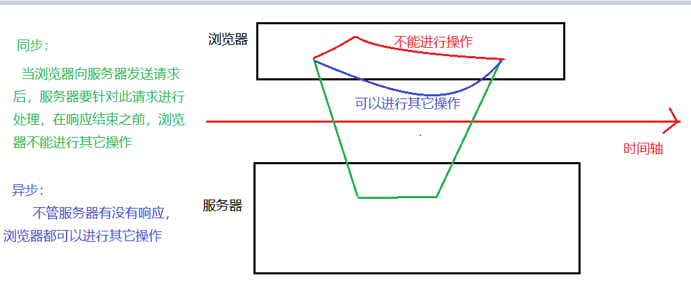
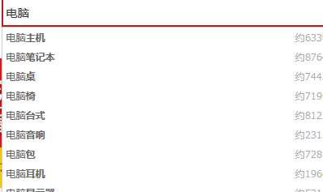
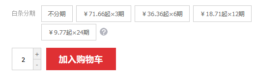
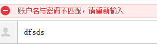
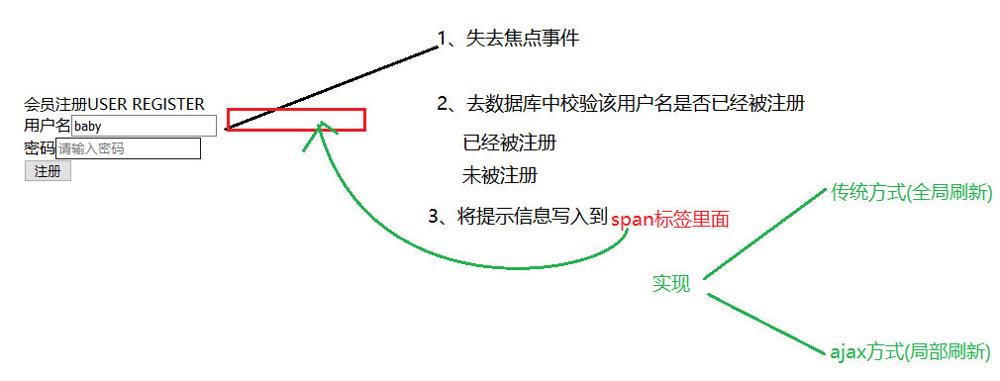
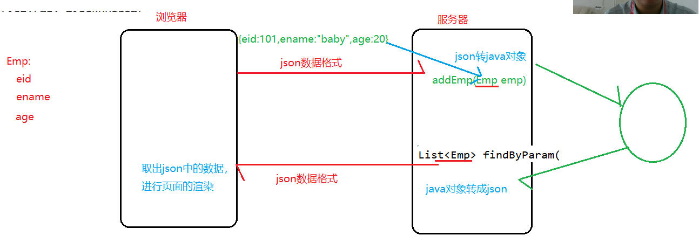
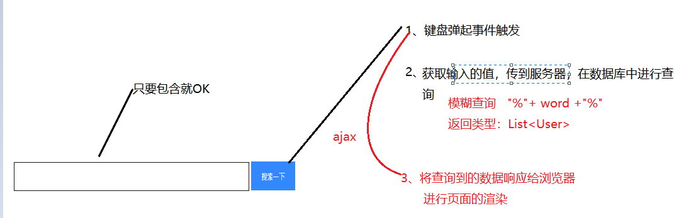

# Day19笔记

昨日内容回顾：

1、过滤器如何实现

​	java类实现Filter接口，重写init、doFilter、destroy

​	@WebFilter（url）

2、过滤器的生命周期

​	创建：服务器启动时

​	执行：只要能匹配成功url,执行doFilter

​	销毁：服务器关闭时

3、请描述过滤器的执行流程

​	放行

​	拦截

4、过滤器拦截路径的几种方式

​	精确路径：/target

​	模糊路径：

​		目录匹配：/admin/*

​		扩展名匹配：*.action

​		所有匹配：/*

5、过滤器默认是拦截什么请求？

​	默认拦截客户端路径

​	请求转发不拦截

​	dispatcher =  Forward

6、多个过滤器的执行流程

​	过滤器链

7、多个过滤器的执行顺序和什么有关？

​	3.0：和类名字符的大小有关(从第一个字母开始，以此类推，越小的越先执行)

​	2.5：和web.xml中配置的先后顺序有关

8、说几个过滤器的应用场景

​	生活中的场景

​	代码中的场景：作业、解决全站乱码、过滤敏感字符、权限判断


今日目标：

1、ajax 两个核心思想(异步、局部刷新)

2、ajax的实现方式

​	JavaScript的实现

​	jquery的实现

3、做两个案例

4、JSON(数据的传输格式)

5、监听器

# **1、Ajax**

## **1.1 什么是Ajax**

Ajax 即"Asynchronous Javascript And XML"，是指一种创建交互式网页应用的网页开发技术。Ajax = 异步 JavaScript 和 XML。通过在后台与服务器进行少量数据交换，

Ajax  可以使网页实现**异步更新**。这意味着可以在不重新加载整个网页的情况下，对网页的**某部分进行更新（局部更新）**。传统的网页如果需要更新内容，必须重载整个网页页面。

ArrayList 和 Vectory

异步和同步的区别：

​	

局部更新：

应用场景：

​	




​	


资源跳转：

​	重定向、请求转发（全局刷新）

​	ajax实现

## 1.2 ajax的实现方式

ajax的实现：

- JS的ajax：出现最早。使用一个对象XmlHttpRequest对象。专门用于进行ajax请求发送，和响应的接收 

使用ajax发请求，使用ajax接收响应，使用JS进行页面刷新。

1. 若使用JS的AJAX技术，为了实现简单功能，就需要书写大量复杂代码。
2. JS的AJAX代码，浏览器兼容性比较差。

```javascript
<script type="text/javascript">
		//负责发送ajax请求
		function run(){
			//1、创建核心对象
			var xmlhttp;
			if (window.XMLHttpRequest)
			  {// code for IE7+, Firefox, Chrome, Opera, Safari
			  xmlhttp=new XMLHttpRequest();
			  }
			else
			  {// code for IE6, IE5
			  xmlhttp=new ActiveXObject("Microsoft.XMLHTTP");
			  }
			//2、建立连接
			//参数一：请求方式   GET/Post
			//参数二：请求的url
			//参数三：true：异步   false:同步
			xmlhttp.open("GET","ajax?uname=baby",true);
			//3、发送请求
			xmlhttp.send();
			//4、响应
			xmlhttp.onreadystatechange=function()
			  {
			  if (xmlhttp.readyState==4 && xmlhttp.status==200)
			    {
			   	var text = xmlhttp.responseText;
			   	alert(text);
			    }
			  }
			
		}
	</script>
</head>
<body>

	<input type="button" value="js发送ajax请求" onclick="run()">
	
	<input type="text">
</body>
```

AjaxServlet：

```java
//加长处理时间
		try {
			Thread.sleep(10000);
		} catch (InterruptedException e) {
			// TODO Auto-generated catch block
			e.printStackTrace();
		}
		String uname = request.getParameter("uname");
		System.out.println(uname);
		response.getWriter().write(uname);
```


- JQ的ajax：底层封装了JS的ajax代码，做了浏览器的兼容性。

程序员仅需要调用简单的JQ的AJAX方法，就可以实现复杂的AJAX功能。

1. 少量代码，实现复杂功能


2. 浏览器兼容性好，一处编写，处处执行

## **1.3 jQuery框架的ajax**

### **1.3.1 jQuery框架的ajax简介**

jquery是一个优秀的js框架，自然对js原生的ajax进行了封装，封装后的ajax的操 作方法更简洁，功能更强大，与ajax操作相关的jquery方法有如下几种，但开发中 经常使用的有三种：

三种：get、post、ajax

### **1.3.2 GET请求方式**

#### **1.3.2.1 Get请求方式概述**

通过远程 HTTP GET 请求载入信息。这是一个简单的 GET 请求功能，如需复杂的ajax参数设置请使用$.ajax

#### **1.3.2.2 Get请求方式语法** 

$.get(url,data,callback,type)

参数1：url      请求的路径

参数2：data  请求携带的参数   

​	      格式：key = value   或者  {uname:"baby",pwd:666}

参数3：callback  响应成功后的回调函数

参数4：type    响应的数据类型     text、html、xml、json

#### **1.3.2.3 Get请求方式代码** 

```javascript
<script type="text/javascript">
		function fun(){
			//jq的get方式发送ajax请求
			//参数1
			var url = "/day19/ajax";
			//参数2
			var data = {uname:"baby",pwd:666};
			$.get(url,data,function(msg){
              	//msg  : 响应过来的内容体
				//响应成功后执行   200
				alert("响应成功！！"+msg);
			});
		}
	</script>

<input type="button" value="jq的get方式"  onclick = "fun()">
```

### **1.3.3 POST请求方式**

#### **1.3.3.1 Post请求方式概述**

通过远程 HTTP POST 请求载入信息。这是一个简单的 POST 请求功能，如需复杂的ajax参数设置请使用$.ajax

#### **1.3.3.2 Post请求方式语法**

$.post(url,data,callback,type)   

里面的四个参数和get方式是一样

不一样的是请求方式的不同

#### **1.3.3.3 Post请求方式代码** 

```javascript
$.post(url,data,function(msg){
				//响应成功后执行   200
				//baby:666  [baby,666]
				alert("响应成功！！"+msg);
			});
```

### **1.3.4  Ajax请求方式**

#### **1.3.4.1 ajax请求方式概述**

通过 HTTP 请求加载远程数据。jQuery 底层 A JAX 实现。简单易用的高层实现见get和post方法。$.ajax()方法可以更加详细的设置底层的参数。

#### **1.3.4.2 ajax请求方式语法**

jQuery.ajax({[settings]})

$.ajax({})

其中，settings是一个js字面量形式的对象，格式是{name:value,name:value	}，常用的name属性名如下：

```javascript
function fun(){
			$.ajax({
				url:"/day19/ajax",
				async:true,
				data:{uname:"baby",pwd:666},
				type:"POST",
				dataType:"text",
				success:function(){
					alert("响应成功");
				},
				error:function(){
					alert("响应失败！！");
				}
			})
		}
```

## **1.4 案例一：检测用户名是否已被注册		**	



**传统实现方式：**

demo1.jsp

```html

<script type="text/javascript">
	//校验用户名
	function checkUsername(val){
		
		//发送请求   将输入框中的用户名携带过去
		location.href = "/day19/check?username="+val;
	}
</script>
<form class="form‐horizontal" style="margin‐top: 5px;">
用户名<input type="text" name="username"
placeholder="请输入用户名"  onblur="checkUsername(this.value)">
<span id="usernameInfo" style="color:red">${msg}</span><br/>
密码<input type="password" placeholder="请输入密码"><br/>
<input type="submit" value="注册"/>
</form>
</div>
```

CheckServlet：

```java
protected void doGet(HttpServletRequest request, HttpServletResponse response) throws ServletException, IOException {
		//获取用户名
		String username = request.getParameter("username");
		//去数据库中校验
		CheckDao cd = new CheckDao();
		User user = cd.checkUsername(username);
		//判断
		if(user != null) {
			//用户名已经存在(提示用户名不可用)
			request.setAttribute("msg", "该用户名已经被注册，请更换一个");
		}else {
			//用户名不存在(提示用户名可用)
			request.setAttribute("msg", "该用户名可用！");
		}
		request.getRequestDispatcher("/demo1.jsp").forward(request, response);

	}
```

CheckDao：

```java
//根据用户名查询用户
	public User checkUsername(String username) {
		QueryRunner qr= new QueryRunner(C3p0Utils.getDataSource());
		
		String sql = "select * from user where username = ?";
		
		try {
			return qr.query(sql, new BeanHandler<User>(User.class),username);
		} catch (SQLException e) {
			// TODO Auto-generated catch block
			e.printStackTrace();
			return null;
		}
	}
```

ajax实现方式：

​	请求转发和重定向都属于刷新整个页面

​	要使用流的形式将内容响应给浏览器

```javascript
	function checkUsername(val){
		//发送请求   将输入框中的用户名携带过去
		//location.href = "/day19/check?username="+val;
		//ajax  三种
		$.post("/day19/check",{username:val},function(msg){
			//响应成功
			if(msg == "true"){
				//用户名可用
				//设置span的内容体
				$("#usernameInfo").html("<font color='green'>用户名可用！！<font>");
			}else if(msg == "false"){
				//用户名已经被占用
				$("#usernameInfo").html("<font color='red'>该用户名已被占用，请更换一个！！<font>");
			}
		})
	}
```

```java
	String msg = "";
		//判断
		if(user != null) {
			//用户名已经存在(提示用户名不可用)
			//request.setAttribute("msg", "该用户名已经被注册，请更换一个");
			msg = "false";
		}else {
			//用户名不存在(提示用户名可用)
			//request.setAttribute("msg", "该用户名可用！");
			msg = "true";
		}
		//以流的形式输出
		response.getWriter().write(msg);
```

# 2、**JSON**

## **2.1、json简述** 

JSON(JavaScript Object Notation) JavaScript对象表示法。  

是一种轻量级的数据交换格式。JSON采用完全独立于语言的文本格式，就是说不同的编程语言JSON数据是一致的。

易于人阅读和编写，同时也易于机器解析和生成(一般用于提升网络传输速率)。

> [JSON](https://baike.baidu.com/item/JSON)([JavaScript](https://baike.baidu.com/item/JavaScript) Object Notation, JS 对象简谱) 是一种**轻量级的数据交换格式**。它基于 [ECMAScript](https://baike.baidu.com/item/ECMAScript) (欧洲计算机协会制定的js规范)的一个子集，采用完全独立于编程语言的文本格式来存储和表示数据。简洁和清晰的层次结构使得 JSON 成为理想的数据交换语言。 易于人阅读和编写，同时也易于机器解析和生成，并有效地提升网络传输效率。

xml：重量级的数据交换格式

​	<person><name>悟空</name><person>

Json：轻量级的数据交换格式

​	{name:value,pwd:666}

独立于编程语言存在

## **2.2、json语法格式**

- JSON自定义格式：

  var  json1 =  {参数名1:参数值1,参数名2:参数值2};

  注意：

  ​	1、外面由{}括起来

  ​	2、参数名和参数值之间用 ":"隔开，多个参数之间用","隔开

  ​	3、参数名的引号可加可不加

  ​	4、参数值如果是string类型，就必须加引号，如果是数字类型，引号可加可不加

  取值：

  ​	json1.参数名

  ```javascript
  //自定义json格式
  	var json1 = {"uname":"baby","sex":"女",age:20};
  	//取数据
  	alert(json1.age)
  ```

- JSON数组格式：

  ```javascript
  //json数组格式
  	var json2 = ["唐僧","悟空","八戒","沙僧"];
  	//取数据
  	alert(json2[1]);
  	alert(json2.length);
  ```


- JSON复合形式：

  ```javascript
  var json3 = [{uname:"baby",sex:"女"},{uname:"tom",sex:"男"}
  	,{uname:"lucy",sex:"女"}]
  	//取出tom
  	alert(json3[1].uname)
  	//长度
  	alert(json3.length)
  ```

## **2.3、JSON数据和Java对象的相互转换**



json和java对象相互转换的工具（第三方提供好的）

学习目的：学会工具的使用

​	getParameterMap()  获取整个参数列表   eid=101&ename=baby&age=20

​	借助的工具类是BeanUtils：

​			BeanUtils.populate(emp,map)

###  **2.3.1 Json-lib**

```java
//JavaBean转json
	@Test
	public void test1() {
		//创建javaBean对象
		User user = new User(101,"baby","666");
		//转成json
		JSONObject json = JSONObject.fromObject(user);
		System.out.println(json.toString());
	}
	//Map转json
	@Test
	public void test2() {
		//创建javaBean对象
		Map map = new HashMap();
		map.put("name", "悟空");
		map.put("age", 30);
		map.put("sex", "男");
		//转成json
		JSONObject json = JSONObject.fromObject(map);
		System.out.println(json.toString());
	}
	//数组转json
	@Test
	public void test3() {
		String [] arr = {"唐僧","悟空","八戒","沙僧"};
		//转成json
		JSONArray json = JSONArray.fromObject(arr);
		System.out.println(json.toString());
	}
	//List<JavaBean>转json
	@Test
	public void test4() {
		List<User> ulist = new ArrayList();
		ulist.add(new User(101,"baby","666"));
		ulist.add(new User(102,"lucy","777"));
		ulist.add(new User(103,"tom","888"));
		//转成json
		JSONArray json = JSONArray.fromObject(ulist);
		System.out.println(json.toString());
	}
```

### 2.3.2 **JackSon（springmvc）** 

```java
public class JackSonDemo {
	@Test
	public void test1() throws JsonProcessingException {
		//JavaBean转成json
		User user = new User(101,"baby","666");
		user.setDate(new Date());
		//核心类
		ObjectMapper mapper = new ObjectMapper();
		String json = mapper.writeValueAsString(user);
		System.out.println(json);
	}
	@Test
	public void test2() throws Exception {
		//JavaBean转成json
		User user = new User(101,"baby","666");
		user.setDate(new Date());
		//核心类
		ObjectMapper mapper = new ObjectMapper();
	 mapper.writeValue(new File("g://json.txt"), user);
	}
	//数组、map、复合类型转json（课下做）
	
	//json转java对象
	@Test
	public void test3() throws Exception {
		String json = "{\"uid\":101,\"username\":\"baby\",\"pwd\":\"666\",\"date\":\"2020-02-11\"}";
		ObjectMapper mapper = new ObjectMapper();
		User user = mapper.readValue(json, User.class);
		System.out.println(user);
	}

}
```

# **3、案例二：内容自动补全**




demo2.jsp

```html
display: block; 别忘了改
<script type="text/javascript">
		function searchWord(word){
			//先清空内容体
			$("#show").html("");
			if(word == ""){
				return ;
			}
			//使用ajax发送请求
			$.post("/day19/search",{word:word},function(msg){
				var content = "";
				for(var i = 0;i<msg.length;i++){
					//取出json中的username
					content += "<div>"+msg[i].username+"</div>"
				}
				$("#show").append(content);
			},"json");
		}
</script>
<input type="text" name="word" id="tid" onkeyup="searchWord(this.value)">
```

SearchServlet：

```java
@WebServlet("/search")
public class SearchWordServlet extends HttpServlet {
	
	protected void doGet(HttpServletRequest request, HttpServletResponse response) throws ServletException, IOException {
		//获取word的值
		String word = request.getParameter("word");
		SearchDao sd = new SearchDao();
		List<User> ulist = sd.searchList(word);
		//将ulist转成json
		JSONArray json = JSONArray.fromObject(ulist);
		//将json响应给浏览器
		response.getWriter().write(json.toString());
	}
```

SearchDao：

```java
public List<User> searchList(String username){
			QueryRunner qr= new QueryRunner(C3p0Utils.getDataSource());
		String sql = "select * from user where username like ?";
		
		try {
			Object param [] = {"%"+username+"%"};
			return 
		qr.query(sql, new BeanListHandler<User>(User.class),param);
		} catch (SQLException e) {
			// TODO Auto-generated catch block
			e.printStackTrace();
			return null;
		}
	}
```

## 

