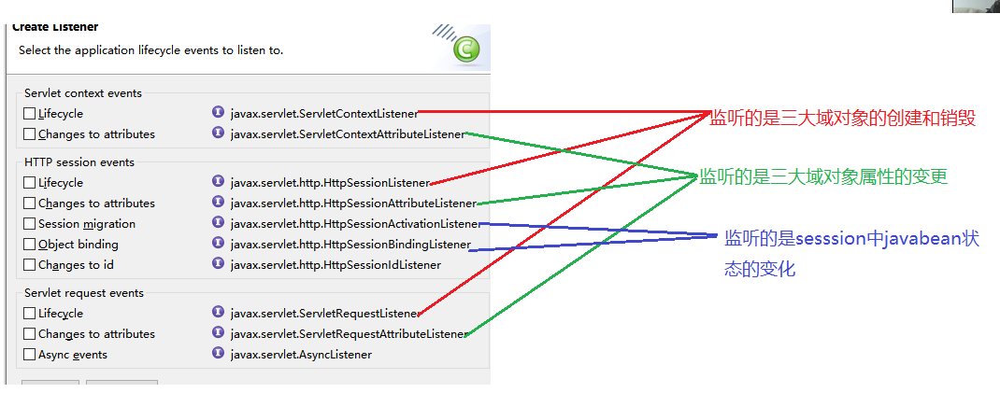
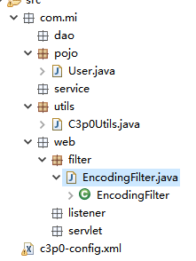
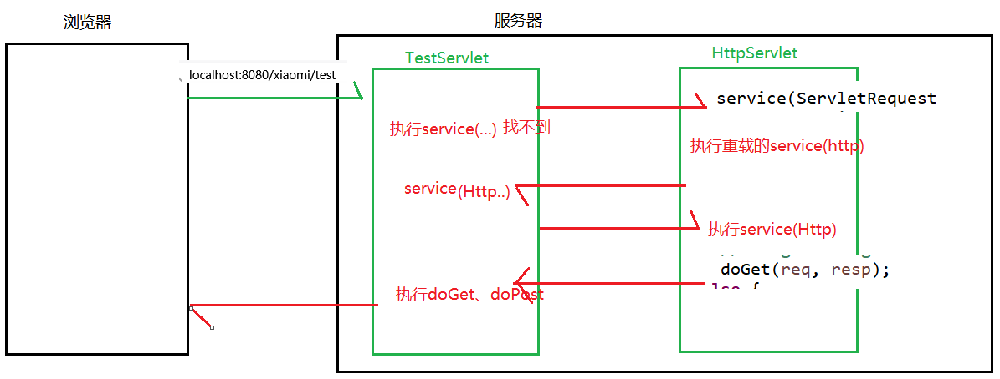

# Day20笔记

昨日内容回顾：

ajax：

​	1、两大核心

​		异步提交：和同步的区别

​		局部更新：和全局刷新的区别

​	2、实现方式

​		JS方式的ajax：创建核心对象、建立连接、发送请求、响应

​			缺点：1、大量的代码仅能完成简单的功能  2、浏览器兼容性不好

​		JQ方式的ajax：

​			1、get方式

​			格式：$.get(url,data,function(msg){},type)

​			2、post方式

​			格式：$.post(...)

​			3、ajax方式

​			格式：$.ajax({ name:value})

json：

​	1、特点：是一个轻量级的数据交换格式、独立于编程语言存在

​	2、书写格式

​		自定义json:{name:value,age:12}

​		数组：[1,2,3,4]

​		复合：[{name:value,age:12},{name:value,age:12}]

​	3、json和java对象的相互转换

​		浏览器发过来请求：json转java

​		服务器响应时：java转json

​	4、json转换工具

​		jsonlib：JSONObject、JSONArray

​		jackson：ObjectMapper

两个案例：

​	1、校验用户名是否存在(传统、ajax)

​	2、搜索时内容自动补全

# 一、监听器

### 1.1、什么是监听器

​	在实际生活着，我们很多商场有摄像头，监视着客户的一举一动。如果客户有违法行为，商场可以采取相应的措施。同样，在我们的java程序中，有时也需要监视某些事情，一旦被监视的对象发生相应的变化，我们应该采取相应的操作。这就需要用到java中的监听器。

**监听器：监听到某种行为，就采取对应的措施**

回顾：

​	js中的事件   onclick、onchange


web监听器是一种Servlet中的特殊的类，它们能帮助开发者监听web中的特定事件，比如：ServletContext,HttpSession,ServletRequest的创建和销毁等。可以在某些动作前后增加处理，实现监控



### 1.2、监听器的创建 

​	右键-创建listener

### **1.3、第一类监听器**

​	监听域对象的创建和销毁：

监听ServletContext的创建和销毁：

```java
@WebListener
public class MyServletContextListener implements ServletContextListener {
    public void contextDestroyed(ServletContextEvent sce)  { 
         System.out.println("ServeltContext对象被销毁了");
      
    }
    public void contextInitialized(ServletContextEvent sce)  { 
    	  System.out.println("ServeltContext对象被创建了");
    }
}
```

监听HttpSession的创建和销毁：

```java
@WebListener
public class MySessionListener implements HttpSessionListener {
    public void sessionCreated(HttpSessionEvent se)  { 
         System.out.println("session对象被创建了");
    }

    public void sessionDestroyed(HttpSessionEvent se)  { 
    	 System.out.println("session对象被销毁了");
    }
}

HttpSession session = request.getSession();
		session.invalidate();
```

监听HttpServeltRequest的创建和销毁：

​	创建：请求过来时  销毁：响应结束后

```java
@WebListener
public class MyRequestListener implements ServletRequestListener {
    public void requestDestroyed(ServletRequestEvent sre)  { 
       System.out.println("request对象被销毁了");
    }
    public void requestInitialized(ServletRequestEvent sre)  { 
    	 System.out.println("request对象被创建了");
    }
}
```

### 1.4、第二类监听器

监听域对象的属性变更

```java
@WebListener
public class MySessionAttributeListener implements HttpSessionAttributeListener {
    public void attributeAdded(HttpSessionBindingEvent se)  { 
    	System.out.println("session中添加了属性！！！");
    }
    public void attributeRemoved(HttpSessionBindingEvent se)  { 
    	System.out.println("session中属性被移除了！！！");
    }
    public void attributeReplaced(HttpSessionBindingEvent se)  { 
    	System.out.println("session中属性被替换了！！！");
    }
}
//添加了uname属性
		session.setAttribute("uname", "baby");
		//替换
		session.setAttribute("uname", "lucy");
		//移除
		session.removeAttribute("uname");
```

### 1.5、第三类监听器

监听session中的特殊javaBean状态的改变

**HttpSessionBindingListener：**

​	监听session中javabean的绑定和解绑

```java
public class Person implements HttpSessionBindingListener{
  
  public void valueBound(HttpSessionBindingEvent event) {
		System.out.println("person绑定到session中了");
	}

	@Override
	public void valueUnbound(HttpSessionBindingEvent event) {
		System.out.println("person从session中解绑了");
	}
}

//将person对象绑定到session上
		session.setAttribute("user", new Person());
		//解绑
		session.removeAttribute("user");
```

**HttpSessionActivationListener：**

前提提交：必须实现可序列化接口Serializable

​	监听的是session中javaBean的钝化和活化

钝化：序列化（将内存中的数据保存在硬盘上）

活化：反序列化(将硬盘上的数据加载到内存中)


回顾session的钝化和活化：

​	钝化：正常关闭服务器时

​	活化：正常启动服务器

```java
public class Dog implements Serializable,HttpSessionActivationListener{
	private String dname;
	public String getDname() {
		return dname;
	}
	public void setDname(String dname) {
		this.dname = dname;
	}
	@Override
	public void sessionWillPassivate(HttpSessionEvent se) {
		System.out.println("钝化：："+getDname());
	}
	public void sessionDidActivate(HttpSessionEvent se) {
		System.out.println("活化：："+getDname());
	}
}

Dog dog = new Dog();
		dog.setDname("小白");
		session.setAttribute("dog", dog);
```


# 二、环境的搭建

​	做项目时

​	回顾之前的知识点：反射、继承特点

​	了解项目的开发流程

​	为后面的大型项目打下基础

## 2.1 前端页面的分析

css引入方式:

​	行内样式、内部样式、外部样式

结构：

​	css：存放项目的样式

​	img：存放项目中的图片

​	js：存放jquery、各种js插件

jar包的问题：(很头疼的问题)

存在的问题：

​	解决：maven

## 2.2 数据库的分析

创建小米商城对应的数据库(xiaomi)

分析用户表：

```sql
CREATE TABLE `user` (
  `uid` INT(10) PRIMARY KEY AUTO_INCREMENT,#主键自增
  `name` VARCHAR(100) NOT NULL,#真实姓名
  `sex` INT(1),#性别    1：男   0：女
  `phone_number` VARCHAR(20) UNIQUE,#手机号
  `area` VARCHAR(100),#所在地区
  `manager` INT(1),#角色   1：管理员   0：普通用户
  `username` VARCHAR(50) UNIQUE,#用户名
  `password` VARCHAR(50) NOT NULL,#密码
  `photo` VARCHAR(100),#上传头像
  `create_time` TIMESTAMP#注册时间
) 
```

## 2.3 包结构的搭建



# 三、搭建项目的框架

## 3.1 需求分析

思考问题：Servlet如何去选用？

一个项目下有大量的模块：小米商城有用户模块、商品模块、分类模块、订单模块、权限模块..

一个模块下有大量的功能：用户模块下注册功能、登录功能、退出功能、激活.....

一个项目下有海量的功能

day17：**一个功能对应一个Servlet(不用)**

缺点：

​	1、代码的开发和维护麻烦

​	2、导致执行效率变低

根据url去匹配Servlet   for(Serlvet s  :servlet数组){}

**一个项目对应一个Servlet(不用)**：

​	缺点：代码冗余、耦合性高

**折中：一个模块对应一个Servlet**

## 3.2 一个模块对应一个Servlet

test.jsp

```html
<a href="${pageContext.request.contextPath}/test?method=register">用户注册</a><br>
	<a href="${pageContext.request.contextPath}/test?method=login">用户登录</a><br>
	<a href="${pageContext.request.contextPath}/test?method=logout">用户退出</a><br>
	<a href="${pageContext.request.contextPath}/test?method=active">用户激活</a><br>
```

TestServlet：

```java
protected void doGet(HttpServletRequest request, HttpServletResponse response) throws ServletException, IOException {
	 //获取method的值
	String method = request.getParameter("method");
	if("register".equals(method)) {
		//调用注册方法
		register(request, response);
	}else if("login".equals(method)) {
		login(request, response);
	}else if("logout".equals(method)) {
		logout(request, response);
	}else if("active".equals(method)) {
		active(request, response);
	}else {
		System.out.println("没有对应的方法");
	}
	}
```

## 3.3 提升代码的可维护性(反射)

回顾：doGet和doPost方法是如何执行的？

反射前：

​	创建对象      对象.doGet();

反射：

​	可以调用doGet、doPost


反射：允许程序在运行期间取得任何类的内部信息，并能够直接操作任意对象内部属性和方法。

内部信息：

​	属性

​	方法

​	构造方法

**获取字节码Class三种：**

​	1、类名.class

​	2、对象名.getClass()；

​	3、Class.fornName("全限定名")

Class：加载完类之后，在堆内存的方法区就成一个Class类型的对象，这个Class对象就包括了完整类的信息。

相关的API：

​	java.lang.reflect.Method     方法信息

​	java.lang.reflect.Field           属性信息

​	java.lang.reflect.Contructor  构造方法信息  

代码：

```java
public class Dog {
	//属性
	public String dname;
	private String color;
	//普通方法
	public void eat() {
		System.out.println("吃骨头。。。。。");
	}
	private void play(String xxx) {
		System.out.println("玩游戏......"+xxx);
	}
	//构造方法
	public Dog(String dname, String color) {
		super();
		this.dname = dname;
		this.color = color;
	}
	private Dog(String dname) {
		this.dname = dname;
	}
	public String getDname() {
		return dname;
	}
	public void setDname(String dname) {
		this.dname = dname;
	}
	public String getColor() {
		return color;
	}
	public void setColor(String color) {
		this.color = color;
	}
	public Dog() {
		super();
		// TODO Auto-generated constructor stub
	}
	@Override
	public String toString() {
		return "Dog [dname=" + dname + ", color=" + color + "]";
	}

}
```

FanSheDemo：

```java
@Test
	//不用反射
	public void test1() {
		//1、操作属性
		Dog dog = new Dog();
		dog.dname = "小黑";
		//不能直接操作私有属性
		//dog.color = "黑色";
		System.out.println(dog);
		//Dog dog1 = new Dog("小黄");
		//2、操作方法
		dog.eat();
		//dog.play();
	}
	@Test
	//使用反射
	public void test2() throws Exception {
		//1、操作属性
		//获取到Dog的Class
		Class clazz = Class.forName("com.mi.demo.Dog");
		Field dname = clazz.getField("dname");
		//2、创建对象
		Constructor cons = clazz.getConstructor();
		Dog dog = (Dog)cons.newInstance();
		dname.set(dog, "小白");
		//给color赋值
		Field color =  clazz.getDeclaredField("color");
		//暴力反射
		color.setAccessible(true);
		color.set(dog, "白色");
		System.out.println(dog);
		//3、操作私有的构造方法
		Constructor cons2 = clazz.getDeclaredConstructor(String.class);
		cons2.setAccessible(true);
		Dog dog2 = (Dog)cons2.newInstance("小黄");
		System.out.println(dog2);
		
		//4、操作方法
		Method method1 = clazz.getDeclaredMethod("eat");
		//调用方法
		method1.invoke(dog2);
		Method method2 =  clazz.getDeclaredMethod("play", String.class);
		//暴力反射
		method2.setAccessible(true);
		//调用play方法
		method2.invoke(dog2, "哈哈哈哈");
	}
```

//使用反射提升可维护性

```java
try {
		
		//获取method的值
		String method = request.getParameter("method");
		//使用反射
		//1、或者字节码文件
		Class clazz = this.getClass();
		//2、获取method获取方法信息
		Method m = clazz.getDeclaredMethod(method, HttpServletRequest.class,HttpServletResponse.class);
		//3、调用方法
		m.invoke(this, request,response);
	} catch (Exception e) {
		e.printStackTrace();
	}
```


 回顾：doGet和doPost的执行流程



## 3.4 BaseServlet的抽取

```java
//抽取
public class BaseServlet extends HttpServlet{
	@Override
	protected void doGet(HttpServletRequest request, HttpServletResponse response) throws ServletException, IOException {
		try {
			//获取method的值
			String method = request.getParameter("method");
			//使用反射
			//1、或者字节码文件
			Class clazz = this.getClass();
			//2、获取method获取方法信息
			Method m = clazz.getDeclaredMethod(method, HttpServletRequest.class,HttpServletResponse.class);
			//3、调用方法
			String path = (String) m.invoke(this, request,response);
			if(!"".equals(path) && path != null) {
				//页面的跳转
				request.getRequestDispatcher(path+".jsp").forward(request, response);;
			}
		} catch (Exception e) {
			e.printStackTrace();
		}
	}
	protected void doPost(HttpServletRequest req, HttpServletResponse resp) throws ServletException, IOException {
	}
}
```

让模块去继承BaseServlet：

```java
@WebServlet("/test")
public class TestServlet extends BaseServlet {
  @WebServlet("/user")
public class UserServlet extends BaseServlet {
```


作业：

​	1、使用ajax校验电话号码和用户名

​	2、注册功能