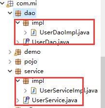
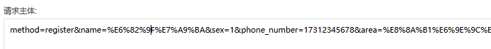
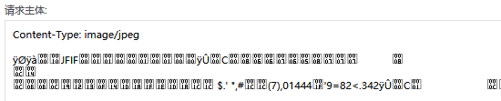
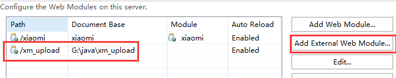

# Day21笔记

昨日内容回顾：

1、监听器(Listener)

第一类：监听三大域对象的创建和销毁

第二类：监听三大域对象的属性变更

第三类：监听session中javabean状态的改变

​		绑定/解绑

​		钝化/活化

2、框架的抽取

- Servlet的选用

  一个模块对应一个Servlet（测试模块：TestServlet   用户模块：UserServlet）

- 初始代码的编写

  if(){}elseif(..)

- 提升代码的可维护性

  反射(需要在每个模块的Servlet中都要写反射代码)

- 抽取BaseServlet

  继承HttpServlet，模块Servlet去继承BaseServlet

  有些方法执行完需要跳转页面（return 路径）

  ​

# 1、接口的设计

定义接口的好处：

​	1、定义好一种规则、规范（规范了代码的开发）

​	2、jdk的动态代理 要求 目标对象和代理对象实现同一个接口




# 2、手机号码的校验

核心代码：

register.jsp

```javascript
<script type="text/javascript">
	//手机号正则表达式
	var req = /^1(3|5|6|7|8|9)\d{9}$/;//手机号
	//手机号的校验
	$(function(){
		$("#phone_number").blur(function(){
			//获取手机号的值
			var p_val = $("#phone_number").val();
			if(!req.test(p_val)){
				//手机号未校验通过，不提交并且提示请输入正确的手机号
				alert("您输入的手机号格式不正确");
				return;
			}
			//如果手机号符合规范，将手机号的值提交到服务器
			//使用ajax
			$.post("/xiaomi/user",{method:"checkPhoneNumber",phoneNumber:p_val}
			,function(msg){
				if(msg == "true"){
					//手机号可用
					$("#s_phone_number").html("<font color='green'>该手机号尚未注册，可用</font>");
				}else if(msg == "false"){
					//手机号不可用
					$("#s_phone_number").html("<font color='red'>该手机号已被注册，请更换一个！！</font>")
				}
			})
			
		})
		
	})
</script>
```

Servlet、service、dao看项目中的代码

# 3、用户注册

步骤：

1、点击立即注册将表单中的数据提交到服务器

2、服务器接收数据后将数据封装到User对象中

3、注册的业务(将数据保存到数据表中)

4、结果的展示

**表单序列化：**

var data = $("#f4").serialize(); 

可以将form表单中的含有name属性的元素对象，的name值以及输入的值获取到

name属性值：参数  

输入的值：参数值

register.jsp

```html
//立即注册
		$("#btn").click(function(){
			/* var data = $("#f4").serialize();
			alert(data); */
			//表单提交
			$("#f4").submit();
		})
在原有页面上添加：
<form id="f4" action="${pageContext.request.contextPath}/user"
<input type="hidden" name="method" value="register" >
```

# 4、文件上传

需求：将图片上传到tomcat的upload目录中

默认提交参数形式：文本形式

**浏览器三步走：**

​	1、type的类型必须为file

​	2、必须将form的enctype的属性值设置为:multipart/form-data

​	enctype="application/x-www-form-urlencoded" 默认方式




​	**enctype="multipart/form-data"**  参数提交方式：二进制形式



​	3、method的值必须为post

**服务器三步走：**

1、需要在Serlvet加上@MultipartConfig    支持文件上传

2、request.getPart(name)   上传组件的name的值

3、part.write(path)   上传到指定的路径

```java
Part part = request.getPart("photo");
			//获取upload的路径
		String path = request.getServletContext().getRealPath("/upload");
			//获取图片的名称
			String value = part.getHeader("Content-Disposition");
			//form-data; name="photo"; filename="xiaobai.jpg"
			String fileName = value.substring(value.indexOf("filename")+10, value.length()-1);
			//上传到指定的位置
			part.write(path+"//"+fileName);
```

# 5、文件上传存在的三个问题

## 5.1   同名图片覆盖的问题

解决：在图片名称上加随机数，保证图片名称不会重复

```java
fileName = UUIDUtils.getUUID() + fileName;
```

## 5.2   clean tomcat 后图片丢失问题

project --  clean  ： 将代码编译成最新的class

右键tomcat--clean：将最新的class 发布到tomcat上

解决：将图片上传到本地硬盘上

```java
//本地硬盘的路径
String path = "G:\\java\\xm_upload";
```

上传到本地硬盘后：资源怎么访问？

本地虚拟路径的挂载



## 5.3   user表中的photo字段的值存什么

存图片的名称

```java
//设置user的photo字段
			user.setPhoto(fileName);
```

# 6、阿里云短信服务的申请

参考视频和文档


