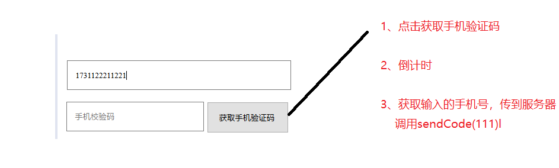
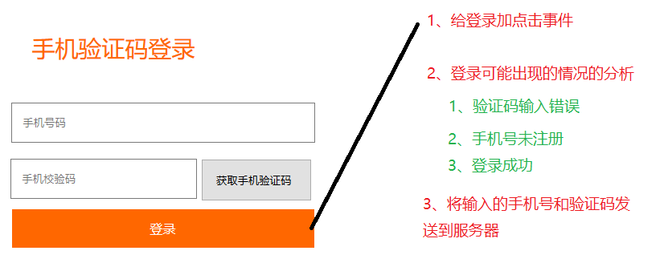
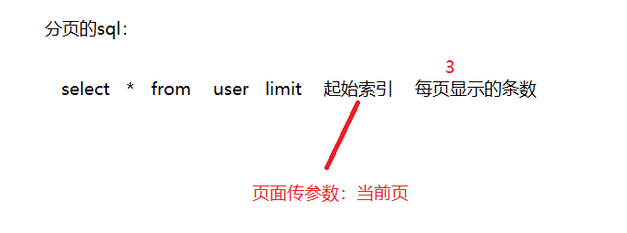
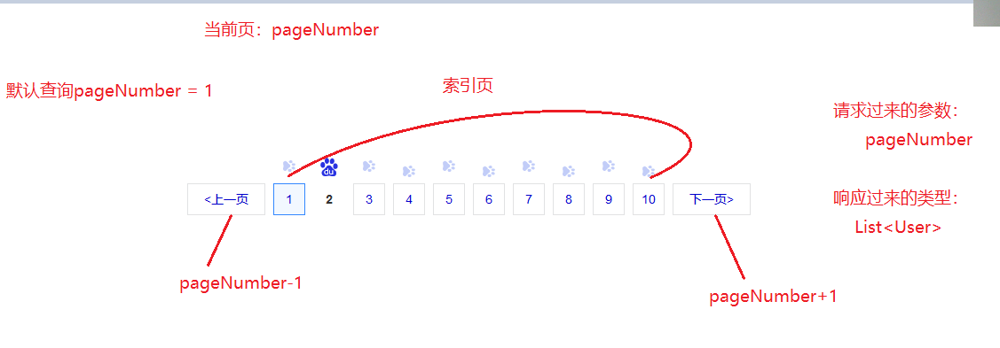

# Day22笔记

昨日内容回顾：

1、接口的定义

2、校验手机号唯一

3、用户注册

4、文件上传

浏览器三步：

​	1、type的类型必须为file  <intpu type ="file" name = "photo">

​	2、method的值必须为post

​	3、修改enctype的值为 multipart/form-data

​		默认提交形式：key=value&name=111

服务器三步：

​	1、在Servlet加上@MutiparyConfig  表示该Servet支持文件上传

​	2、Part part = request.getPart("photo");

​	3、part.write(path)

5、文件上传的三个问题

​	1、图片名称覆盖问题      加随机数

​	2、clean服务器后图片丢失      存放在本地硬盘上(挂载虚拟路径)

​	3、photo字段存值问题   图片的名称

6、用户登录

​	申请短信的服务(Acceskey、模板管理、签名管理)

# 一、向手机上发送验证码



核心代码：

login.jsp

```javascript
$(function(){
		//给获取手机验证码按钮加一个点击事件
		$("#zphone").click(function(){
			//获取手机号的值
			var p_val = $("#phone_number").val();
			if(!req.test(p_val)){
				//手机号未校验通过，不提交并且提示请输入正确的手机号
				alert("您输入的手机号格式不正确");
				return;
			}
			//倒计时
			RemainTime();
			//向服务器传手机号的值
			$.post("/xiaomi/user",{method:"sendCode",phoneNumber:p_val}
			,function(flag){
				if(flag == "true"){
					$("#flag").html("<font color='green'>发送成功<font>")
				}else if(flag == "false"){
					///
					$("#flag").html("<font color='green'>发送失败<font>")
				}
			})
		})
	})
```

UserServlet：

```java
//向手机上发送验证码
	public String sendCode(HttpServletRequest request, HttpServletResponse response) throws ServletException, IOException {
		//1、准备数据
		String phoneNumber = request.getParameter("phoneNumber");
		//2、调用业务处理
		UserService us = new UserServiceImpl();
		String msg = us.checkPhoneNumber(phoneNumber);
		String flag = "";
		if(msg.equals("true")) {
			//不让发送验证码
			flag = "false";
		}else {
			//SMSTools.sendCode(phoneNumber);
			//模拟发送验证码
			//获取四位随机数  
			long code = (long) (Math.random()*(9999-1000)+1000);
			System.out.println("您收到的验证码为："+code+"，五分钟内有效，不要泄露给他人");
			//3、结果展示
			flag = "true";
		}
		response.getWriter().write(flag);
	
		return "";
	}
```

# 二、 手机验证码登录

登录成功：

​	1、验证码正确

​	2、手机号已被注册



login.jsp

```javascript
//非空校验正则表达式
			var req2 = /^\s*$/;
			//手机号验证码登录
			$("#sub").click(function(){
				//校验手机号和验证码
				//获取手机号的值
				var p_val = $("#phone_number").val();
				if(!req.test(p_val)){
					//手机号未校验通过，不提交并且提示请输入正确的手机号
					alert("您输入的手机号格式不正确");
					return;
				}
				//获取验证码的值
				var code = $("#code").val();
				if(req2.test(code)){
					alert("验证码不允许为空！！")
					return;
				}
				//将手机号、验证码发送到服务器
				$.post("/xiaomi/user",{method:"login",phoneNumber:p_val,code:code}
				,function(msg){
					if(msg == "0"){
						//验证码不正确
						$("#msg").html("验证码输入错误!")
					}else if(msg == "1"){
						$("#msg").html("该手机号尚未注册！！");
					}else if(msg == "2"){
						alert("登录成功！！")
					}
				})
			})
```

Servlet：

sendCode：

```java
//将验证码存到session中
			request.getSession().setAttribute("code", phoneNumber+code+"");
```


```java
//手机验证码登录
	public String login(HttpServletRequest request, HttpServletResponse response) throws ServletException, IOException {
		//1、获取手机号验证吗的值
		String phoneNumber = request.getParameter("phoneNumber");
		String code = request.getParameter("code");
		//2、调用业务
		UserService us = new UserServiceImpl();
		String msg = us.login(phoneNumber,code,request);
		//3、将结果响应给浏览器
		response.getWriter().write(msg);
		return "";
	}
```

Service：

```java
public String login(String phoneNumber, String code,HttpServletRequest request) {
		/*
		 * 业务处理：
		 * 1、验证码输入错误
		 * 2、手机号未注册
		 * 3、登录成功
		 * 
		 * 0:验证码输入错误    1：手机号未注册   2：登录成功
		 * */
		//1、判断验证码(用户输入的验证码是否和发送到手机上的一致)
		//从session中获取code
		String sessionCode = (String) request.getSession().getAttribute("code");
		if(code != null && (phoneNumber+code).equals(sessionCode)) {
			//验证码输入正确
			//判断手机号是否被注册
			User user = ud.checkPhoneNumber(phoneNumber);
			if(user != null) {
				//已被注册
				return "2";
			}else {
				//未被注册
				return "1";
			}
		}else {
			//验证码输入错误
			return "0";
		}
	}
```

# 三、管理员登录

明确sql的书写：manger = 1

login.jsp

```html
<form action="${pageContext.request.contextPath}/user" method="post">
    	<input type="hidden" name = "method" value="adminLogin">
  
  
   <li><font color="red">${msg}</font></li>
```


Servlet：

```java
	//后台管理员登录
	public String adminLogin(HttpServletRequest request, HttpServletResponse response) throws ServletException, IOException {
		//1、获取用户名、密码的值
		String username = request.getParameter("username");
		String password = request.getParameter("password");
		//2、调用业务
		UserService us = new UserServiceImpl();
		User user = us.adminLogin(username, password);
		//3、结果展示
		if(user != null) {
			//将user信息存到session中
			request.getSession().setAttribute("user", user);
			//跳转到首页(main.jsp)
			response.sendRedirect(request.getContextPath()+"/admin/main.jsp");
		}else {
			//跳转到登录页面  提示登录失败信息
			request.setAttribute("msg", "用户名密码不正确或者不是管理员身份！！");
			return "admin/login";
		}
		return "";
	}
```

dao：

```java
QueryRunner qr = new QueryRunner(C3p0Utils.getDataSource());
		String sql = "select * from user where username = ? and password = ? and manager = ?";
		try {
			Object [] param = {username,password,1};
			return qr.query(sql, new BeanHandler<User>(User.class),param);
```

# 四、管理员退出

1、从session 移除user信息

2、跳转到登录页面

top.jsp

```java
<a href="${pageContext.request.contextPath}/user?method=adminLogout">用户退出
```

```java
//管理员退出
	public String adminLogout(HttpServletRequest request, HttpServletResponse response) throws ServletException, IOException {
		//从session中移除user信息
		request.getSession().removeAttribute("user");
		return "admin/login";
	}
```

# 五、用户列表查询

left.jsp

```html
<li class="active"><cite></cite><a href="${pageContext.request.contextPath}/user?method=findUlist" target="rightFrame">用户管理</a><i></i></li>
```

Servlet：

```java
//查询所有用户
	public String findUlist(HttpServletRequest request, HttpServletResponse response) throws ServletException, IOException {
		//2、调用业务
		UserService us = new UserServiceImpl();
		List<User> ulist = us.findUlist();
		//3、结果展示
		request.setAttribute("ulist", ulist);
		return "admin/user_list";
	}
```

user_list.jsp

```
<c:if test="${not empty ulist}">
        			<c:forEach items="${ulist}" var="user" varStatus="vs">
        		<tr>
			        <td><input name="ids" type="checkbox" value=""/></td>
			        <td>${vs.count}</td>
			        
<td>
			        	<c:if test="${user.sex == 0}">女</c:if>
			        	<c:if test="${user.sex == 1}">男</c:if>
			        </td>
 <td>
			        	<c:if test="${user.manager == 0}">
			        		<font color="blue">普通用户</font>
			        	</c:if>
			        	<c:if test="${user.manager == 1}">
			        		<font color="red">管理员</font>
			        	</c:if>
			        </td>

		<a href="${pageContext.request.contextPath}/user?method=updateRole&manager=1&uid=${user.uid}"><font color="red">修改为管理员</font></a>
			        	</c:if>
```

Servlet：

```java
//修改用户的权限
	public String updateRole(HttpServletRequest request, HttpServletResponse response) throws ServletException, IOException {
		//1、准备数据
		String manager = request.getParameter("manager");
		String uid = request.getParameter("uid");
		//2、调用业务
		UserService us = new UserServiceImpl();
		us.updateRole(manager,uid);
		//3、结果展示
		response.sendRedirect(request.getContextPath()+"/user?method=findUlist");
		return "";
	}
```

Dao：

```java
public void updateRole(String manager, String uid) {
		QueryRunner qr = new QueryRunner(C3p0Utils.getDataSource());
		String sql = "update user set manager = ? where uid = ?";
		Object [] param = {manager,uid};
		try {
			qr.update(sql, param);
		} catch (SQLException e) {
			// TODO Auto-generated catch block
			e.printStackTrace();
		}
	}
```

# 七、批量删除

全选的实现：

```java
$("#checkbox_main").click(function(){
			//全选实现
			//1、获取全选框的选中状态   checked
			var flag = $("#checkbox_main").prop("checked");
			//2、获取所有复选框
			var ids = $("[name=ids]");
			//3、将所有复选框的checked的值设置为flag
			ids.prop("checked",flag);
		})
```

批量删除:

```javascript
 <td><input name="ids"  type="checkbox" value="${user.uid}"/></td> 别忘了给value赋值
 
 //批量删除
		$("#batchDelete").click(function(){
			
			if(confirm("是否确认删除呢？？")){
				//删除业务
				//1、获取所有选中的复选框
				var ids = $("[name=ids]:checked");
				//2、获取选中复选框的uid的值
				//遍历数组
				var idsStr = "";
				ids.each(function(){
					idsStr += "," + this.value;
				})
				idsStr = idsStr.substring(1);
				//将参数提交到服务器
				location.href = "${pageContext.request.contextPath}/user?method=batchDelete&ids="+idsStr;
			}
		})
 
 
```

Servlet;

```java
//批量删除
	public String batchDelete(HttpServletRequest request, HttpServletResponse response) throws ServletException, IOException {
		//1、准备数据
		String ids = request.getParameter("ids");
		//2、调用业务
		UserService us = new UserServiceImpl();
		us.batchDelete(ids);
		//3、结果展示
		response.sendRedirect(request.getContextPath()+"/user?method=findUlist");
		return "";
	}
```

Dao：

```java
public void batchDelete(String ids) {
		QueryRunner qr = new QueryRunner(C3p0Utils.getDataSource());
		String sql = "DELETE FROM USER WHERE uid IN("+ids+")";
		try {
			qr.update(sql);
		} catch (SQLException e) {
			// TODO Auto-generated catch block
			e.printStackTrace();
		}
	}
```

# 八、用户的分页查询

回顾分页的sql：

​	select * from  user   limit  ?,?

参数一：起始索引(从0开始)

参数二：每页显示的条数

两个公式：

​	起始索引 = (当前页 - 1) * 每页显示的条数

​	总页数 = 总记录数 % 每页显示的条数 == 0 ?  (总记录数 / 每页显示的条数 )

​			: (总记录数 / 每页显示的条数 +1)






创建对应的JavaBean进行数据的封装：

```java
public class PageBean<T> implements Serializable{
	//起始索引
	private int startIndex;
	//当前页
	private int pageNumber;
	//每页显示的条数
	private int pageSize = 3;
	//查询到某页的数据
	private List<T> result;
	public int getStartIndex() {
		//第一个计算公式
		return startIndex = (getPageNumber() - 1) * getPageSize();
	}
	public void setStartIndex(int startIndex) {
		this.startIndex = startIndex;
	}
  //省略get/set方法
```


