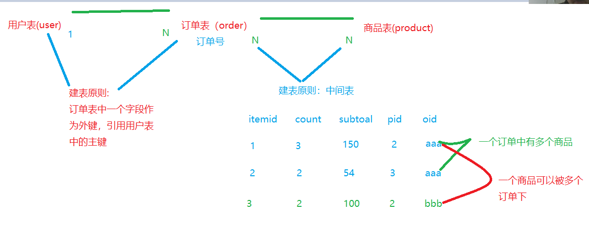

# Day27笔记

## 1、沙箱环境使用以及Demo（见文档和视频）

## 2、去结算

- 生成订单
- 跳转到支付页面

## 3、生成订单

分析表关系：



orders：订单表

```sql
CREATE TABLE orders (
  oid VARCHAR(32) NOT NULL, # 订单主键  varchar
  ordertime DATETIME DEFAULT NULL,  # 下单时间
  total DOUBLE DEFAULT NULL, # 总金额
  state INT(11) DEFAULT NULL, # 订单状态   0：未付款    1：已付款
  uid INT DEFAULT NULL,  #外键
  PRIMARY KEY (oid),
  KEY fk_0003 (uid),
  CONSTRAINT fk_0003 FOREIGN KEY (uid) REFERENCES USER (uid)
) 
```

```sql
orderitem：订单项表

CREATE TABLE  (
  itemid VARCHAR(32) NOT NULL, # 主键
  COUNT INT(11) DEFAULT NULL, #购买数量
  subtotal DOUBLE DEFAULT NULL, #小计
  pid INT(32) DEFAULT NULL, # 外键引用商品表的pid
  oid VARCHAR(32) DEFAULT NULL,#外键引用订单表的od
  PRIMARY KEY (itemid),
  KEY fk_0001 (pid),
  KEY fk_0002 (oid),
  CONSTRAINT fk_0001 FOREIGN KEY (pid) REFERENCES product (pid),
  CONSTRAINT fk_0002 FOREIGN KEY (oid) REFERENCES orders (oid)
) 
```

**表对应的JavaBean：**

OrderItem：

```java
public class OrderItem implements Serializable{
	
	private String itemid;
	private int count;//购买数量
	private double subtotal;//小计
	private int pid;
	private int oid;
```

Orders：

```java
public class Orders implements Serializable{
	private String oid;
	private String ordertime;
	private double total;
	private int state;
	private int uid;
	private User user;
	private List<OrderItem> olist;
```


**SQL：**

- insert   into   orders  values (?,?...)

- insert   into   orderitem   values(?,?,?,....)

  ​

  **保证将数据封装到Orders、OrderItem这两个JavaBean中**

**业务处理：**

在cart.jsp，点去结算

```
//去结算
	function toPay(){
		location.href="/xiaomi/order?method=toPay";
	}
```

OrderServlet：

- 判断用户是否登录

  ```java
  //判断用户是否登录？
  		HttpSession session = request.getSession();
  		User user = (User)session.getAttribute("qianUser");
  		if(user == null) {
  			//用户未登录
  			request.setAttribute("msg", "用户尚未登录，请先去登录！！！");
  			return "msg";
  		}
  ```

- 判断购物车中是否有商品

  ```java
  //用户登录成功，但是购物车中没有商品，提示请先去购物
  		Cart cart = getCart(request);
  		if(cart.getCartMap().size() == 0) {
  			//购物车中没有数据
  			request.setAttribute("msg", "购物车是空的，请先去购物！！！");
  			return "msg";
  		}
  ```


封装两个JavaBean的过程&生成订单业务：

```java
//1、生成订单(本质就是对订单表、订单项表进行insert into)
		//创建Orders对象
		Orders orders = new Orders();
		//封装数据
		orders.setOid(UUIDUtils.getUUID());
		orders.setOrdertime(new Date().toLocaleString());
		orders.setTotal(cart.getTotal());
		orders.setState(0);
		orders.setUid(user.getUid());
		orders.setUser(user);
		List<OrderItem> olist = new ArrayList();
		   //如何拿到购物项对象
		Set<Integer> keySet = cart.getCartMap().keySet();
		for(Integer key:keySet) {
			//根据key获取CartItem对象
			CartItem ci = cart.getCartMap().get(key);
			//创建OrderItem对象
			OrderItem oi = new OrderItem();
			//进行数据的封装
			oi.setItemid(UUIDUtils.getUUID());
			oi.setCount(ci.getCount());
			oi.setSubtotal(ci.getSubTotal());
			oi.setPid(ci.getProduct().getPid());
			oi.setOid(orders.getOid());
			olist.add(oi);
		}
		orders.setOlist(olist);
		//调用业务
		OrderService os = new OrderServiceImpl();
		os.addOrdersAndOrderItem(orders);
```

OrderServiceImpl：

```java
public void addOrdersAndOrderItem(Orders orders) {
		//1、添加订单
		od.addOrders(orders);
		//2、添加订单项
		for(OrderItem oi:orders.getOlist()) {
			od.addOrderItem(oi);
		}
	}
```

OrderDaoImpl：

```java
public void addOrders(Orders order) {
		QueryRunner qr = new QueryRunner(C3p0Utils.getDataSource());
		String sql = "insert into orders values(?,?,?,?,?)";
		Object [] param = {order.getOid(),order.getOrdertime(),order.getTotal(),
				order.getState(),order.getUid()};
		try {
			qr.update(sql, param);
		} catch (SQLException e) {
			// TODO Auto-generated catch block
			e.printStackTrace();
		}
	}

	@Override
	public void addOrderItem(OrderItem orderItem) {
		QueryRunner qr = new QueryRunner(C3p0Utils.getDataSource());
		String sql = "insert into orderitem values(?,?,?,?,?)";
		Object [] param = {orderItem.getItemid(),orderItem.getCount(),orderItem.getSubtotal(),
				orderItem.getPid(),orderItem.getOid()};
		try {
			qr.update(sql, param);
		} catch (SQLException e) {
			// TODO Auto-generated catch block
			e.printStackTrace();
		}
	}

```

生成订单后，需要从购物车中移除商品且跳转到支付页面

```java
//2、跳转到支付页面
		//清空购物车
		cart.getCartMap().clear();
		session.setAttribute("orders", orders);
		return "pay/index";
```

pay/index.jsp 取出订单的信息：

修改action的路径：

action=/xiaomi/pay/alipay.trade.page.pay.jsp

```html
<dt>下单人姓名：</dt>
					<dd>
						<input id="WIDsubject" value="${orders.user.name}" name="WIDsubject" />
					</dd>
					<hr class="one_line">
					<dt>付款金额 ：</dt>
					<dd>
						<input id="WIDtotal_amount" value="${orders.total}"  name="WIDtotal_amount" />
					</dd>
```

点击付款跳转到alipay.trade.page.pay.jsp该页面

付款成功后跳转的路径：

```java
//支付成功跳转到此路径
	alipayRequest.setReturnUrl("http://localhost:8080/xiaomi/order?method=updateState");
```


OrderServlet：

```java
//修改订单状态
	//update orders set state = 1  where oid = ?
	public String updateState(HttpServletRequest request, HttpServletResponse response) throws ServletException, IOException {
		OrderService os = new OrderServiceImpl();
		
		Orders orders = (Orders)request.getSession().getAttribute("orders");
		os.updateState(orders.getOid());
		response.getWriter().write("<h2>支付成功，3秒后跳转到首页继续购物！！！</h2>");
		response.setHeader("refresh", "3;url=/xiaomi/index.jsp");
		return "";
	}
```

OrderDao：

```java
public void updateState(String oid) {
		QueryRunner qr = new QueryRunner(C3p0Utils.getDataSource());
		String sql ="update orders set state = ?  where oid = ?";
		Object [] param = {1,oid};
		try {
			qr.update(sql, param);
		} catch (SQLException e) {
			// TODO Auto-generated catch block
			e.printStackTrace();
		}
	}
```


注册、登录、删除

insert  de

